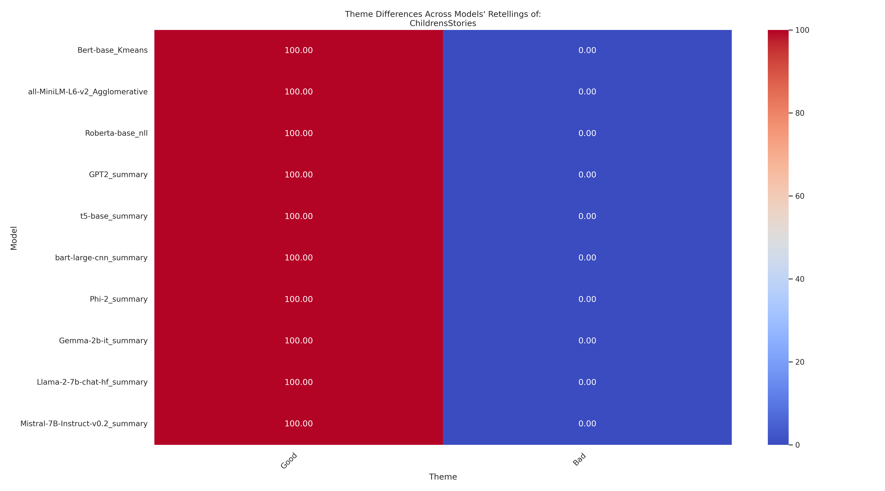
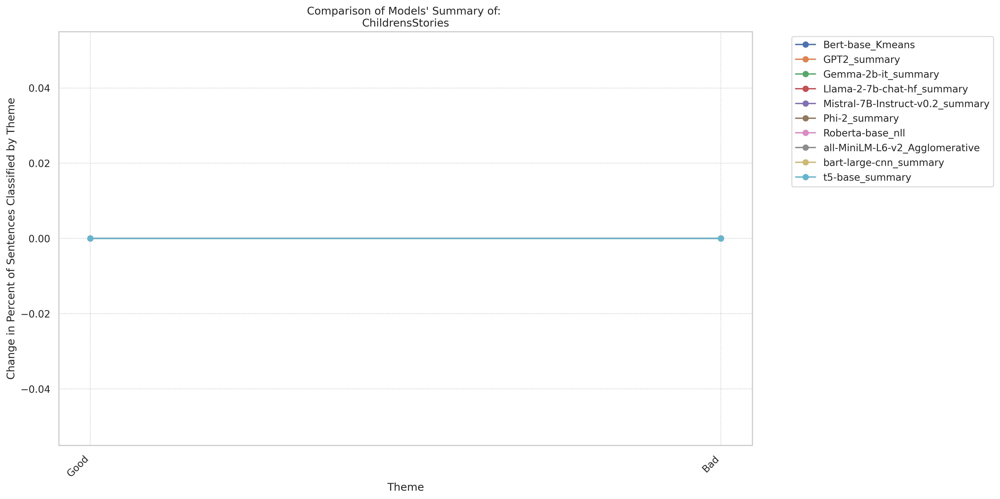
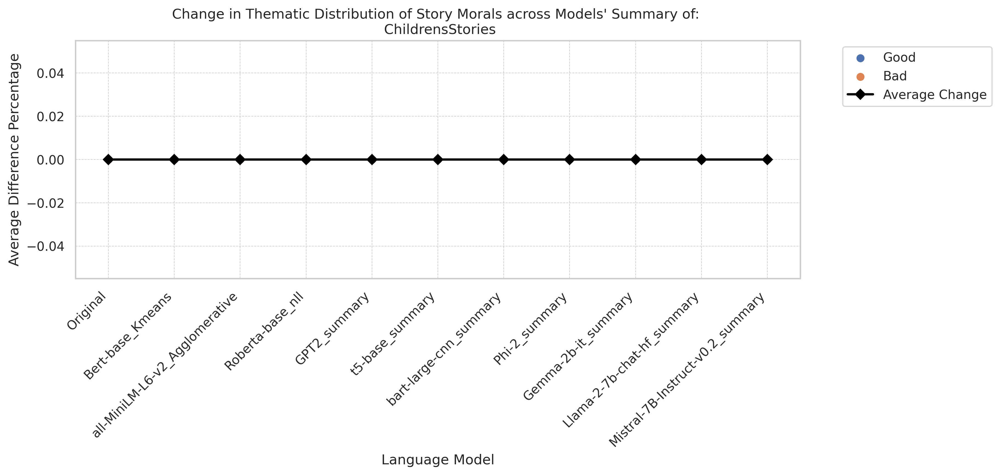

# A Comparison of Story-Moral Salience Across AI Models 
Measuring Theme Representations in Model Summarization of: ChildrensStories

Summarize the Lessons of: ChildrensStories
Primary Source:[youtu.be/F3-2kkD1LNU](https://youtu.be/F3-2kkD1LNU) 
 Models Evaluated: LLAMA-7b-chat-hf, Mistral-7B-Instruct-v0.2, Gemma-2b-it, Phi-2, T5-base, Bart-large-cnn, gpt2, Roberta-base_NLL, BERT-large_K-Means_Clustering, and all-MiniLM-L6-v2_Agglomerative_Clustering  
 Tokenln Primary Source: 2211 * Summarization Ratio: 0.1 = 
  Tokenln Per Model Summary:<221.10000000000002  ## Themes for Classification:  
 ['Good', 'Bad']  

 ### Source Theme Classification
  Average Mean Difference for primary source text = 0.5416666666666666
This measures the confidence of BERT NSP and GPT2 for classifying with the codebook. Lower is better.

   Distribution of themes across sentences:
100.0  | Good 
 0.0  | Bad   

  

Average Mean Difference for Bert-base_Kmeans: 0.0
     1 | Good  
I'll tell you a story once upon a time a poor farmer was plowing his field  when he hit something hard it was a large metal pot  what's this a metal pot I wonder if there is something more valuable underneath in the hope that he could find something more valuable the farmer dug deeper and wider tired after hours of searching the farmer decided to rest he left his faith in the pot and lay down under the tree  a while later when he got up and went back to the pot he was surprised how is this possible the pot is full of hundreds of spades I had left only one in it looks like this is a magical pot let me see what will happen if I put a mango in it  .
   

Average Mean Difference for all-MiniLM-L6-v2_Agglomerative: 0.0
     1 | Good  
I'll tell you a story once upon a time a poor farmer was plowing his field  when he hit something hard it was a large metal pot  what's this a metal pot I wonder if there is something more valuable underneath in the hope that he could find something more valuable the farmer dug deeper and wider tired after hours of searching the farmer decided to rest he left his faith in the pot and lay down under the tree  a while later when he got up and went back to the pot he was surprised how is this possible the pot is full of hundreds of spades I had left only one in it looks like this is a magical pot let me see what will happen if I put a mango in it  .
   

Average Mean Difference for Roberta-base_nll: 0.0
     1 | Good  
and I'll jump into it on my own the foolish crocodile opened his wide mouth with his eyes shut and waited for the monkey to jump the clever monkey who was watching the closed eye crocodile hopped on the head of the crocodile and crossed the river you couldn't fool me this time either by clear and clever thinking the monkey managed to trick the foolish crocodile  . ha ha ha ha the crocodile was indeed a fool who got tricked by the clever monkey. yeah.
   

Average Mean Difference for GPT2_summary: 0.0
     1 | Good  
Posted by Mr. Ritchie at 11:39 AM.
   

Average Mean Difference for t5-base_summary: 0.0
     1 | Good  
. Jim and Jerry took all the tokens I had collected for the charity and submitted it as their own now they are going to win the appreciation sticker don't worry about it Doku. a clever monkey thought he was clever but was actually a big fool. clever monkey tricked crocodile by jumping on his head and crossing river. clever monkey hopped on the head of the monkey and crossed the river.
   

Average Mean Difference for bart-large-cnn_summary: 0.0
     1 | Good  
A poor farmer with his wife they had nothing but a little farm where they grew vegetables that they could eat. Eventually he saved up enough money to buy a goose he took it home and made a nest for it to lay eggs. The Fox quickly ate the crab and ended his life do you still think you can handle the tall shells. anyway he was not familiar with the terrain at all it's my fault I should have stayed in the seas and the beach where I belong and know how to protect myself. well yes.
   

Average Mean Difference for Phi-2_summary: 0.0
     1 | Good  
.   The key lesson of the text is that being careful and not being too greedy can help us make wise decisions and avoid negative consequences.
   

Average Mean Difference for Gemma-2b-it_summary: 0.0
     1 | Good  
The farmer and his wife saved up enough money to purchase a goose that laid golden eggs. The farmer and his wife were able to become rich and wealthy.  The moral of the story is that we must think carefully before we do anything. We should not be impulsive and we should always be careful. We should also be clever and we should never be afraid to take risks. 
   

Average Mean Difference for Llama-2-7b-chat-hf_summary: 0.0
     1 | Good  
The fourth story, "The Clever Monkey and the Crocodile," teaches the lesson of thinking before acting and not falling for foolish tricks. These lessons can be applied to everyday life and can help individuals lead a more fulfilling and meaningful life.
   

Average Mean Difference for Mistral-7B-Instruct-v0.2_summary: 0.0
     1 | Good  
The fourth story is about a crab who leaves the safety of the sea to live on land and is killed by a fox. The fifth story is about a clever monkey who outsmarts a crocodile. The overall lesson from these stories is that greed, hoarding, and being careless can lead to great loss, while being content, using wealth wisely, and being clever can bring happiness and success.
 

 ### Summary Theme Quantification
 Each BERT and GPT sentence embedding compares to a research question and category to classify.
 Research Question:
 The Moral of the Story is :
#### Bert-base_Kmeans: 
 Average Mean Difference = 1.0
Theme Distribution Scores:
 {'Good': 100.0, 'Bad': 0}  

#### all-MiniLM-L6-v2_Agglomerative: 
 Average Mean Difference = 1.0
Theme Distribution Scores:
 {'Good': 100.0, 'Bad': 0}  

#### Roberta-base_nll: 
 Average Mean Difference = 0.5
Theme Distribution Scores:
 {'Good': 100.0, 'Bad': 0}  

#### GPT2_summary: 
 Average Mean Difference = 1.0
Theme Distribution Scores:
 {'Good': 100.0, 'Bad': 0}  

#### t5-base_summary: 
 Average Mean Difference = 0.0
Theme Distribution Scores:
 {'Good': 100.0, 'Bad': 0}  

#### bart-large-cnn_summary: 
 Average Mean Difference = 1.0
Theme Distribution Scores:
 {'Good': 100.0, 'Bad': 0}  

#### Phi-2_summary: 
 Average Mean Difference = 1.0
Theme Distribution Scores:
 {'Good': 100.0, 'Bad': 0}  

#### Gemma-2b-it_summary: 
 Average Mean Difference = 1.0
Theme Distribution Scores:
 {'Good': 100.0, 'Bad': 0}  

#### Llama-2-7b-chat-hf_summary: 
 Average Mean Difference = 1.0
Theme Distribution Scores:
 {'Good': 100.0, 'Bad': 0}  

#### Mistral-7B-Instruct-v0.2_summary: 
 Average Mean Difference = 1.0
Theme Distribution Scores:
 {'Good': 100.0, 'Bad': 0}  

Category 'Good': Original = 100.00%, Bert-base_Kmeans ChildrensStories = 100.00%
 Percentage difference 0.00%
 Category 'Bad': Original = 0.00%, Bert-base_Kmeans ChildrensStories = 0.00%
 Percentage difference 0.00%
 
 Chi-square Statistic: 0.0
 Degrees of Freedom: 1
 P-value: 1.0
 Expected Frequencies:
 [[1.001e+02 1.000e-01]
 [1.001e+02 1.000e-01]]
  No significant differences exist between the distributions (H0) null hypothesis
    

Category 'Good': Original = 100.00%, all-MiniLM-L6-v2_Agglomerative ChildrensStories = 100.00%
 Percentage difference 0.00%
 Category 'Bad': Original = 0.00%, all-MiniLM-L6-v2_Agglomerative ChildrensStories = 0.00%
 Percentage difference 0.00%
 
 Chi-square Statistic: 0.0
 Degrees of Freedom: 1
 P-value: 1.0
 Expected Frequencies:
 [[1.001e+02 1.000e-01]
 [1.001e+02 1.000e-01]]
  No significant differences exist between the distributions (H0) null hypothesis
    

Category 'Good': Original = 100.00%, Roberta-base_nll ChildrensStories = 100.00%
 Percentage difference 0.00%
 Category 'Bad': Original = 0.00%, Roberta-base_nll ChildrensStories = 0.00%
 Percentage difference 0.00%
 
 Chi-square Statistic: 0.0
 Degrees of Freedom: 1
 P-value: 1.0
 Expected Frequencies:
 [[1.001e+02 1.000e-01]
 [1.001e+02 1.000e-01]]
  No significant differences exist between the distributions (H0) null hypothesis
    

Category 'Good': Original = 100.00%, GPT2_summary ChildrensStories = 100.00%
 Percentage difference 0.00%
 Category 'Bad': Original = 0.00%, GPT2_summary ChildrensStories = 0.00%
 Percentage difference 0.00%
 
 Chi-square Statistic: 0.0
 Degrees of Freedom: 1
 P-value: 1.0
 Expected Frequencies:
 [[1.001e+02 1.000e-01]
 [1.001e+02 1.000e-01]]
  No significant differences exist between the distributions (H0) null hypothesis
    

Category 'Good': Original = 100.00%, t5-base_summary ChildrensStories = 100.00%
 Percentage difference 0.00%
 Category 'Bad': Original = 0.00%, t5-base_summary ChildrensStories = 0.00%
 Percentage difference 0.00%
 
 Chi-square Statistic: 0.0
 Degrees of Freedom: 1
 P-value: 1.0
 Expected Frequencies:
 [[1.001e+02 1.000e-01]
 [1.001e+02 1.000e-01]]
  No significant differences exist between the distributions (H0) null hypothesis
    

Category 'Good': Original = 100.00%, bart-large-cnn_summary ChildrensStories = 100.00%
 Percentage difference 0.00%
 Category 'Bad': Original = 0.00%, bart-large-cnn_summary ChildrensStories = 0.00%
 Percentage difference 0.00%
 
 Chi-square Statistic: 0.0
 Degrees of Freedom: 1
 P-value: 1.0
 Expected Frequencies:
 [[1.001e+02 1.000e-01]
 [1.001e+02 1.000e-01]]
  No significant differences exist between the distributions (H0) null hypothesis
    

Category 'Good': Original = 100.00%, Phi-2_summary ChildrensStories = 100.00%
 Percentage difference 0.00%
 Category 'Bad': Original = 0.00%, Phi-2_summary ChildrensStories = 0.00%
 Percentage difference 0.00%
 
 Chi-square Statistic: 0.0
 Degrees of Freedom: 1
 P-value: 1.0
 Expected Frequencies:
 [[1.001e+02 1.000e-01]
 [1.001e+02 1.000e-01]]
  No significant differences exist between the distributions (H0) null hypothesis
    

Category 'Good': Original = 100.00%, Gemma-2b-it_summary ChildrensStories = 100.00%
 Percentage difference 0.00%
 Category 'Bad': Original = 0.00%, Gemma-2b-it_summary ChildrensStories = 0.00%
 Percentage difference 0.00%
 
 Chi-square Statistic: 0.0
 Degrees of Freedom: 1
 P-value: 1.0
 Expected Frequencies:
 [[1.001e+02 1.000e-01]
 [1.001e+02 1.000e-01]]
  No significant differences exist between the distributions (H0) null hypothesis
    

Category 'Good': Original = 100.00%, Llama-2-7b-chat-hf_summary ChildrensStories = 100.00%
 Percentage difference 0.00%
 Category 'Bad': Original = 0.00%, Llama-2-7b-chat-hf_summary ChildrensStories = 0.00%
 Percentage difference 0.00%
 
 Chi-square Statistic: 0.0
 Degrees of Freedom: 1
 P-value: 1.0
 Expected Frequencies:
 [[1.001e+02 1.000e-01]
 [1.001e+02 1.000e-01]]
  No significant differences exist between the distributions (H0) null hypothesis
    

Category 'Good': Original = 100.00%, Mistral-7B-Instruct-v0.2_summary ChildrensStories = 100.00%
 Percentage difference 0.00%
 Category 'Bad': Original = 0.00%, Mistral-7B-Instruct-v0.2_summary ChildrensStories = 0.00%
 Percentage difference 0.00%
 
 Chi-square Statistic: 0.0
 Degrees of Freedom: 1
 P-value: 1.0
 Expected Frequencies:
 [[1.001e+02 1.000e-01]
 [1.001e+02 1.000e-01]]
  No significant differences exist between the distributions (H0) null hypothesis
    

   ## Graphing the change in theme distributions across models:  

    ### Resulting Average Theme:Content Mean Difference Across Models: 0.8219696969696969

   Table: 
ChildrensStories_theme_scores.csv  

 
 
 
