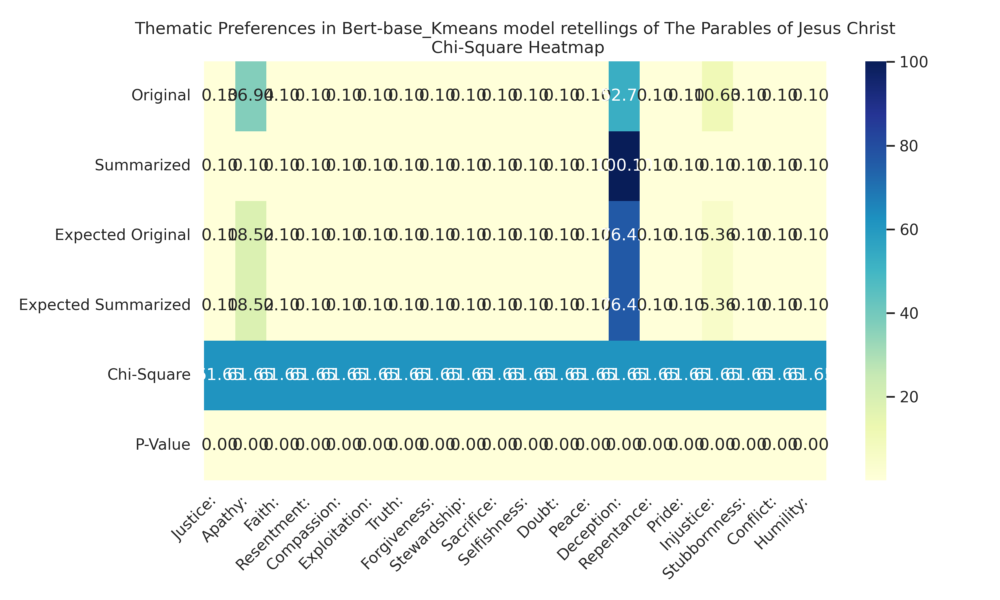
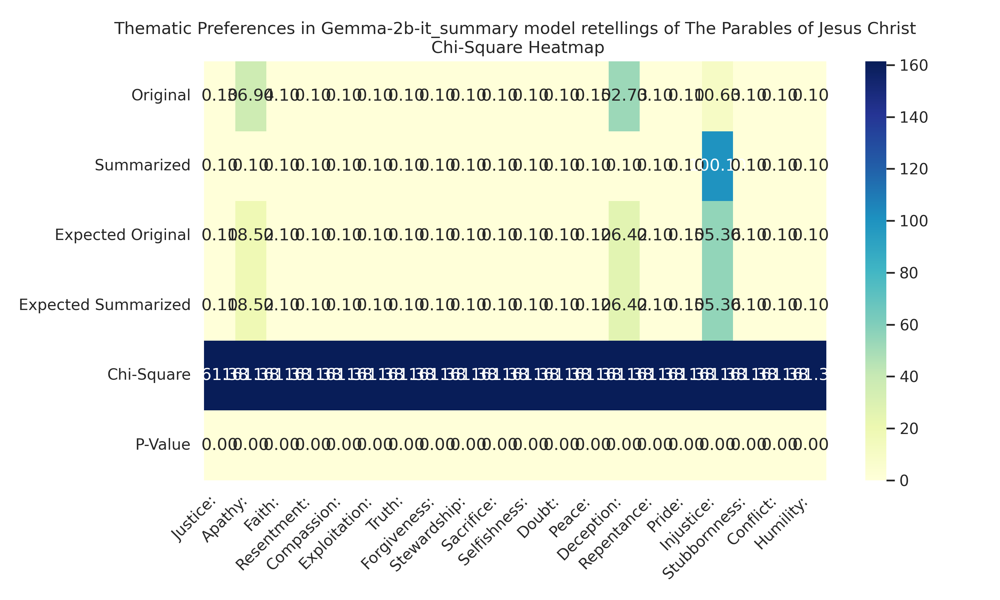
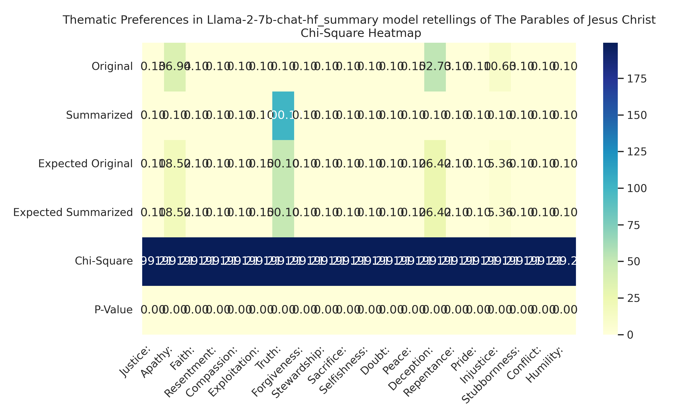
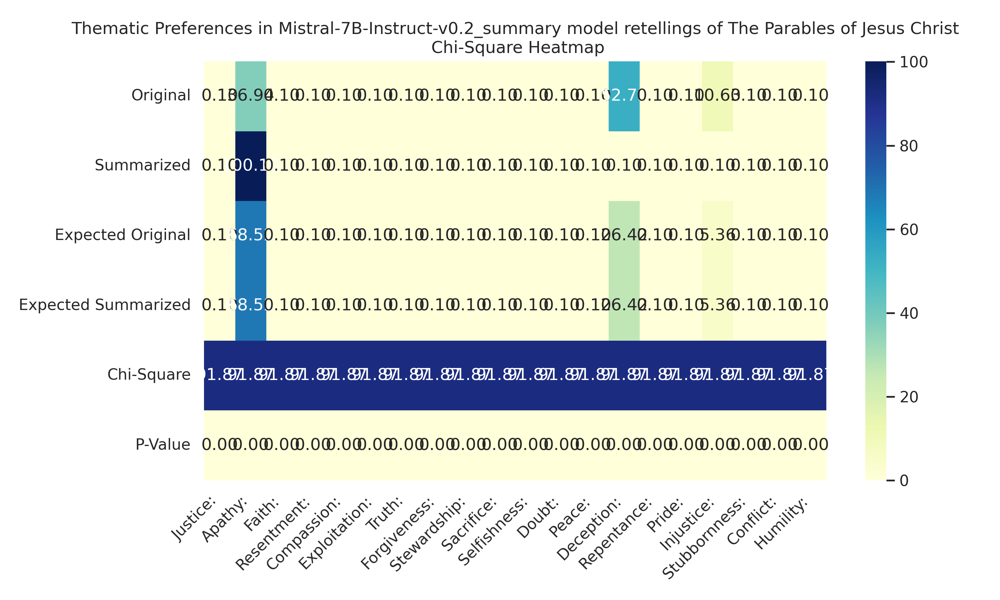
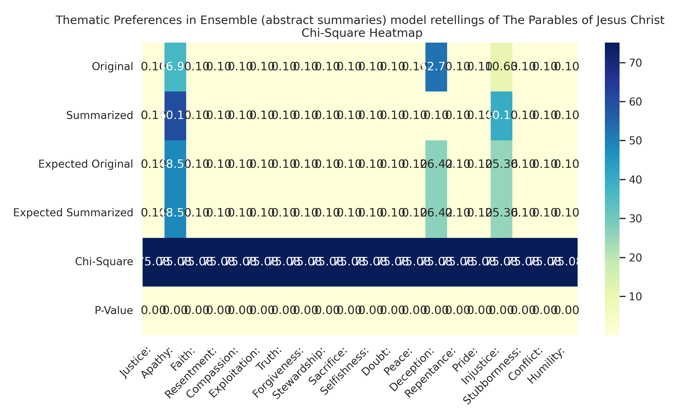
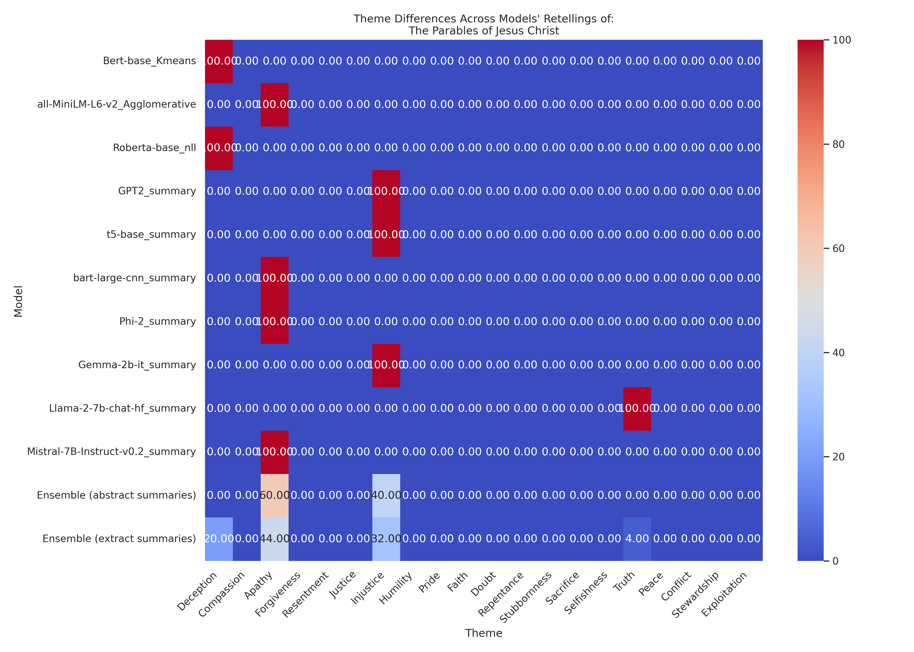
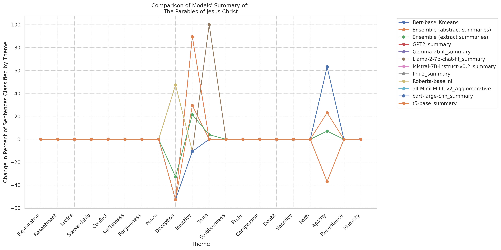
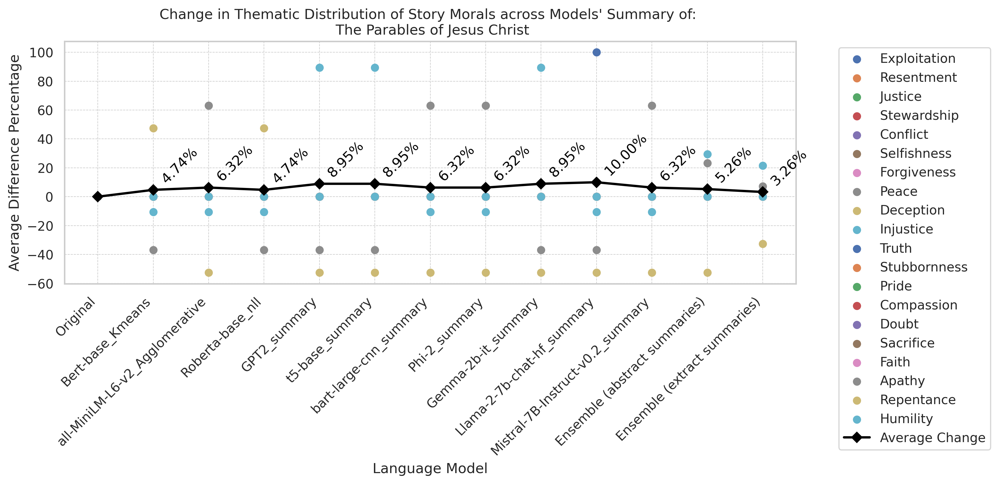
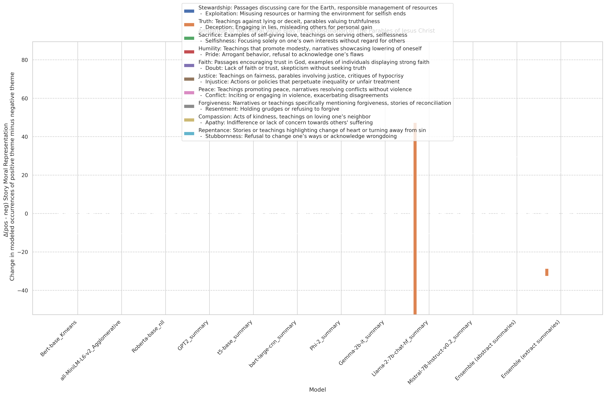

# A Comparison of Story-Moral Salience Across AI Models 
Measuring Theme Representations in Model Summarization of: The Parables of Jesus Christ

Summarize the Lessons of: The Parables of Jesus Christ
Primary Source:[youtu.be/Ed41paFWSKM](https://youtu.be/Ed41paFWSKM) 
Models Evaluated: LLAMA-7b-chat-hf, Mistral-7B-Instruct-v0.2, Gemma-2b-it, Phi-2, T5-base, Bart-large-cnn, gpt2, Roberta-base_NLL, BERT-large_K-Means_Clustering, and all-MiniLM-L6-v2_Agglomerative_Clustering 

Tokenln Primary Source: 8402 * Summarization Ratio: 0.05 = 
 Tokenln Per Model Summary: <420.1

## Themes for Classification: 
 ['Compassion: Acts of kindness, teachings on loving one’s neighbor', "Apathy: Indifference or lack of concern towards others' suffering", 'Forgiveness: Narratives or teachings specifically mentioning forgiveness, stories of reconciliation', 'Resentment: Holding grudges or refusing to forgive', 'Justice: Teachings on fairness, parables involving justice, critiques of hypocrisy', 'Injustice: Actions or policies that perpetuate inequality or unfair treatment', 'Humility: Teachings that promote modesty, narratives showcasing lowering of oneself', 'Pride: Arrogant behavior, refusal to acknowledge one’s flaws', 'Faith: Passages encouraging trust in God, examples of individuals displaying strong faith', 'Doubt: Lack of faith or trust, skepticism without seeking truth', 'Repentance: Stories or teachings highlighting change of heart or turning away from sin', 'Stubbornness: Refusal to change one’s ways or acknowledge wrongdoing', 'Sacrifice: Examples of self-giving love, teachings on serving others, selflessness', 'Selfishness: Focusing solely on one’s own interests without regard for others', 'Truth: Teachings against lying or deceit, parables valuing truthfulness', 'Deception: Engaging in lies, misleading others for personal gain', 'Peace: Teachings promoting peace, narratives resolving conflicts without violence', 'Conflict: Inciting or engaging in violence, exacerbating disagreements', 'Stewardship: Passages discussing care for the Earth, responsible management of resources', 'Exploitation: Misusing resources or harming the environment for selfish ends']

### Source Theme Classification
Average Mean Difference for primary source text = 0.5048267819720076
This measures the confidence of BERT NSP and GPT2 for classifying with the codebook. Lower is better.

 Distribution of themes across sentences:
52.6  | Deception: Engaging in lies, misleading others for personal gain 
36.8  | Apathy: Indifference or lack of concern towards others' suffering 
10.5  | Injustice: Actions or policies that perpetuate inequality or unfair treatment 
0.0  | Compassion: Acts of kindness, teachings on loving one’s neighbor 
0.0  | Forgiveness: Narratives or teachings specifically mentioning forgiveness, stories of reconciliation 
0.0  | Resentment: Holding grudges or refusing to forgive 
0.0  | Justice: Teachings on fairness, parables involving justice, critiques of hypocrisy 
0.0  | Humility: Teachings that promote modesty, narratives showcasing lowering of oneself 
0.0  | Pride: Arrogant behavior, refusal to acknowledge one’s flaws 
0.0  | Faith: Passages encouraging trust in God, examples of individuals displaying strong faith 
0.0  | Doubt: Lack of faith or trust, skepticism without seeking truth 
0.0  | Repentance: Stories or teachings highlighting change of heart or turning away from sin 
0.0  | Stubbornness: Refusal to change one’s ways or acknowledge wrongdoing 
0.0  | Sacrifice: Examples of self-giving love, teachings on serving others, selflessness 
0.0  | Selfishness: Focusing solely on one’s own interests without regard for others 
0.0  | Truth: Teachings against lying or deceit, parables valuing truthfulness 
0.0  | Peace: Teachings promoting peace, narratives resolving conflicts without violence 
0.0  | Conflict: Inciting or engaging in violence, exacerbating disagreements 
0.0  | Stewardship: Passages discussing care for the Earth, responsible management of resources 
0.0  | Exploitation: Misusing resources or harming the environment for selfish ends 

Average Mean Difference for Bert-base_Kmeans: 0.0
    1 | Faith 
and you came to me then the righteous will answer him saying Lord when did we see you hungry and feed you or thirsty and give you a drink when did we see you as a stranger and take you in or naked and clothe you when did we see you sick or in prison and come to you the king will answer them most certainly I tell you because you did it to one of the least of these my brothers you did it to me then he will say also to those on his left hand depart from me you cursed into the eternal fire which is prepared for the devil and his angels for I was hungry and you didn't give me food to eat I was thirsty and you gave me no drink I was a stranger.
    2 | Faith 
but she has wet my feet with her tears and wiped them with the hair of her head you gave me no kiss. but she since the time I came in has not ceased to kiss my feet you didn't anoint my head with oil.

Average Mean Difference for all-MiniLM-L6-v2_Agglomerative: 0.5239875033212589
    1 | Faith 
so I tell you there is joy in the presence of the angels of God over one sinner repenting therefore the kingdom of heaven is like a certain king who wanted to reconcile accounts with his servants when he had begun to reconcile one was brought to him who owed him ten thousand talents but because he couldn't pay his LORD commanded him to be sold with his wife his children and all that he had and the payment to be made the servant therefore fell down and knelt before him saying Lord have patience with me.

Average Mean Difference for Roberta-base_nll: 0.0
    1 | Faith 
but if that servant should say in his heart my Lord is delaying his coming and begins to beat his fellow servants and eat and drink with the drunkards the Lord of that servant will come in a day when he doesn't expect it in an hour when he doesn't know it and will cut him in pieces and appoint his portion with the hypocrites that is where the weeping and grinding of teeth will be but of that day or that hour no one knows not even the angels in heaven nor the son but only the father take heed stay awake and pray for you don't know when the time is it is like a man traveling to another country having left his house and given authority to his servants and to each one his work and also commanded the doorkeeper to stay awake therefore stay awake for you don't know when the Lord of the house is coming whether a evening or at midnight or when the rooster crows or in the morning lest coming suddenly he might find you sleeping what I tell you I tell all stay awake you who then is the faithful and wise steward whom his Lord will set over his household to give them their portion of food at the right times blessed is that servant whom his Lord will find doing so when he comes truly I tell you that he will set him over all that he has.

Average Mean Difference for GPT2_summary: 0.5667398161526501
    1 | Humility 
Galatians 5:16 ESV / 5 kind votes Helpful Not an essential part of the gospel.  . Ephesians 6:4 ESV / 5 really helpful votes Helpful NOT recommended for those seeking salvation by faith alone.  . John 14:27 ESV / 5 like this post? Sign up for our free newsletters.   i think it's worth mentioning that there is a great deal of evidence for the fact that some of these things are true.
    2 | Stewardship 
Jesus said, "Because our Lord sent us out of the Garden of Gethsemane, which is in the middle of the Sea of.   He that believeth in me will not perish, but will be saved.  . Revelation 22:12 ESV / 5 useful votes Helpful Not a day goes by without a new revelation from God.  . Proverbs 18:11 ESV / 5 beneficial votes Helpful Not recommended for those who are too weak to receive it.  .
    3 | Humility 
But if he had succeeded in reaching the heavens, he would have achieved what he has accomplished so far.  .   When Jesus arrived at the place where he was supposed to be, he saw a large group of people gathered around him. They looked at him and said, "Who are these people? Do you know who they are?" Jesus replied, "They are my disciples, and I am the messenger of Allah." They said, "What do you mean by that?"
    4 | Stewardship 
It goes like this: "And Moses said to Noah, 'It is time for you to build a house upon the top of Mt. Sinai, and divide it among the three parts. The third part is divided.   https://www.youtube.com/watch?v=9XuJtDwYVx8&feature=youtu.be.
    5 | Humility 
Deuteronomy 21:8 ESV / 5 good votes Helpful Not required for those who wish to follow the example of the Lord.  . Romans 10:10 ESV / 5 nice votes Helpful Not needed for those who desire to follow the tradition of the Old Testament.  . Acts 3:18 ESV / 5 pretty votes Helpful Not necessary for those who seek salvation through faith alone.  .

Average Mean Difference for t5-base_summary: 0.14692851901992357
    1 | Faith 
. Jesus the anointed he spoke to the disciples in parables. true story: farmer hears the word and immediately with joy receives it. False. the bridegroom came and said Lord you delivered to me five talents behold I have gained another two talents in addition to them his Lord said to him well done good and faithful servant you have been faithful over a few things.

Average Mean Difference for bart-large-cnn_summary: 0.14680596989537684
    1 | Faith 
But if that servant should say in his heart my Lord is delaying his coming and begins to beat his fellow servants and eat and drink with the drunkards the Lord of that servant will come in a day when he doesn't expect it and will cut him in pieces. That is where the weeping and grinding of teeth will be but of that day or that hour no one knows. He said to those who stood by take the mine away from him and give it to him who has the ten.
    2 | Faith 
Jesus told the parable of the darnel weeds of the field. He said the good seed is the son of man the field is the world. The enemy who sowed them is the devil. The harvest is the end of the age and the Reapers are the Angels. The son said to him father I have sinned against heaven and in your sight I am no longer worthy to be called your son.
    3 | Faith 
The Pharisee who had invited him saw it he said to himself this man if you were a prophet would have perceived who and what kind of woman this is who does him that she is a sinner. and therefore I can't come that servant came and told his Lord these things then the master of the house being angry said to his servant go out quickly into the streets and lanes of the city and bring in the poor maimed blind and lame.

Average Mean Difference for Phi-2_summary: 0.0
    1 | Faith 
.  John was a faithful and hardworking man who was chosen by Jesus to help spread his teachings and baptize people in the name of Christ. He showed kindness and selflessness by giving his water to a sick man in the desert. John's story teaches us the importance of being faithful and kind to others.

Average Mean Difference for Gemma-2b-it_summary: 0.07886996255851779
    1 | Faith 
The poor man received his blessing from God. The poor man received blessings from God. The rich Man gave his servants a blessing, which was a stone or a fish. The poor man received many blessings from God. The poor Man received a blessing from God, which was a stone. The rich Man gave many blessings to his servants, which were a stone or a fish, which was a blessing from God.  
    2 | Faith 
The tax collector standing far away would not even lift up his eyes docile that he was not worthy to believe him. The tax collectors and prostitutes believed him when you seen it.   The kingdom of heaven will be a ten virgins who took their lamp and went out to meet their bridegroom. Five of them were foolish and took no oil with them, but the wise took oil and their lamps. At midnight there was a cry, behold the bridegroom is coming.  
    3 | Faith 
100 times more than before, the kingdom of heaven is likened to a certain king who wanted and wanted to reconcile accounts with its servants when he began to reconcile one was brought and knelt before him saying, Lord have patience with me.|. 2 men went up into the Temple to pray. One was a Pharisee and one was a tax collector. The Pharisee Corsica stood and prayed to verfolgt that he was not like the rest of the men.

Average Mean Difference for Llama-2-7b-chat-hf_summary: 0.5
    1 | Sacrifice 
| Lesson: The story emphasizes the importance of faith and perseverance in prayer. Jesus teaches that God will be merciful to those who are merciful to others, and that we should be willing to show compassion and help those in need. The parables also highlight the importance of forgiveness, humility, and being prepared for God's kingdom.

Average Mean Difference for Mistral-7B-Instruct-v0.2_summary: 0.0
    1 | Sacrifice 
The text also encourages persistence in prayer and seeking God's help, and warns against giving in to temptation and neglecting one's responsibilities towards family and community. Overall, the text emphasizes the importance of loving and caring for others, especially the less fortunate, as a means to inherit eternal life.
    2 | Sacrifice 
The text contains several parables and stories that teach about the importance of living a virtuous and compassionate life in accordance with God's teachings. The parables of the Good Samaritan and the Rich Man and Lazarus illustrate the consequences of prioritizing wealth and self-interest over compassion and kindness towards others.

Average Mean Difference for Ensemble (abstract summaries): 0.5165303058222024
    1 | Stewardship 
Then Moses said to his brothers, 'Take care that you do not break the fourth part of the house.' " That's pretty much all we have to say about this verse. Let's look at some of the more interesting passages in Genesis as well. First of all, the story of Noah's flood is very similar to the story of Moses' flood.
    2 | Injustice 
Deuteronomy 21:8 ESV / 5 good votes Helpful Not required for those who wish to follow the example of the Lord.  . Romans 10:10 ESV / 5 nice votes Helpful Not needed for those who desire to follow the tradition of the Old Testament.  . Acts 3:18 ESV / 5 pretty votes Helpful Not necessary for those who seek salvation through faith alone.  .
    3 | Injustice 
But if he had succeeded in reaching the heavens, he would have achieved what he has accomplished so far.  .   When Jesus arrived at the place where he was supposed to be, he saw a large group of people gathered around him. They looked at him and said, "Who are these people? Do you know who they are?" Jesus replied, "They are my disciples, and I am the messenger of Allah." They said, "What do you mean by that?"
    4 | Injustice 
Summarize::.::.:::::--:::----------------. Jesus told the parable of the darnel weeds of the field. He said the good seed is the son of man the field is the world. The enemy who sowed them is the devil. The harvest is the end of the age and the Reapers are the Angels. The son said to him father
    5 | Injustice 
It goes like this: "And Moses said to Noah, 'It is time for you to build a house upon the top of Mt. Sinai, and divide it among the three parts. The third part is divided.   https://www.youtube.com/watch?v=9XuJtDwYVx8&feature=youtu.be.  . Jesus the anointed he spoke to the disciples in parables.
    6 | Injustice 
Galatians 5:16 ESV / 5 kind votes Helpful Not an essential part of the gospel.  . Ephesians 6:4 ESV / 5 really helpful votes Helpful NOT recommended for those seeking salvation by faith alone.  . John 14:27 ESV / 5 like this post? Sign up for our free newsletters.   i think it's worth mentioning that there is a great deal of evidence for the fact that some of these things are true.
    7 | Apathy 
The rich Man gave many blessings to his servants, which were a stone or a fish, which was a blessing from God.  . | Lesson: The story emphasizes the importance of faith and perseverance in prayer. Jesus teaches that God will be merciful to those who are merciful to others, and that we should be willing to show compassion and help those in need. The parables also highlight the importance of forgiveness, humility, and being prepared for God's kingdom.
    8 | Injustice 
Jesus said, "Because our Lord sent us out of the Garden of Gethsemane, which is in the middle of the Sea of.   He that believeth in me will not perish, but will be saved.  . Revelation 22:12 ESV / 5 useful votes Helpful Not a day goes by without a new revelation from God.  . Proverbs 18:11 ESV / 5 beneficial votes Helpful Not recommended for those who are too weak to receive it.  .

Average Mean Difference for Ensemble (extract summaries): 0.5159580043830357
    1 | Injustice 
When Jesus arrived at the place where he was supposed to be, he saw a large group of people gathered around him. They looked at him and said, "Who are these people? Do you know who they are?" Jesus replied, "They are my disciples, and I am the messenger of Allah." They said, "What do you mean by that?"
    2 | Truth 
but you never gave me a goat that I might celebrate with my friends but when this your son came who has devoured your living with prostitutes you killed the fattened calf for him he said to him son you are always with me and all that is mine is yours..
    3 | Deception 
but if that servant should say in his heart my Lord is delaying his coming and begins to beat his fellow servants and eat and drink with the drunkards the Lord of that servant will come in a day when he doesn't expect it in an hour when he doesn't know it and will cut him in pieces and appoint his portion with the hypocrites that is where the weeping and grinding of teeth will be but of that day or that hour no one knows not even the angels in heaven nor the son but only the father take heed stay awake and pray for you don't know when the time is it is like a man traveling to another country having left his house and given authority to his servants and to each one his work and also commanded the doorkeeper to stay awake therefore stay awake for you don't know when the Lord of the house is coming whether a evening or at midnight or when the rooster crows or in the morning lest coming suddenly he might find you sleeping what I tell you I tell all stay awake you who then is the faithful and wise steward whom his Lord will set over his household to give them their portion of food at the right times blessed is that servant whom his Lord will find doing so when he comes truly I tell you that he will set him over all that he has..
    4 | Injustice 
but she has wet my feet with her tears and wiped them with the hair of her head you gave me no kiss.. the parables of Jesus the anointed he spoke to them many things in parables saying behold a farmer went out to sow as he sowed some seeds fell by the roadside and the birds came and devoured them others fell on rocky ground where they didn't have much soil and immediately they sprang up because they had no depth of earth when the Sun had risen they were scorched because they had no root they withered away others fell among thorns the thorns grew up and choked them others fell on good soil and yielded fruit some 100 times as much some sixty some thirty he who has ears to hear let him hear the disciples came and said to him why do you speak to them in parables he answered them to you it is given to know the mysteries of the kingdom of heaven..
    5 | Injustice 
Jesus said, "Because our Lord sent us out of the Garden of Gethsemane, which is in the middle of the Sea of.   He that believeth in me will not perish, but will be saved.  . Revelation 22:12 ESV / 5 useful votes Helpful Not a day goes by without a new revelation from God.  . Proverbs 18:11 ESV / 5 beneficial votes Helpful Not recommended for those who are too weak to receive it.  .
    6 | Deception 
but she has anointed my feet with ointment therefore I tell you her sins which are many are forgiven for she loved much but to whom little is forgiven the same loves little  he spoke also this parable to certain people who are convinced of their own righteousness and who despised all others two men went up into the temple to pray one was a Pharisee and the other was a tax collector the Pharisee stood and prayed to himself like this god I thank you that I am not like the rest of men extortionists unrighteous adulterers or even like this tax collector I fast twice a week I give tithes of all that I get but the tax collector standing far away wouldn't even lift up his eyes to heaven but beat his breast saying God be merciful to me a sinner I tell you this man went down to his house justified rather than the other for everyone who exalts himself will be humbled..
    7 | Apathy 
and I'm dying with hunger I will get up and go to my father and will tell him father I have sinned against heaven and in your sight I am no more worthy to be called your son make me as one of your hired servants he arose and came to his father but while he was still far off his father saw him and was moved with compassion and ran and fell on his neck and kissed him the son said to him father I have sinned against heaven and in your sight I am no longer worthy to be called your son but the father said to his servants bring out the best robe and put it on him put a ring on his hand and shoes on his feet bring the fattened calf kill it and let's eat and celebrate for this my son was dead and is alive again he was lost and is found they began to celebrate now his elder son was in the field as he came near to the house he heard music and dancing he called one of the servants to him and asked what was going on he said to him your brother has come and your father has killed the fattened calf because he has received him back safe and healthy but he was angry and would not go in therefore his father came out and begged him..
    8 | Deception 
and you came to me then the righteous will answer him saying Lord when did we see you hungry and feed you or thirsty and give you a drink when did we see you as a stranger and take you in or naked and clothe you when did we see you sick or in prison and come to you the king will answer them most certainly I tell you because you did it to one of the least of these my brothers you did it to me then he will say also to those on his left hand depart from me you cursed into the eternal fire which is prepared for the devil and his angels for I was hungry and you didn't give me food to eat I was thirsty and you gave me no drink I was a stranger..
    9 | Truth 
The story emphasizes the need for humility, forgiveness, and a willingness to receive God's love and grace. Faith and perseverance in prayer are essential for receiving what we need from God.. The text contains several parables and stories that teach about the importance of living a virtuous and compassionate life in accordance with God's teachings.
    10 | Apathy 
don't you understand this parable how will you understand all of the parables here then the parable of the farmer when anyone hears the word of the kingdom and doesn't understand it the evil one comes and snatches away that which has been sown in his heart this is what was sown by the roadside what was sown on the rocky places this is he who hears the word and immediately with joy receives it..
    11 | Deception 
but if the salt has lost its saltiness with what will you season it have salt in yourselves and be at peace with one another if anyone comes to me and doesn't disregard his own father mother wife children brothers and sisters yes in his own life also he can't be my disciple whoever doesn't bear his own cross and come after me can't be my disciple for which of you desiring to build a tower doesn't first sit down and count the cost to see if he has enough to complete it or perhaps when he has laid a foundation and is not able to finish everyone who sees begins to mock him saying this man began to build and wasn't able to finish or what King as he goes to encounter another king in war will not sit down first and consider whether he is able with ten thousand to meet him who comes against him with twenty thousand or else while the other is yet a great way off he sends an envoy and asks for conditions of peace so therefore whoever if you who doesn't renounce all that he has he can't be my disciple salt is good but if the salt becomes flat and tasteless with what do you season it it is fit neither for the soil nor for the manure pile it is thrown out and trampled under the feet of men he who has ears to hear let him hear take heed what you hear with whatever measure you measure it will be measured to you and more will be given to you who here for whoever has to him will more be given and he who doesn't have even that which he has will be taken away from him  which of you if you go to a friend at midnight and tell him friend lend me three loaves of bread for a friend of mine has come to me from a journey and I have nothing to set before him and he from within will answer and say don't bother me the door is now shut and my children are with me in bed I can't get up and give to you I tell you although he will not rise and give to him because he is his friend yet because of his persistence he will get up and give him as many as he needs  I tell you keep asking and it will be given you keep seeking and you will find keep knocking and it will be open to you for everyone who asks receives he who seeks finds to him who knocks it will be opened which of you fathers if your son asks for bread will give him a stone or if he asks for a fish he won't give him a snake instead of a fish will he or if he asks for an egg he won't give him a scorpion will he if you then being evil know how to give good gifts to your children how much more will your heavenly Father give the Holy Spirit to those who ask him  he also spoke a parable to them that they must always pray and not give up saying there was a judge in a certain city who didn't fear God and didn't respect man a widow was in that city.. but Abraham said to him they have Moses and the prophets let them listen to them he said no father Abraham but if one goes to them from the dead they will repent he said to him if they don't listen to Moses and the prophets neither will they be persuaded if one rises from the dead  if your eye causes you to stumble cast it out it is better for you to enter into the kingdom of God with one eye rather than having two eyes to be cast into the Gehenna of fire where their worm doesn't die and the fire is not quenched for everyone will be salted with fire and every sacrifice will be seasoned with salt salt is good..
    12 | Apathy 
I tell you that even so there will be more joy in heaven over one sinner who repents than over the 99 righteous people who need no repentance for it is not the will of your father who is in heaven that one of these little ones should perish or what woman if she had 10 drachma coins if she lost one drop the coin wouldn't light a lamp sweeps the house and seek diligently until she found it when she has found it she calls together her friends and neighbors saying rejoice with me for I have found the drachma which I had lost even..
    13 | Injustice 
It goes like this: "And Moses said to Noah, 'It is time for you to build a house upon the top of Mt. Sinai, and divide it among the three parts. The third part is divided.   https://www.youtube.com/watch?v=9XuJtDwYVx8&feature=youtu.be.  . Jesus the anointed he spoke to the disciples in parables.
    14 | Apathy 
but Abraham said son remember that you and your lifetime received your good things and Lazarus in the same way bad things but here he is now comforted and you are in anguish besides all this between us and you there is a great gulf fixed that those who want to pass from here to you are not able and that no one may cross over from there to us he said I ask you therefore father that you would send him to my father's house for I have five brothers that he may testify to them so they won't also come into this place of torment..
    15 | Deception 
but it is not given to them for whoever has to him will be given and he will have abundance but whoever doesn't have from him will be taken away even that which he has therefore I speak to them in parables because seeing they don't see and hearing they don't hear neither do they understand in them the prophecy of Isaiah is fulfilled which says by hearing it you will hear and will in no way understand seeing you will see and will in no way perceive for this people's heart has grown callous their ears are dull of hearing they have closed their eyes or else perhaps they might perceive with their eyes hear with their ears understand with their heart and would turn again..

 ### Summary Theme Quantification
 Each BERT and GPT sentence embedding compares to a research question and category to classify.
 Research Question:
 The Moral of the Story deals with:
#### Bert-base_Kmeans:
 Average Mean Difference = 0.5331200847647135
Theme Distribution Scores:
{'Deception: Engaging in lies, misleading others for personal gain': 100.0, 'Compassion: Acts of kindness, teachings on loving one’s neighbor': 0, "Apathy: Indifference or lack of concern towards others' suffering": 0, 'Forgiveness: Narratives or teachings specifically mentioning forgiveness, stories of reconciliation': 0, 'Resentment: Holding grudges or refusing to forgive': 0, 'Justice: Teachings on fairness, parables involving justice, critiques of hypocrisy': 0, 'Injustice: Actions or policies that perpetuate inequality or unfair treatment': 0, 'Humility: Teachings that promote modesty, narratives showcasing lowering of oneself': 0, 'Pride: Arrogant behavior, refusal to acknowledge one’s flaws': 0, 'Faith: Passages encouraging trust in God, examples of individuals displaying strong faith': 0, 'Doubt: Lack of faith or trust, skepticism without seeking truth': 0, 'Repentance: Stories or teachings highlighting change of heart or turning away from sin': 0, 'Stubbornness: Refusal to change one’s ways or acknowledge wrongdoing': 0, 'Sacrifice: Examples of self-giving love, teachings on serving others, selflessness': 0, 'Selfishness: Focusing solely on one’s own interests without regard for others': 0, 'Truth: Teachings against lying or deceit, parables valuing truthfulness': 0, 'Peace: Teachings promoting peace, narratives resolving conflicts without violence': 0, 'Conflict: Inciting or engaging in violence, exacerbating disagreements': 0, 'Stewardship: Passages discussing care for the Earth, responsible management of resources': 0, 'Exploitation: Misusing resources or harming the environment for selfish ends': 0}

#### all-MiniLM-L6-v2_Agglomerative:
 Average Mean Difference = 0.47946459594950264
Theme Distribution Scores:
{"Apathy: Indifference or lack of concern towards others' suffering": 100.0, 'Compassion: Acts of kindness, teachings on loving one’s neighbor': 0, 'Forgiveness: Narratives or teachings specifically mentioning forgiveness, stories of reconciliation': 0, 'Resentment: Holding grudges or refusing to forgive': 0, 'Justice: Teachings on fairness, parables involving justice, critiques of hypocrisy': 0, 'Injustice: Actions or policies that perpetuate inequality or unfair treatment': 0, 'Humility: Teachings that promote modesty, narratives showcasing lowering of oneself': 0, 'Pride: Arrogant behavior, refusal to acknowledge one’s flaws': 0, 'Faith: Passages encouraging trust in God, examples of individuals displaying strong faith': 0, 'Doubt: Lack of faith or trust, skepticism without seeking truth': 0, 'Repentance: Stories or teachings highlighting change of heart or turning away from sin': 0, 'Stubbornness: Refusal to change one’s ways or acknowledge wrongdoing': 0, 'Sacrifice: Examples of self-giving love, teachings on serving others, selflessness': 0, 'Selfishness: Focusing solely on one’s own interests without regard for others': 0, 'Truth: Teachings against lying or deceit, parables valuing truthfulness': 0, 'Deception: Engaging in lies, misleading others for personal gain': 0, 'Peace: Teachings promoting peace, narratives resolving conflicts without violence': 0, 'Conflict: Inciting or engaging in violence, exacerbating disagreements': 0, 'Stewardship: Passages discussing care for the Earth, responsible management of resources': 0, 'Exploitation: Misusing resources or harming the environment for selfish ends': 0}

#### Roberta-base_nll:
 Average Mean Difference = 0.49494804934514436
Theme Distribution Scores:
{'Deception: Engaging in lies, misleading others for personal gain': 100.0, 'Compassion: Acts of kindness, teachings on loving one’s neighbor': 0, "Apathy: Indifference or lack of concern towards others' suffering": 0, 'Forgiveness: Narratives or teachings specifically mentioning forgiveness, stories of reconciliation': 0, 'Resentment: Holding grudges or refusing to forgive': 0, 'Justice: Teachings on fairness, parables involving justice, critiques of hypocrisy': 0, 'Injustice: Actions or policies that perpetuate inequality or unfair treatment': 0, 'Humility: Teachings that promote modesty, narratives showcasing lowering of oneself': 0, 'Pride: Arrogant behavior, refusal to acknowledge one’s flaws': 0, 'Faith: Passages encouraging trust in God, examples of individuals displaying strong faith': 0, 'Doubt: Lack of faith or trust, skepticism without seeking truth': 0, 'Repentance: Stories or teachings highlighting change of heart or turning away from sin': 0, 'Stubbornness: Refusal to change one’s ways or acknowledge wrongdoing': 0, 'Sacrifice: Examples of self-giving love, teachings on serving others, selflessness': 0, 'Selfishness: Focusing solely on one’s own interests without regard for others': 0, 'Truth: Teachings against lying or deceit, parables valuing truthfulness': 0, 'Peace: Teachings promoting peace, narratives resolving conflicts without violence': 0, 'Conflict: Inciting or engaging in violence, exacerbating disagreements': 0, 'Stewardship: Passages discussing care for the Earth, responsible management of resources': 0, 'Exploitation: Misusing resources or harming the environment for selfish ends': 0}

#### GPT2_summary:
 Average Mean Difference = 0.5012893540053704
Theme Distribution Scores:
{'Injustice: Actions or policies that perpetuate inequality or unfair treatment': 100.0, 'Compassion: Acts of kindness, teachings on loving one’s neighbor': 0, "Apathy: Indifference or lack of concern towards others' suffering": 0, 'Forgiveness: Narratives or teachings specifically mentioning forgiveness, stories of reconciliation': 0, 'Resentment: Holding grudges or refusing to forgive': 0, 'Justice: Teachings on fairness, parables involving justice, critiques of hypocrisy': 0, 'Humility: Teachings that promote modesty, narratives showcasing lowering of oneself': 0, 'Pride: Arrogant behavior, refusal to acknowledge one’s flaws': 0, 'Faith: Passages encouraging trust in God, examples of individuals displaying strong faith': 0, 'Doubt: Lack of faith or trust, skepticism without seeking truth': 0, 'Repentance: Stories or teachings highlighting change of heart or turning away from sin': 0, 'Stubbornness: Refusal to change one’s ways or acknowledge wrongdoing': 0, 'Sacrifice: Examples of self-giving love, teachings on serving others, selflessness': 0, 'Selfishness: Focusing solely on one’s own interests without regard for others': 0, 'Truth: Teachings against lying or deceit, parables valuing truthfulness': 0, 'Deception: Engaging in lies, misleading others for personal gain': 0, 'Peace: Teachings promoting peace, narratives resolving conflicts without violence': 0, 'Conflict: Inciting or engaging in violence, exacerbating disagreements': 0, 'Stewardship: Passages discussing care for the Earth, responsible management of resources': 0, 'Exploitation: Misusing resources or harming the environment for selfish ends': 0}

#### t5-base_summary:
 Average Mean Difference = 0.4896125783324532
Theme Distribution Scores:
{'Injustice: Actions or policies that perpetuate inequality or unfair treatment': 100.0, 'Compassion: Acts of kindness, teachings on loving one’s neighbor': 0, "Apathy: Indifference or lack of concern towards others' suffering": 0, 'Forgiveness: Narratives or teachings specifically mentioning forgiveness, stories of reconciliation': 0, 'Resentment: Holding grudges or refusing to forgive': 0, 'Justice: Teachings on fairness, parables involving justice, critiques of hypocrisy': 0, 'Humility: Teachings that promote modesty, narratives showcasing lowering of oneself': 0, 'Pride: Arrogant behavior, refusal to acknowledge one’s flaws': 0, 'Faith: Passages encouraging trust in God, examples of individuals displaying strong faith': 0, 'Doubt: Lack of faith or trust, skepticism without seeking truth': 0, 'Repentance: Stories or teachings highlighting change of heart or turning away from sin': 0, 'Stubbornness: Refusal to change one’s ways or acknowledge wrongdoing': 0, 'Sacrifice: Examples of self-giving love, teachings on serving others, selflessness': 0, 'Selfishness: Focusing solely on one’s own interests without regard for others': 0, 'Truth: Teachings against lying or deceit, parables valuing truthfulness': 0, 'Deception: Engaging in lies, misleading others for personal gain': 0, 'Peace: Teachings promoting peace, narratives resolving conflicts without violence': 0, 'Conflict: Inciting or engaging in violence, exacerbating disagreements': 0, 'Stewardship: Passages discussing care for the Earth, responsible management of resources': 0, 'Exploitation: Misusing resources or harming the environment for selfish ends': 0}

#### bart-large-cnn_summary:
 Average Mean Difference = 0.48115408003526217
Theme Distribution Scores:
{"Apathy: Indifference or lack of concern towards others' suffering": 100.0, 'Compassion: Acts of kindness, teachings on loving one’s neighbor': 0, 'Forgiveness: Narratives or teachings specifically mentioning forgiveness, stories of reconciliation': 0, 'Resentment: Holding grudges or refusing to forgive': 0, 'Justice: Teachings on fairness, parables involving justice, critiques of hypocrisy': 0, 'Injustice: Actions or policies that perpetuate inequality or unfair treatment': 0, 'Humility: Teachings that promote modesty, narratives showcasing lowering of oneself': 0, 'Pride: Arrogant behavior, refusal to acknowledge one’s flaws': 0, 'Faith: Passages encouraging trust in God, examples of individuals displaying strong faith': 0, 'Doubt: Lack of faith or trust, skepticism without seeking truth': 0, 'Repentance: Stories or teachings highlighting change of heart or turning away from sin': 0, 'Stubbornness: Refusal to change one’s ways or acknowledge wrongdoing': 0, 'Sacrifice: Examples of self-giving love, teachings on serving others, selflessness': 0, 'Selfishness: Focusing solely on one’s own interests without regard for others': 0, 'Truth: Teachings against lying or deceit, parables valuing truthfulness': 0, 'Deception: Engaging in lies, misleading others for personal gain': 0, 'Peace: Teachings promoting peace, narratives resolving conflicts without violence': 0, 'Conflict: Inciting or engaging in violence, exacerbating disagreements': 0, 'Stewardship: Passages discussing care for the Earth, responsible management of resources': 0, 'Exploitation: Misusing resources or harming the environment for selfish ends': 0}

#### Phi-2_summary:
 Average Mean Difference = 0.5051201321539238
Theme Distribution Scores:
{"Apathy: Indifference or lack of concern towards others' suffering": 100.0, 'Compassion: Acts of kindness, teachings on loving one’s neighbor': 0, 'Forgiveness: Narratives or teachings specifically mentioning forgiveness, stories of reconciliation': 0, 'Resentment: Holding grudges or refusing to forgive': 0, 'Justice: Teachings on fairness, parables involving justice, critiques of hypocrisy': 0, 'Injustice: Actions or policies that perpetuate inequality or unfair treatment': 0, 'Humility: Teachings that promote modesty, narratives showcasing lowering of oneself': 0, 'Pride: Arrogant behavior, refusal to acknowledge one’s flaws': 0, 'Faith: Passages encouraging trust in God, examples of individuals displaying strong faith': 0, 'Doubt: Lack of faith or trust, skepticism without seeking truth': 0, 'Repentance: Stories or teachings highlighting change of heart or turning away from sin': 0, 'Stubbornness: Refusal to change one’s ways or acknowledge wrongdoing': 0, 'Sacrifice: Examples of self-giving love, teachings on serving others, selflessness': 0, 'Selfishness: Focusing solely on one’s own interests without regard for others': 0, 'Truth: Teachings against lying or deceit, parables valuing truthfulness': 0, 'Deception: Engaging in lies, misleading others for personal gain': 0, 'Peace: Teachings promoting peace, narratives resolving conflicts without violence': 0, 'Conflict: Inciting or engaging in violence, exacerbating disagreements': 0, 'Stewardship: Passages discussing care for the Earth, responsible management of resources': 0, 'Exploitation: Misusing resources or harming the environment for selfish ends': 0}

#### Gemma-2b-it_summary:
 Average Mean Difference = 0.4482698069932137
Theme Distribution Scores:
{'Injustice: Actions or policies that perpetuate inequality or unfair treatment': 100.0, 'Compassion: Acts of kindness, teachings on loving one’s neighbor': 0, "Apathy: Indifference or lack of concern towards others' suffering": 0, 'Forgiveness: Narratives or teachings specifically mentioning forgiveness, stories of reconciliation': 0, 'Resentment: Holding grudges or refusing to forgive': 0, 'Justice: Teachings on fairness, parables involving justice, critiques of hypocrisy': 0, 'Humility: Teachings that promote modesty, narratives showcasing lowering of oneself': 0, 'Pride: Arrogant behavior, refusal to acknowledge one’s flaws': 0, 'Faith: Passages encouraging trust in God, examples of individuals displaying strong faith': 0, 'Doubt: Lack of faith or trust, skepticism without seeking truth': 0, 'Repentance: Stories or teachings highlighting change of heart or turning away from sin': 0, 'Stubbornness: Refusal to change one’s ways or acknowledge wrongdoing': 0, 'Sacrifice: Examples of self-giving love, teachings on serving others, selflessness': 0, 'Selfishness: Focusing solely on one’s own interests without regard for others': 0, 'Truth: Teachings against lying or deceit, parables valuing truthfulness': 0, 'Deception: Engaging in lies, misleading others for personal gain': 0, 'Peace: Teachings promoting peace, narratives resolving conflicts without violence': 0, 'Conflict: Inciting or engaging in violence, exacerbating disagreements': 0, 'Stewardship: Passages discussing care for the Earth, responsible management of resources': 0, 'Exploitation: Misusing resources or harming the environment for selfish ends': 0}

#### Llama-2-7b-chat-hf_summary:
 Average Mean Difference = 0.37430379942965286
Theme Distribution Scores:
{'Truth: Teachings against lying or deceit, parables valuing truthfulness': 100.0, 'Compassion: Acts of kindness, teachings on loving one’s neighbor': 0, "Apathy: Indifference or lack of concern towards others' suffering": 0, 'Forgiveness: Narratives or teachings specifically mentioning forgiveness, stories of reconciliation': 0, 'Resentment: Holding grudges or refusing to forgive': 0, 'Justice: Teachings on fairness, parables involving justice, critiques of hypocrisy': 0, 'Injustice: Actions or policies that perpetuate inequality or unfair treatment': 0, 'Humility: Teachings that promote modesty, narratives showcasing lowering of oneself': 0, 'Pride: Arrogant behavior, refusal to acknowledge one’s flaws': 0, 'Faith: Passages encouraging trust in God, examples of individuals displaying strong faith': 0, 'Doubt: Lack of faith or trust, skepticism without seeking truth': 0, 'Repentance: Stories or teachings highlighting change of heart or turning away from sin': 0, 'Stubbornness: Refusal to change one’s ways or acknowledge wrongdoing': 0, 'Sacrifice: Examples of self-giving love, teachings on serving others, selflessness': 0, 'Selfishness: Focusing solely on one’s own interests without regard for others': 0, 'Deception: Engaging in lies, misleading others for personal gain': 0, 'Peace: Teachings promoting peace, narratives resolving conflicts without violence': 0, 'Conflict: Inciting or engaging in violence, exacerbating disagreements': 0, 'Stewardship: Passages discussing care for the Earth, responsible management of resources': 0, 'Exploitation: Misusing resources or harming the environment for selfish ends': 0}

#### Mistral-7B-Instruct-v0.2_summary:
 Average Mean Difference = 0.36151226490600585
Theme Distribution Scores:
{"Apathy: Indifference or lack of concern towards others' suffering": 100.0, 'Compassion: Acts of kindness, teachings on loving one’s neighbor': 0, 'Forgiveness: Narratives or teachings specifically mentioning forgiveness, stories of reconciliation': 0, 'Resentment: Holding grudges or refusing to forgive': 0, 'Justice: Teachings on fairness, parables involving justice, critiques of hypocrisy': 0, 'Injustice: Actions or policies that perpetuate inequality or unfair treatment': 0, 'Humility: Teachings that promote modesty, narratives showcasing lowering of oneself': 0, 'Pride: Arrogant behavior, refusal to acknowledge one’s flaws': 0, 'Faith: Passages encouraging trust in God, examples of individuals displaying strong faith': 0, 'Doubt: Lack of faith or trust, skepticism without seeking truth': 0, 'Repentance: Stories or teachings highlighting change of heart or turning away from sin': 0, 'Stubbornness: Refusal to change one’s ways or acknowledge wrongdoing': 0, 'Sacrifice: Examples of self-giving love, teachings on serving others, selflessness': 0, 'Selfishness: Focusing solely on one’s own interests without regard for others': 0, 'Truth: Teachings against lying or deceit, parables valuing truthfulness': 0, 'Deception: Engaging in lies, misleading others for personal gain': 0, 'Peace: Teachings promoting peace, narratives resolving conflicts without violence': 0, 'Conflict: Inciting or engaging in violence, exacerbating disagreements': 0, 'Stewardship: Passages discussing care for the Earth, responsible management of resources': 0, 'Exploitation: Misusing resources or harming the environment for selfish ends': 0}

#### Ensemble (abstract summaries):
 Average Mean Difference = 0.46376854329007855
Theme Distribution Scores:
{'Injustice: Actions or policies that perpetuate inequality or unfair treatment': 40.0, "Apathy: Indifference or lack of concern towards others' suffering": 60.0, 'Compassion: Acts of kindness, teachings on loving one’s neighbor': 0, 'Forgiveness: Narratives or teachings specifically mentioning forgiveness, stories of reconciliation': 0, 'Resentment: Holding grudges or refusing to forgive': 0, 'Justice: Teachings on fairness, parables involving justice, critiques of hypocrisy': 0, 'Humility: Teachings that promote modesty, narratives showcasing lowering of oneself': 0, 'Pride: Arrogant behavior, refusal to acknowledge one’s flaws': 0, 'Faith: Passages encouraging trust in God, examples of individuals displaying strong faith': 0, 'Doubt: Lack of faith or trust, skepticism without seeking truth': 0, 'Repentance: Stories or teachings highlighting change of heart or turning away from sin': 0, 'Stubbornness: Refusal to change one’s ways or acknowledge wrongdoing': 0, 'Sacrifice: Examples of self-giving love, teachings on serving others, selflessness': 0, 'Selfishness: Focusing solely on one’s own interests without regard for others': 0, 'Truth: Teachings against lying or deceit, parables valuing truthfulness': 0, 'Deception: Engaging in lies, misleading others for personal gain': 0, 'Peace: Teachings promoting peace, narratives resolving conflicts without violence': 0, 'Conflict: Inciting or engaging in violence, exacerbating disagreements': 0, 'Stewardship: Passages discussing care for the Earth, responsible management of resources': 0, 'Exploitation: Misusing resources or harming the environment for selfish ends': 0}

#### Ensemble (extract summaries):
 Average Mean Difference = 0.4884865235601408
Theme Distribution Scores:
{"Apathy: Indifference or lack of concern towards others' suffering": 44.0, 'Injustice: Actions or policies that perpetuate inequality or unfair treatment': 32.0, 'Deception: Engaging in lies, misleading others for personal gain': 20.0, 'Truth: Teachings against lying or deceit, parables valuing truthfulness': 4.0, 'Compassion: Acts of kindness, teachings on loving one’s neighbor': 0, 'Forgiveness: Narratives or teachings specifically mentioning forgiveness, stories of reconciliation': 0, 'Resentment: Holding grudges or refusing to forgive': 0, 'Justice: Teachings on fairness, parables involving justice, critiques of hypocrisy': 0, 'Humility: Teachings that promote modesty, narratives showcasing lowering of oneself': 0, 'Pride: Arrogant behavior, refusal to acknowledge one’s flaws': 0, 'Faith: Passages encouraging trust in God, examples of individuals displaying strong faith': 0, 'Doubt: Lack of faith or trust, skepticism without seeking truth': 0, 'Repentance: Stories or teachings highlighting change of heart or turning away from sin': 0, 'Stubbornness: Refusal to change one’s ways or acknowledge wrongdoing': 0, 'Sacrifice: Examples of self-giving love, teachings on serving others, selflessness': 0, 'Selfishness: Focusing solely on one’s own interests without regard for others': 0, 'Peace: Teachings promoting peace, narratives resolving conflicts without violence': 0, 'Conflict: Inciting or engaging in violence, exacerbating disagreements': 0, 'Stewardship: Passages discussing care for the Earth, responsible management of resources': 0, 'Exploitation: Misusing resources or harming the environment for selfish ends': 0}

Category 'Deception:': Original = 52.63%, Bert-base_Kmeans The Parables of Jesus Christ = 100.00%
Percentage difference 47.37%
Category 'Apathy:': Original = 36.84%, Bert-base_Kmeans The Parables of Jesus Christ = 0.00%
Percentage difference -36.84%
Category 'Injustice:': Original = 10.53%, Bert-base_Kmeans The Parables of Jesus Christ = 0.00%
Percentage difference -10.53%
Category 'Compassion:': Original = 0.00%, Bert-base_Kmeans The Parables of Jesus Christ = 0.00%
Percentage difference 0.00%
Category 'Forgiveness:': Original = 0.00%, Bert-base_Kmeans The Parables of Jesus Christ = 0.00%
Percentage difference 0.00%
Category 'Resentment:': Original = 0.00%, Bert-base_Kmeans The Parables of Jesus Christ = 0.00%
Percentage difference 0.00%
Category 'Justice:': Original = 0.00%, Bert-base_Kmeans The Parables of Jesus Christ = 0.00%
Percentage difference 0.00%
Category 'Humility:': Original = 0.00%, Bert-base_Kmeans The Parables of Jesus Christ = 0.00%
Percentage difference 0.00%
Category 'Pride:': Original = 0.00%, Bert-base_Kmeans The Parables of Jesus Christ = 0.00%
Percentage difference 0.00%
Category 'Faith:': Original = 0.00%, Bert-base_Kmeans The Parables of Jesus Christ = 0.00%
Percentage difference 0.00%
Category 'Doubt:': Original = 0.00%, Bert-base_Kmeans The Parables of Jesus Christ = 0.00%
Percentage difference 0.00%
Category 'Repentance:': Original = 0.00%, Bert-base_Kmeans The Parables of Jesus Christ = 0.00%
Percentage difference 0.00%
Category 'Stubbornness:': Original = 0.00%, Bert-base_Kmeans The Parables of Jesus Christ = 0.00%
Percentage difference 0.00%
Category 'Sacrifice:': Original = 0.00%, Bert-base_Kmeans The Parables of Jesus Christ = 0.00%
Percentage difference 0.00%
Category 'Selfishness:': Original = 0.00%, Bert-base_Kmeans The Parables of Jesus Christ = 0.00%
Percentage difference 0.00%
Category 'Truth:': Original = 0.00%, Bert-base_Kmeans The Parables of Jesus Christ = 0.00%
Percentage difference 0.00%
Category 'Peace:': Original = 0.00%, Bert-base_Kmeans The Parables of Jesus Christ = 0.00%
Percentage difference 0.00%
Category 'Conflict:': Original = 0.00%, Bert-base_Kmeans The Parables of Jesus Christ = 0.00%
Percentage difference 0.00%
Category 'Stewardship:': Original = 0.00%, Bert-base_Kmeans The Parables of Jesus Christ = 0.00%
Percentage difference 0.00%
Category 'Exploitation:': Original = 0.00%, Bert-base_Kmeans The Parables of Jesus Christ = 0.00%
Percentage difference 0.00%

Chi-square Statistic: 61.65453694114832
Degrees of Freedom: 19
P-value: 2.1121632218056145e-06
Expected Frequencies:
[[ 0.1         0.1         0.1         0.1         0.1         0.1
   0.1         0.1        76.41578947  5.36315789  0.1         0.1
   0.1         0.1         0.1         0.1         0.1        18.52105263
   0.1         0.1       ]
 [ 0.1         0.1         0.1         0.1         0.1         0.1
   0.1         0.1        76.41578947  5.36315789  0.1         0.1
   0.1         0.1         0.1         0.1         0.1        18.52105263
   0.1         0.1       ]]
Significant differences exist between the distributions (reject H0)

 Generated a heatmap of Statistical Significance 
 

Category 'Deception:': Original = 52.63%, all-MiniLM-L6-v2_Agglomerative The Parables of Jesus Christ = 0.00%
Percentage difference -52.63%
Category 'Apathy:': Original = 36.84%, all-MiniLM-L6-v2_Agglomerative The Parables of Jesus Christ = 100.00%
Percentage difference 63.16%
Category 'Injustice:': Original = 10.53%, all-MiniLM-L6-v2_Agglomerative The Parables of Jesus Christ = 0.00%
Percentage difference -10.53%
Category 'Compassion:': Original = 0.00%, all-MiniLM-L6-v2_Agglomerative The Parables of Jesus Christ = 0.00%
Percentage difference 0.00%
Category 'Forgiveness:': Original = 0.00%, all-MiniLM-L6-v2_Agglomerative The Parables of Jesus Christ = 0.00%
Percentage difference 0.00%
Category 'Resentment:': Original = 0.00%, all-MiniLM-L6-v2_Agglomerative The Parables of Jesus Christ = 0.00%
Percentage difference 0.00%
Category 'Justice:': Original = 0.00%, all-MiniLM-L6-v2_Agglomerative The Parables of Jesus Christ = 0.00%
Percentage difference 0.00%
Category 'Humility:': Original = 0.00%, all-MiniLM-L6-v2_Agglomerative The Parables of Jesus Christ = 0.00%
Percentage difference 0.00%
Category 'Pride:': Original = 0.00%, all-MiniLM-L6-v2_Agglomerative The Parables of Jesus Christ = 0.00%
Percentage difference 0.00%
Category 'Faith:': Original = 0.00%, all-MiniLM-L6-v2_Agglomerative The Parables of Jesus Christ = 0.00%
Percentage difference 0.00%
Category 'Doubt:': Original = 0.00%, all-MiniLM-L6-v2_Agglomerative The Parables of Jesus Christ = 0.00%
Percentage difference 0.00%
Category 'Repentance:': Original = 0.00%, all-MiniLM-L6-v2_Agglomerative The Parables of Jesus Christ = 0.00%
Percentage difference 0.00%
Category 'Stubbornness:': Original = 0.00%, all-MiniLM-L6-v2_Agglomerative The Parables of Jesus Christ = 0.00%
Percentage difference 0.00%
Category 'Sacrifice:': Original = 0.00%, all-MiniLM-L6-v2_Agglomerative The Parables of Jesus Christ = 0.00%
Percentage difference 0.00%
Category 'Selfishness:': Original = 0.00%, all-MiniLM-L6-v2_Agglomerative The Parables of Jesus Christ = 0.00%
Percentage difference 0.00%
Category 'Truth:': Original = 0.00%, all-MiniLM-L6-v2_Agglomerative The Parables of Jesus Christ = 0.00%
Percentage difference 0.00%
Category 'Peace:': Original = 0.00%, all-MiniLM-L6-v2_Agglomerative The Parables of Jesus Christ = 0.00%
Percentage difference 0.00%
Category 'Conflict:': Original = 0.00%, all-MiniLM-L6-v2_Agglomerative The Parables of Jesus Christ = 0.00%
Percentage difference 0.00%
Category 'Stewardship:': Original = 0.00%, all-MiniLM-L6-v2_Agglomerative The Parables of Jesus Christ = 0.00%
Percentage difference 0.00%
Category 'Exploitation:': Original = 0.00%, all-MiniLM-L6-v2_Agglomerative The Parables of Jesus Christ = 0.00%
Percentage difference 0.00%

Chi-square Statistic: 91.86963720240607
Degrees of Freedom: 19
P-value: 1.5443687491449185e-11
Expected Frequencies:
[[ 0.1         0.1         0.1         0.1         0.1         0.1
   0.1         0.1        26.41578947  5.36315789  0.1         0.1
   0.1         0.1         0.1         0.1         0.1        68.52105263
   0.1         0.1       ]
 [ 0.1         0.1         0.1         0.1         0.1         0.1
   0.1         0.1        26.41578947  5.36315789  0.1         0.1
   0.1         0.1         0.1         0.1         0.1        68.52105263
   0.1         0.1       ]]
Significant differences exist between the distributions (reject H0)

 Generated a heatmap of Statistical Significance 
 

Category 'Deception:': Original = 52.63%, Roberta-base_nll The Parables of Jesus Christ = 100.00%
Percentage difference 47.37%
Category 'Apathy:': Original = 36.84%, Roberta-base_nll The Parables of Jesus Christ = 0.00%
Percentage difference -36.84%
Category 'Injustice:': Original = 10.53%, Roberta-base_nll The Parables of Jesus Christ = 0.00%
Percentage difference -10.53%
Category 'Compassion:': Original = 0.00%, Roberta-base_nll The Parables of Jesus Christ = 0.00%
Percentage difference 0.00%
Category 'Forgiveness:': Original = 0.00%, Roberta-base_nll The Parables of Jesus Christ = 0.00%
Percentage difference 0.00%
Category 'Resentment:': Original = 0.00%, Roberta-base_nll The Parables of Jesus Christ = 0.00%
Percentage difference 0.00%
Category 'Justice:': Original = 0.00%, Roberta-base_nll The Parables of Jesus Christ = 0.00%
Percentage difference 0.00%
Category 'Humility:': Original = 0.00%, Roberta-base_nll The Parables of Jesus Christ = 0.00%
Percentage difference 0.00%
Category 'Pride:': Original = 0.00%, Roberta-base_nll The Parables of Jesus Christ = 0.00%
Percentage difference 0.00%
Category 'Faith:': Original = 0.00%, Roberta-base_nll The Parables of Jesus Christ = 0.00%
Percentage difference 0.00%
Category 'Doubt:': Original = 0.00%, Roberta-base_nll The Parables of Jesus Christ = 0.00%
Percentage difference 0.00%
Category 'Repentance:': Original = 0.00%, Roberta-base_nll The Parables of Jesus Christ = 0.00%
Percentage difference 0.00%
Category 'Stubbornness:': Original = 0.00%, Roberta-base_nll The Parables of Jesus Christ = 0.00%
Percentage difference 0.00%
Category 'Sacrifice:': Original = 0.00%, Roberta-base_nll The Parables of Jesus Christ = 0.00%
Percentage difference 0.00%
Category 'Selfishness:': Original = 0.00%, Roberta-base_nll The Parables of Jesus Christ = 0.00%
Percentage difference 0.00%
Category 'Truth:': Original = 0.00%, Roberta-base_nll The Parables of Jesus Christ = 0.00%
Percentage difference 0.00%
Category 'Peace:': Original = 0.00%, Roberta-base_nll The Parables of Jesus Christ = 0.00%
Percentage difference 0.00%
Category 'Conflict:': Original = 0.00%, Roberta-base_nll The Parables of Jesus Christ = 0.00%
Percentage difference 0.00%
Category 'Stewardship:': Original = 0.00%, Roberta-base_nll The Parables of Jesus Christ = 0.00%
Percentage difference 0.00%
Category 'Exploitation:': Original = 0.00%, Roberta-base_nll The Parables of Jesus Christ = 0.00%
Percentage difference 0.00%

Chi-square Statistic: 61.65453694114832
Degrees of Freedom: 19
P-value: 2.1121632218056145e-06
Expected Frequencies:
[[ 0.1         0.1         0.1         0.1         0.1         0.1
   0.1         0.1        76.41578947  5.36315789  0.1         0.1
   0.1         0.1         0.1         0.1         0.1        18.52105263
   0.1         0.1       ]
 [ 0.1         0.1         0.1         0.1         0.1         0.1
   0.1         0.1        76.41578947  5.36315789  0.1         0.1
   0.1         0.1         0.1         0.1         0.1        18.52105263
   0.1         0.1       ]]
Significant differences exist between the distributions (reject H0)

 Generated a heatmap of Statistical Significance 
 

Category 'Deception:': Original = 52.63%, GPT2_summary The Parables of Jesus Christ = 0.00%
Percentage difference -52.63%
Category 'Apathy:': Original = 36.84%, GPT2_summary The Parables of Jesus Christ = 0.00%
Percentage difference -36.84%
Category 'Injustice:': Original = 10.53%, GPT2_summary The Parables of Jesus Christ = 100.00%
Percentage difference 89.47%
Category 'Compassion:': Original = 0.00%, GPT2_summary The Parables of Jesus Christ = 0.00%
Percentage difference 0.00%
Category 'Forgiveness:': Original = 0.00%, GPT2_summary The Parables of Jesus Christ = 0.00%
Percentage difference 0.00%
Category 'Resentment:': Original = 0.00%, GPT2_summary The Parables of Jesus Christ = 0.00%
Percentage difference 0.00%
Category 'Justice:': Original = 0.00%, GPT2_summary The Parables of Jesus Christ = 0.00%
Percentage difference 0.00%
Category 'Humility:': Original = 0.00%, GPT2_summary The Parables of Jesus Christ = 0.00%
Percentage difference 0.00%
Category 'Pride:': Original = 0.00%, GPT2_summary The Parables of Jesus Christ = 0.00%
Percentage difference 0.00%
Category 'Faith:': Original = 0.00%, GPT2_summary The Parables of Jesus Christ = 0.00%
Percentage difference 0.00%
Category 'Doubt:': Original = 0.00%, GPT2_summary The Parables of Jesus Christ = 0.00%
Percentage difference 0.00%
Category 'Repentance:': Original = 0.00%, GPT2_summary The Parables of Jesus Christ = 0.00%
Percentage difference 0.00%
Category 'Stubbornness:': Original = 0.00%, GPT2_summary The Parables of Jesus Christ = 0.00%
Percentage difference 0.00%
Category 'Sacrifice:': Original = 0.00%, GPT2_summary The Parables of Jesus Christ = 0.00%
Percentage difference 0.00%
Category 'Selfishness:': Original = 0.00%, GPT2_summary The Parables of Jesus Christ = 0.00%
Percentage difference 0.00%
Category 'Truth:': Original = 0.00%, GPT2_summary The Parables of Jesus Christ = 0.00%
Percentage difference 0.00%
Category 'Peace:': Original = 0.00%, GPT2_summary The Parables of Jesus Christ = 0.00%
Percentage difference 0.00%
Category 'Conflict:': Original = 0.00%, GPT2_summary The Parables of Jesus Christ = 0.00%
Percentage difference 0.00%
Category 'Stewardship:': Original = 0.00%, GPT2_summary The Parables of Jesus Christ = 0.00%
Percentage difference 0.00%
Category 'Exploitation:': Original = 0.00%, GPT2_summary The Parables of Jesus Christ = 0.00%
Percentage difference 0.00%

Chi-square Statistic: 161.37576985851757
Degrees of Freedom: 19
P-value: 1.3696566620963377e-24
Expected Frequencies:
[[ 0.1         0.1         0.1         0.1         0.1         0.1
   0.1         0.1        26.41578947 55.36315789  0.1         0.1
   0.1         0.1         0.1         0.1         0.1        18.52105263
   0.1         0.1       ]
 [ 0.1         0.1         0.1         0.1         0.1         0.1
   0.1         0.1        26.41578947 55.36315789  0.1         0.1
   0.1         0.1         0.1         0.1         0.1        18.52105263
   0.1         0.1       ]]
Significant differences exist between the distributions (reject H0)

 Generated a heatmap of Statistical Significance 
 

Category 'Deception:': Original = 52.63%, t5-base_summary The Parables of Jesus Christ = 0.00%
Percentage difference -52.63%
Category 'Apathy:': Original = 36.84%, t5-base_summary The Parables of Jesus Christ = 0.00%
Percentage difference -36.84%
Category 'Injustice:': Original = 10.53%, t5-base_summary The Parables of Jesus Christ = 100.00%
Percentage difference 89.47%
Category 'Compassion:': Original = 0.00%, t5-base_summary The Parables of Jesus Christ = 0.00%
Percentage difference 0.00%
Category 'Forgiveness:': Original = 0.00%, t5-base_summary The Parables of Jesus Christ = 0.00%
Percentage difference 0.00%
Category 'Resentment:': Original = 0.00%, t5-base_summary The Parables of Jesus Christ = 0.00%
Percentage difference 0.00%
Category 'Justice:': Original = 0.00%, t5-base_summary The Parables of Jesus Christ = 0.00%
Percentage difference 0.00%
Category 'Humility:': Original = 0.00%, t5-base_summary The Parables of Jesus Christ = 0.00%
Percentage difference 0.00%
Category 'Pride:': Original = 0.00%, t5-base_summary The Parables of Jesus Christ = 0.00%
Percentage difference 0.00%
Category 'Faith:': Original = 0.00%, t5-base_summary The Parables of Jesus Christ = 0.00%
Percentage difference 0.00%
Category 'Doubt:': Original = 0.00%, t5-base_summary The Parables of Jesus Christ = 0.00%
Percentage difference 0.00%
Category 'Repentance:': Original = 0.00%, t5-base_summary The Parables of Jesus Christ = 0.00%
Percentage difference 0.00%
Category 'Stubbornness:': Original = 0.00%, t5-base_summary The Parables of Jesus Christ = 0.00%
Percentage difference 0.00%
Category 'Sacrifice:': Original = 0.00%, t5-base_summary The Parables of Jesus Christ = 0.00%
Percentage difference 0.00%
Category 'Selfishness:': Original = 0.00%, t5-base_summary The Parables of Jesus Christ = 0.00%
Percentage difference 0.00%
Category 'Truth:': Original = 0.00%, t5-base_summary The Parables of Jesus Christ = 0.00%
Percentage difference 0.00%
Category 'Peace:': Original = 0.00%, t5-base_summary The Parables of Jesus Christ = 0.00%
Percentage difference 0.00%
Category 'Conflict:': Original = 0.00%, t5-base_summary The Parables of Jesus Christ = 0.00%
Percentage difference 0.00%
Category 'Stewardship:': Original = 0.00%, t5-base_summary The Parables of Jesus Christ = 0.00%
Percentage difference 0.00%
Category 'Exploitation:': Original = 0.00%, t5-base_summary The Parables of Jesus Christ = 0.00%
Percentage difference 0.00%

Chi-square Statistic: 161.37576985851757
Degrees of Freedom: 19
P-value: 1.3696566620963377e-24
Expected Frequencies:
[[ 0.1         0.1         0.1         0.1         0.1         0.1
   0.1         0.1        26.41578947 55.36315789  0.1         0.1
   0.1         0.1         0.1         0.1         0.1        18.52105263
   0.1         0.1       ]
 [ 0.1         0.1         0.1         0.1         0.1         0.1
   0.1         0.1        26.41578947 55.36315789  0.1         0.1
   0.1         0.1         0.1         0.1         0.1        18.52105263
   0.1         0.1       ]]
Significant differences exist between the distributions (reject H0)

 Generated a heatmap of Statistical Significance 
 

Category 'Deception:': Original = 52.63%, bart-large-cnn_summary The Parables of Jesus Christ = 0.00%
Percentage difference -52.63%
Category 'Apathy:': Original = 36.84%, bart-large-cnn_summary The Parables of Jesus Christ = 100.00%
Percentage difference 63.16%
Category 'Injustice:': Original = 10.53%, bart-large-cnn_summary The Parables of Jesus Christ = 0.00%
Percentage difference -10.53%
Category 'Compassion:': Original = 0.00%, bart-large-cnn_summary The Parables of Jesus Christ = 0.00%
Percentage difference 0.00%
Category 'Forgiveness:': Original = 0.00%, bart-large-cnn_summary The Parables of Jesus Christ = 0.00%
Percentage difference 0.00%
Category 'Resentment:': Original = 0.00%, bart-large-cnn_summary The Parables of Jesus Christ = 0.00%
Percentage difference 0.00%
Category 'Justice:': Original = 0.00%, bart-large-cnn_summary The Parables of Jesus Christ = 0.00%
Percentage difference 0.00%
Category 'Humility:': Original = 0.00%, bart-large-cnn_summary The Parables of Jesus Christ = 0.00%
Percentage difference 0.00%
Category 'Pride:': Original = 0.00%, bart-large-cnn_summary The Parables of Jesus Christ = 0.00%
Percentage difference 0.00%
Category 'Faith:': Original = 0.00%, bart-large-cnn_summary The Parables of Jesus Christ = 0.00%
Percentage difference 0.00%
Category 'Doubt:': Original = 0.00%, bart-large-cnn_summary The Parables of Jesus Christ = 0.00%
Percentage difference 0.00%
Category 'Repentance:': Original = 0.00%, bart-large-cnn_summary The Parables of Jesus Christ = 0.00%
Percentage difference 0.00%
Category 'Stubbornness:': Original = 0.00%, bart-large-cnn_summary The Parables of Jesus Christ = 0.00%
Percentage difference 0.00%
Category 'Sacrifice:': Original = 0.00%, bart-large-cnn_summary The Parables of Jesus Christ = 0.00%
Percentage difference 0.00%
Category 'Selfishness:': Original = 0.00%, bart-large-cnn_summary The Parables of Jesus Christ = 0.00%
Percentage difference 0.00%
Category 'Truth:': Original = 0.00%, bart-large-cnn_summary The Parables of Jesus Christ = 0.00%
Percentage difference 0.00%
Category 'Peace:': Original = 0.00%, bart-large-cnn_summary The Parables of Jesus Christ = 0.00%
Percentage difference 0.00%
Category 'Conflict:': Original = 0.00%, bart-large-cnn_summary The Parables of Jesus Christ = 0.00%
Percentage difference 0.00%
Category 'Stewardship:': Original = 0.00%, bart-large-cnn_summary The Parables of Jesus Christ = 0.00%
Percentage difference 0.00%
Category 'Exploitation:': Original = 0.00%, bart-large-cnn_summary The Parables of Jesus Christ = 0.00%
Percentage difference 0.00%

Chi-square Statistic: 91.86963720240607
Degrees of Freedom: 19
P-value: 1.5443687491449185e-11
Expected Frequencies:
[[ 0.1         0.1         0.1         0.1         0.1         0.1
   0.1         0.1        26.41578947  5.36315789  0.1         0.1
   0.1         0.1         0.1         0.1         0.1        68.52105263
   0.1         0.1       ]
 [ 0.1         0.1         0.1         0.1         0.1         0.1
   0.1         0.1        26.41578947  5.36315789  0.1         0.1
   0.1         0.1         0.1         0.1         0.1        68.52105263
   0.1         0.1       ]]
Significant differences exist between the distributions (reject H0)

 Generated a heatmap of Statistical Significance 
 

Category 'Deception:': Original = 52.63%, Phi-2_summary The Parables of Jesus Christ = 0.00%
Percentage difference -52.63%
Category 'Apathy:': Original = 36.84%, Phi-2_summary The Parables of Jesus Christ = 100.00%
Percentage difference 63.16%
Category 'Injustice:': Original = 10.53%, Phi-2_summary The Parables of Jesus Christ = 0.00%
Percentage difference -10.53%
Category 'Compassion:': Original = 0.00%, Phi-2_summary The Parables of Jesus Christ = 0.00%
Percentage difference 0.00%
Category 'Forgiveness:': Original = 0.00%, Phi-2_summary The Parables of Jesus Christ = 0.00%
Percentage difference 0.00%
Category 'Resentment:': Original = 0.00%, Phi-2_summary The Parables of Jesus Christ = 0.00%
Percentage difference 0.00%
Category 'Justice:': Original = 0.00%, Phi-2_summary The Parables of Jesus Christ = 0.00%
Percentage difference 0.00%
Category 'Humility:': Original = 0.00%, Phi-2_summary The Parables of Jesus Christ = 0.00%
Percentage difference 0.00%
Category 'Pride:': Original = 0.00%, Phi-2_summary The Parables of Jesus Christ = 0.00%
Percentage difference 0.00%
Category 'Faith:': Original = 0.00%, Phi-2_summary The Parables of Jesus Christ = 0.00%
Percentage difference 0.00%
Category 'Doubt:': Original = 0.00%, Phi-2_summary The Parables of Jesus Christ = 0.00%
Percentage difference 0.00%
Category 'Repentance:': Original = 0.00%, Phi-2_summary The Parables of Jesus Christ = 0.00%
Percentage difference 0.00%
Category 'Stubbornness:': Original = 0.00%, Phi-2_summary The Parables of Jesus Christ = 0.00%
Percentage difference 0.00%
Category 'Sacrifice:': Original = 0.00%, Phi-2_summary The Parables of Jesus Christ = 0.00%
Percentage difference 0.00%
Category 'Selfishness:': Original = 0.00%, Phi-2_summary The Parables of Jesus Christ = 0.00%
Percentage difference 0.00%
Category 'Truth:': Original = 0.00%, Phi-2_summary The Parables of Jesus Christ = 0.00%
Percentage difference 0.00%
Category 'Peace:': Original = 0.00%, Phi-2_summary The Parables of Jesus Christ = 0.00%
Percentage difference 0.00%
Category 'Conflict:': Original = 0.00%, Phi-2_summary The Parables of Jesus Christ = 0.00%
Percentage difference 0.00%
Category 'Stewardship:': Original = 0.00%, Phi-2_summary The Parables of Jesus Christ = 0.00%
Percentage difference 0.00%
Category 'Exploitation:': Original = 0.00%, Phi-2_summary The Parables of Jesus Christ = 0.00%
Percentage difference 0.00%

Chi-square Statistic: 91.86963720240607
Degrees of Freedom: 19
P-value: 1.5443687491449185e-11
Expected Frequencies:
[[ 0.1         0.1         0.1         0.1         0.1         0.1
   0.1         0.1        26.41578947  5.36315789  0.1         0.1
   0.1         0.1         0.1         0.1         0.1        68.52105263
   0.1         0.1       ]
 [ 0.1         0.1         0.1         0.1         0.1         0.1
   0.1         0.1        26.41578947  5.36315789  0.1         0.1
   0.1         0.1         0.1         0.1         0.1        68.52105263
   0.1         0.1       ]]
Significant differences exist between the distributions (reject H0)

 Generated a heatmap of Statistical Significance 
 

Category 'Deception:': Original = 52.63%, Gemma-2b-it_summary The Parables of Jesus Christ = 0.00%
Percentage difference -52.63%
Category 'Apathy:': Original = 36.84%, Gemma-2b-it_summary The Parables of Jesus Christ = 0.00%
Percentage difference -36.84%
Category 'Injustice:': Original = 10.53%, Gemma-2b-it_summary The Parables of Jesus Christ = 100.00%
Percentage difference 89.47%
Category 'Compassion:': Original = 0.00%, Gemma-2b-it_summary The Parables of Jesus Christ = 0.00%
Percentage difference 0.00%
Category 'Forgiveness:': Original = 0.00%, Gemma-2b-it_summary The Parables of Jesus Christ = 0.00%
Percentage difference 0.00%
Category 'Resentment:': Original = 0.00%, Gemma-2b-it_summary The Parables of Jesus Christ = 0.00%
Percentage difference 0.00%
Category 'Justice:': Original = 0.00%, Gemma-2b-it_summary The Parables of Jesus Christ = 0.00%
Percentage difference 0.00%
Category 'Humility:': Original = 0.00%, Gemma-2b-it_summary The Parables of Jesus Christ = 0.00%
Percentage difference 0.00%
Category 'Pride:': Original = 0.00%, Gemma-2b-it_summary The Parables of Jesus Christ = 0.00%
Percentage difference 0.00%
Category 'Faith:': Original = 0.00%, Gemma-2b-it_summary The Parables of Jesus Christ = 0.00%
Percentage difference 0.00%
Category 'Doubt:': Original = 0.00%, Gemma-2b-it_summary The Parables of Jesus Christ = 0.00%
Percentage difference 0.00%
Category 'Repentance:': Original = 0.00%, Gemma-2b-it_summary The Parables of Jesus Christ = 0.00%
Percentage difference 0.00%
Category 'Stubbornness:': Original = 0.00%, Gemma-2b-it_summary The Parables of Jesus Christ = 0.00%
Percentage difference 0.00%
Category 'Sacrifice:': Original = 0.00%, Gemma-2b-it_summary The Parables of Jesus Christ = 0.00%
Percentage difference 0.00%
Category 'Selfishness:': Original = 0.00%, Gemma-2b-it_summary The Parables of Jesus Christ = 0.00%
Percentage difference 0.00%
Category 'Truth:': Original = 0.00%, Gemma-2b-it_summary The Parables of Jesus Christ = 0.00%
Percentage difference 0.00%
Category 'Peace:': Original = 0.00%, Gemma-2b-it_summary The Parables of Jesus Christ = 0.00%
Percentage difference 0.00%
Category 'Conflict:': Original = 0.00%, Gemma-2b-it_summary The Parables of Jesus Christ = 0.00%
Percentage difference 0.00%
Category 'Stewardship:': Original = 0.00%, Gemma-2b-it_summary The Parables of Jesus Christ = 0.00%
Percentage difference 0.00%
Category 'Exploitation:': Original = 0.00%, Gemma-2b-it_summary The Parables of Jesus Christ = 0.00%
Percentage difference 0.00%

Chi-square Statistic: 161.37576985851757
Degrees of Freedom: 19
P-value: 1.3696566620963377e-24
Expected Frequencies:
[[ 0.1         0.1         0.1         0.1         0.1         0.1
   0.1         0.1        26.41578947 55.36315789  0.1         0.1
   0.1         0.1         0.1         0.1         0.1        18.52105263
   0.1         0.1       ]
 [ 0.1         0.1         0.1         0.1         0.1         0.1
   0.1         0.1        26.41578947 55.36315789  0.1         0.1
   0.1         0.1         0.1         0.1         0.1        18.52105263
   0.1         0.1       ]]
Significant differences exist between the distributions (reject H0)

 Generated a heatmap of Statistical Significance 
 

Category 'Deception:': Original = 52.63%, Llama-2-7b-chat-hf_summary The Parables of Jesus Christ = 0.00%
Percentage difference -52.63%
Category 'Apathy:': Original = 36.84%, Llama-2-7b-chat-hf_summary The Parables of Jesus Christ = 0.00%
Percentage difference -36.84%
Category 'Injustice:': Original = 10.53%, Llama-2-7b-chat-hf_summary The Parables of Jesus Christ = 0.00%
Percentage difference -10.53%
Category 'Compassion:': Original = 0.00%, Llama-2-7b-chat-hf_summary The Parables of Jesus Christ = 0.00%
Percentage difference 0.00%
Category 'Forgiveness:': Original = 0.00%, Llama-2-7b-chat-hf_summary The Parables of Jesus Christ = 0.00%
Percentage difference 0.00%
Category 'Resentment:': Original = 0.00%, Llama-2-7b-chat-hf_summary The Parables of Jesus Christ = 0.00%
Percentage difference 0.00%
Category 'Justice:': Original = 0.00%, Llama-2-7b-chat-hf_summary The Parables of Jesus Christ = 0.00%
Percentage difference 0.00%
Category 'Humility:': Original = 0.00%, Llama-2-7b-chat-hf_summary The Parables of Jesus Christ = 0.00%
Percentage difference 0.00%
Category 'Pride:': Original = 0.00%, Llama-2-7b-chat-hf_summary The Parables of Jesus Christ = 0.00%
Percentage difference 0.00%
Category 'Faith:': Original = 0.00%, Llama-2-7b-chat-hf_summary The Parables of Jesus Christ = 0.00%
Percentage difference 0.00%
Category 'Doubt:': Original = 0.00%, Llama-2-7b-chat-hf_summary The Parables of Jesus Christ = 0.00%
Percentage difference 0.00%
Category 'Repentance:': Original = 0.00%, Llama-2-7b-chat-hf_summary The Parables of Jesus Christ = 0.00%
Percentage difference 0.00%
Category 'Stubbornness:': Original = 0.00%, Llama-2-7b-chat-hf_summary The Parables of Jesus Christ = 0.00%
Percentage difference 0.00%
Category 'Sacrifice:': Original = 0.00%, Llama-2-7b-chat-hf_summary The Parables of Jesus Christ = 0.00%
Percentage difference 0.00%
Category 'Selfishness:': Original = 0.00%, Llama-2-7b-chat-hf_summary The Parables of Jesus Christ = 0.00%
Percentage difference 0.00%
Category 'Truth:': Original = 0.00%, Llama-2-7b-chat-hf_summary The Parables of Jesus Christ = 100.00%
Percentage difference 100.00%
Category 'Peace:': Original = 0.00%, Llama-2-7b-chat-hf_summary The Parables of Jesus Christ = 0.00%
Percentage difference 0.00%
Category 'Conflict:': Original = 0.00%, Llama-2-7b-chat-hf_summary The Parables of Jesus Christ = 0.00%
Percentage difference 0.00%
Category 'Stewardship:': Original = 0.00%, Llama-2-7b-chat-hf_summary The Parables of Jesus Christ = 0.00%
Percentage difference 0.00%
Category 'Exploitation:': Original = 0.00%, Llama-2-7b-chat-hf_summary The Parables of Jesus Christ = 0.00%
Percentage difference 0.00%

Chi-square Statistic: 199.20596532298225
Degrees of Freedom: 19
P-value: 4.8975812649330604e-32
Expected Frequencies:
[[ 0.1         0.1         0.1         0.1         0.1         0.1
   0.1         0.1        26.41578947  5.36315789 50.1         0.1
   0.1         0.1         0.1         0.1         0.1        18.52105263
   0.1         0.1       ]
 [ 0.1         0.1         0.1         0.1         0.1         0.1
   0.1         0.1        26.41578947  5.36315789 50.1         0.1
   0.1         0.1         0.1         0.1         0.1        18.52105263
   0.1         0.1       ]]
Significant differences exist between the distributions (reject H0)

 Generated a heatmap of Statistical Significance 
 

Category 'Deception:': Original = 52.63%, Mistral-7B-Instruct-v0.2_summary The Parables of Jesus Christ = 0.00%
Percentage difference -52.63%
Category 'Apathy:': Original = 36.84%, Mistral-7B-Instruct-v0.2_summary The Parables of Jesus Christ = 100.00%
Percentage difference 63.16%
Category 'Injustice:': Original = 10.53%, Mistral-7B-Instruct-v0.2_summary The Parables of Jesus Christ = 0.00%
Percentage difference -10.53%
Category 'Compassion:': Original = 0.00%, Mistral-7B-Instruct-v0.2_summary The Parables of Jesus Christ = 0.00%
Percentage difference 0.00%
Category 'Forgiveness:': Original = 0.00%, Mistral-7B-Instruct-v0.2_summary The Parables of Jesus Christ = 0.00%
Percentage difference 0.00%
Category 'Resentment:': Original = 0.00%, Mistral-7B-Instruct-v0.2_summary The Parables of Jesus Christ = 0.00%
Percentage difference 0.00%
Category 'Justice:': Original = 0.00%, Mistral-7B-Instruct-v0.2_summary The Parables of Jesus Christ = 0.00%
Percentage difference 0.00%
Category 'Humility:': Original = 0.00%, Mistral-7B-Instruct-v0.2_summary The Parables of Jesus Christ = 0.00%
Percentage difference 0.00%
Category 'Pride:': Original = 0.00%, Mistral-7B-Instruct-v0.2_summary The Parables of Jesus Christ = 0.00%
Percentage difference 0.00%
Category 'Faith:': Original = 0.00%, Mistral-7B-Instruct-v0.2_summary The Parables of Jesus Christ = 0.00%
Percentage difference 0.00%
Category 'Doubt:': Original = 0.00%, Mistral-7B-Instruct-v0.2_summary The Parables of Jesus Christ = 0.00%
Percentage difference 0.00%
Category 'Repentance:': Original = 0.00%, Mistral-7B-Instruct-v0.2_summary The Parables of Jesus Christ = 0.00%
Percentage difference 0.00%
Category 'Stubbornness:': Original = 0.00%, Mistral-7B-Instruct-v0.2_summary The Parables of Jesus Christ = 0.00%
Percentage difference 0.00%
Category 'Sacrifice:': Original = 0.00%, Mistral-7B-Instruct-v0.2_summary The Parables of Jesus Christ = 0.00%
Percentage difference 0.00%
Category 'Selfishness:': Original = 0.00%, Mistral-7B-Instruct-v0.2_summary The Parables of Jesus Christ = 0.00%
Percentage difference 0.00%
Category 'Truth:': Original = 0.00%, Mistral-7B-Instruct-v0.2_summary The Parables of Jesus Christ = 0.00%
Percentage difference 0.00%
Category 'Peace:': Original = 0.00%, Mistral-7B-Instruct-v0.2_summary The Parables of Jesus Christ = 0.00%
Percentage difference 0.00%
Category 'Conflict:': Original = 0.00%, Mistral-7B-Instruct-v0.2_summary The Parables of Jesus Christ = 0.00%
Percentage difference 0.00%
Category 'Stewardship:': Original = 0.00%, Mistral-7B-Instruct-v0.2_summary The Parables of Jesus Christ = 0.00%
Percentage difference 0.00%
Category 'Exploitation:': Original = 0.00%, Mistral-7B-Instruct-v0.2_summary The Parables of Jesus Christ = 0.00%
Percentage difference 0.00%

Chi-square Statistic: 91.86963720240607
Degrees of Freedom: 19
P-value: 1.5443687491449185e-11
Expected Frequencies:
[[ 0.1         0.1         0.1         0.1         0.1         0.1
   0.1         0.1        26.41578947  5.36315789  0.1         0.1
   0.1         0.1         0.1         0.1         0.1        68.52105263
   0.1         0.1       ]
 [ 0.1         0.1         0.1         0.1         0.1         0.1
   0.1         0.1        26.41578947  5.36315789  0.1         0.1
   0.1         0.1         0.1         0.1         0.1        68.52105263
   0.1         0.1       ]]
Significant differences exist between the distributions (reject H0)

 Generated a heatmap of Statistical Significance 
 

Category 'Deception:': Original = 52.63%, Ensemble (abstract summaries) The Parables of Jesus Christ = 0.00%
Percentage difference -52.63%
Category 'Apathy:': Original = 36.84%, Ensemble (abstract summaries) The Parables of Jesus Christ = 60.00%
Percentage difference 23.16%
Category 'Injustice:': Original = 10.53%, Ensemble (abstract summaries) The Parables of Jesus Christ = 40.00%
Percentage difference 29.47%
Category 'Compassion:': Original = 0.00%, Ensemble (abstract summaries) The Parables of Jesus Christ = 0.00%
Percentage difference 0.00%
Category 'Forgiveness:': Original = 0.00%, Ensemble (abstract summaries) The Parables of Jesus Christ = 0.00%
Percentage difference 0.00%
Category 'Resentment:': Original = 0.00%, Ensemble (abstract summaries) The Parables of Jesus Christ = 0.00%
Percentage difference 0.00%
Category 'Justice:': Original = 0.00%, Ensemble (abstract summaries) The Parables of Jesus Christ = 0.00%
Percentage difference 0.00%
Category 'Humility:': Original = 0.00%, Ensemble (abstract summaries) The Parables of Jesus Christ = 0.00%
Percentage difference 0.00%
Category 'Pride:': Original = 0.00%, Ensemble (abstract summaries) The Parables of Jesus Christ = 0.00%
Percentage difference 0.00%
Category 'Faith:': Original = 0.00%, Ensemble (abstract summaries) The Parables of Jesus Christ = 0.00%
Percentage difference 0.00%
Category 'Doubt:': Original = 0.00%, Ensemble (abstract summaries) The Parables of Jesus Christ = 0.00%
Percentage difference 0.00%
Category 'Repentance:': Original = 0.00%, Ensemble (abstract summaries) The Parables of Jesus Christ = 0.00%
Percentage difference 0.00%
Category 'Stubbornness:': Original = 0.00%, Ensemble (abstract summaries) The Parables of Jesus Christ = 0.00%
Percentage difference 0.00%
Category 'Sacrifice:': Original = 0.00%, Ensemble (abstract summaries) The Parables of Jesus Christ = 0.00%
Percentage difference 0.00%
Category 'Selfishness:': Original = 0.00%, Ensemble (abstract summaries) The Parables of Jesus Christ = 0.00%
Percentage difference 0.00%
Category 'Truth:': Original = 0.00%, Ensemble (abstract summaries) The Parables of Jesus Christ = 0.00%
Percentage difference 0.00%
Category 'Peace:': Original = 0.00%, Ensemble (abstract summaries) The Parables of Jesus Christ = 0.00%
Percentage difference 0.00%
Category 'Conflict:': Original = 0.00%, Ensemble (abstract summaries) The Parables of Jesus Christ = 0.00%
Percentage difference 0.00%
Category 'Stewardship:': Original = 0.00%, Ensemble (abstract summaries) The Parables of Jesus Christ = 0.00%
Percentage difference 0.00%
Category 'Exploitation:': Original = 0.00%, Ensemble (abstract summaries) The Parables of Jesus Christ = 0.00%
Percentage difference 0.00%

Chi-square Statistic: 75.08387562998323
Degrees of Freedom: 19
P-value: 1.2882360380832136e-08
Expected Frequencies:
[[ 0.1         0.1         0.1         0.1         0.1         0.1
   0.1         0.1        26.41578947 25.36315789  0.1         0.1
   0.1         0.1         0.1         0.1         0.1        48.52105263
   0.1         0.1       ]
 [ 0.1         0.1         0.1         0.1         0.1         0.1
   0.1         0.1        26.41578947 25.36315789  0.1         0.1
   0.1         0.1         0.1         0.1         0.1        48.52105263
   0.1         0.1       ]]
Significant differences exist between the distributions (reject H0)

 Generated a heatmap of Statistical Significance 
 

Category 'Deception:': Original = 52.63%, Ensemble (extract summaries) The Parables of Jesus Christ = 20.00%
Percentage difference -32.63%
Category 'Apathy:': Original = 36.84%, Ensemble (extract summaries) The Parables of Jesus Christ = 44.00%
Percentage difference 7.16%
Category 'Injustice:': Original = 10.53%, Ensemble (extract summaries) The Parables of Jesus Christ = 32.00%
Percentage difference 21.47%
Category 'Compassion:': Original = 0.00%, Ensemble (extract summaries) The Parables of Jesus Christ = 0.00%
Percentage difference 0.00%
Category 'Forgiveness:': Original = 0.00%, Ensemble (extract summaries) The Parables of Jesus Christ = 0.00%
Percentage difference 0.00%
Category 'Resentment:': Original = 0.00%, Ensemble (extract summaries) The Parables of Jesus Christ = 0.00%
Percentage difference 0.00%
Category 'Justice:': Original = 0.00%, Ensemble (extract summaries) The Parables of Jesus Christ = 0.00%
Percentage difference 0.00%
Category 'Humility:': Original = 0.00%, Ensemble (extract summaries) The Parables of Jesus Christ = 0.00%
Percentage difference 0.00%
Category 'Pride:': Original = 0.00%, Ensemble (extract summaries) The Parables of Jesus Christ = 0.00%
Percentage difference 0.00%
Category 'Faith:': Original = 0.00%, Ensemble (extract summaries) The Parables of Jesus Christ = 0.00%
Percentage difference 0.00%
Category 'Doubt:': Original = 0.00%, Ensemble (extract summaries) The Parables of Jesus Christ = 0.00%
Percentage difference 0.00%
Category 'Repentance:': Original = 0.00%, Ensemble (extract summaries) The Parables of Jesus Christ = 0.00%
Percentage difference 0.00%
Category 'Stubbornness:': Original = 0.00%, Ensemble (extract summaries) The Parables of Jesus Christ = 0.00%
Percentage difference 0.00%
Category 'Sacrifice:': Original = 0.00%, Ensemble (extract summaries) The Parables of Jesus Christ = 0.00%
Percentage difference 0.00%
Category 'Selfishness:': Original = 0.00%, Ensemble (extract summaries) The Parables of Jesus Christ = 0.00%
Percentage difference 0.00%
Category 'Truth:': Original = 0.00%, Ensemble (extract summaries) The Parables of Jesus Christ = 4.00%
Percentage difference 4.00%
Category 'Peace:': Original = 0.00%, Ensemble (extract summaries) The Parables of Jesus Christ = 0.00%
Percentage difference 0.00%
Category 'Conflict:': Original = 0.00%, Ensemble (extract summaries) The Parables of Jesus Christ = 0.00%
Percentage difference 0.00%
Category 'Stewardship:': Original = 0.00%, Ensemble (extract summaries) The Parables of Jesus Christ = 0.00%
Percentage difference 0.00%
Category 'Exploitation:': Original = 0.00%, Ensemble (extract summaries) The Parables of Jesus Christ = 0.00%
Percentage difference 0.00%

Chi-square Statistic: 29.854428502888126
Degrees of Freedom: 19
P-value: 0.05368056507104731
Expected Frequencies:
[[ 0.1         0.1         0.1         0.1         0.1         0.1
   0.1         0.1        36.41578947 21.36315789  2.1         0.1
   0.1         0.1         0.1         0.1         0.1        40.52105263
   0.1         0.1       ]
 [ 0.1         0.1         0.1         0.1         0.1         0.1
   0.1         0.1        36.41578947 21.36315789  2.1         0.1
   0.1         0.1         0.1         0.1         0.1        40.52105263
   0.1         0.1       ]]
No significant differences exist between the distributions (H0) null hypothesis

 ## Graphing the change in theme distributions across models:

 ### Resulting Average Theme:Content Mean Difference Across Models: 0.47122127651826684

 Table:
TheParablesofJesusChrist_theme_scores.csv

TheParablesofJesusChrist_net_theme_polarity_lines.png)

## MODEL SUMMARIES TO AUDIT:

### Summary of The Parables of Jesus Christ from Bert-base_Kmeans with a mean differnce of 0.5331200847647135
but she has wet my feet with her tears and wiped them with the hair of her head you gave me no kiss. but she since the time I came in has not ceased to kiss my feet you didn't anoint my head with oil. and you came to me then the righteous will answer him saying Lord when did we see you hungry and feed you or thirsty and give you a drink when did we see you as a stranger and take you in or naked and clothe you when did we see you sick or in prison and come to you the king will answer them most certainly I tell you because you did it to one of the least of these my brothers you did it to me then he will say also to those on his left hand depart from me you cursed into the eternal fire which is prepared for the devil and his angels for I was hungry and you didn't give me food to eat I was thirsty and you gave me no drink I was a stranger.

### Summary of The Parables of Jesus Christ from all-MiniLM-L6-v2_Agglomerative with a mean differnce of 0.47946459594950264
but he said no less perhaps while you gather up the darnel weeds you root up the wheat with them let both grow together until the harvest and in the harvest time I will tell the Reapers first gather up the darnel weeds and bind them in bundles to burn them but gather the wheat into my barn then Jesus sent the multitudes away and went into the house his disciples came to him saying explain to us the parable of the darnel weeds of the field he answered them he who says the good seed is the son of man the field is the world and the good seed these are the children of the kingdom and the darnel weeds are the children of the evil one the enemy who sowed them is the devil the harvest is the end of the age and the Reapers are the Angels as therefore the darnel weeds are gathered and burned with fire so will it be at the end of this age the Son of Man will send out his angels and they will gather out of his kingdom all things that caused stumbling and those who do iniquity and will cast them into the furnace of fire in that place there will be weeping and gnashing of teeth then the righteous will shine like the Sun in the kingdom of their father he who has ears to hear let him hear  he said another parable before them saying the kingdom of heaven is like a grain of mustard seed which a man took and sowed in his field which indeed is smaller than all seeds but when it has grown it is greater than the herbs and becomes a tree so that the birds of the air come and lodge and its branches he spoke another parable to them the kingdom of heaven is like leaven which a woman took and hid in three measures of meal until it was all leavened again the kingdom of heaven is like treasure hidden in the field which a man found and hid in his joy he goes in sells all that he has and buys that field again the kingdom of heaven is like a man who is a merchant seeking fine pearls who having found one pearl of great price he went and sold all that he had and bought it  again the kingdom of heaven is like a dragnet that was cast into the sea and gathered some fish of every kind which when it was filled they drew up on the beach they sat down and gathered the good into containers but the bad they threw away so will it be in the end of the world the angels will come and separate the wicked from among the righteous and will cast them into the furnace of fire in that place there will be weeping and gnashing of teeth he said to them therefore every scribe who has been made a disciple in the kingdom of heaven is like a man who is a householder who brings out of his treasure new and old things no one puts a piece of unshrunk cloth on an old garment for the patch would tear away from the garment and a worse hole is made neither do people put new wine into old wineskins or else the skins would burst and the wine be spilled in the skins ruined no they put new wine into fresh wineskins and both are preserved but to what shall I compare this generation it is like children sitting in the marketplaces who called to their companions and say we have played the flute for you and you didn't dance we mourned for you and you didn't lament for John came neither eating nor drinking.  so I tell you there is joy in the presence of the angels of God over one sinner repenting therefore the kingdom of heaven is like a certain king who wanted to reconcile accounts with his servants when he had begun to reconcile one was brought to him who owed him ten thousand talents but because he couldn't pay his LORD commanded him to be sold with his wife his children and all that he had and the payment to be made the servant therefore fell down and knelt before him saying Lord have patience with me.

### Summary of The Parables of Jesus Christ from Roberta-base_nll with a mean differnce of 0.49494804934514436
but if that servant should say in his heart my Lord is delaying his coming and begins to beat his fellow servants and eat and drink with the drunkards the Lord of that servant will come in a day when he doesn't expect it in an hour when he doesn't know it and will cut him in pieces and appoint his portion with the hypocrites that is where the weeping and grinding of teeth will be but of that day or that hour no one knows not even the angels in heaven nor the son but only the father take heed stay awake and pray for you don't know when the time is it is like a man traveling to another country having left his house and given authority to his servants and to each one his work and also commanded the doorkeeper to stay awake therefore stay awake for you don't know when the Lord of the house is coming whether a evening or at midnight or when the rooster crows or in the morning lest coming suddenly he might find you sleeping what I tell you I tell all stay awake you who then is the faithful and wise steward whom his Lord will set over his household to give them their portion of food at the right times blessed is that servant whom his Lord will find doing so when he comes truly I tell you that he will set him over all that he has.

### Summary of The Parables of Jesus Christ from GPT2_summary with a mean differnce of 0.5012893540053704
 When Jesus entered into the Kingdom of Heaven, it was a very long time before he would have been able to complete his ascension to heaven. However, when he reached the end of his earthly life, he became the first person to ascend to heaven. Therefore, there is no doubt that he was destined to become the first person on earth to reach the heavens. If Jesus had not ascended to heaven, then he would not be able to accomplish what he has done so far. But if he had succeeded in reaching the heavens, he would have achieved what he has accomplished so far.  .  When Jesus arrived at the place where he was supposed to be, he saw a large group of people gathered around him. They looked at him and said, "Who are these people? Do you know who they are?" Jesus replied, "They are my disciples, and I am the messenger of Allah." They said, "What do you mean by that?" Jesus said, "Because our Lord sent us out of the Garden of Gethsemane, which is in the middle of the Sea of.  He that believeth in me will not perish, but will be saved.  . Revelation 22:12 ESV / 5 useful votes Helpful Not a day goes by without a new revelation from God.  . Proverbs 18:11 ESV / 5 beneficial votes Helpful Not recommended for those who are too weak to receive it.  . Deuteronomy 21:8 ESV / 5 good votes Helpful Not required for those who wish to follow the example of the Lord.  . Romans 10:10 ESV / 5 nice votes Helpful Not needed for those who desire to follow the tradition of the Old Testament.  . Acts 3:18 ESV / 5 pretty votes Helpful Not necessary for those who seek salvation through faith alone.  . Galatians 5:16 ESV / 5 kind votes Helpful Not an essential part of the gospel.  . Ephesians 6:4 ESV / 5 really helpful votes Helpful NOT recommended for those seeking salvation by faith alone.  . John 14:27 ESV / 5 like this post? Sign up for our free newsletters.  i think it's worth mentioning that there is a great deal of evidence for the fact that some of these things are true. For example, one of the most important passages in Genesis is called "Genesis 2:1-3", which says, "The Lord said to Moses, 'Let us build a house on the top of Mount Sinai and divide it into two parts.' The first part is divided into three parts; the second part is divided up into four parts; and the third part is split up into six parts. Then Moses said to his brothers, 'Take care that you do not break the fourth part of the house.'" That's pretty much all we have to say about this verse. Let's look at some of the more interesting passages in Genesis as well. First of all, the story of Noah's flood is very similar to the story of Moses' flood. It goes like this: "And Moses said to Noah, 'It is time for you to build a house upon the top of Mt. Sinai, and divide it among the three parts. The third part is divided.  https://www.youtube.com/watch?v=9XuJtDwYVx8&feature=youtu.be. 

### Summary of The Parables of Jesus Christ from t5-base_summary with a mean differnce of 0.4896125783324532
. Jesus the anointed he spoke to the disciples in parables. true story: farmer hears the word and immediately with joy receives it. False. the bridegroom came and said Lord you delivered to me five talents behold I have gained another two talents in addition to them his Lord said to him well done good and faithful servant you have been faithful over a few things. he also who received the two talents came and said lord you are a wicked and slothful servant you knew that I am an exacting man. Abraham said to them they have Moses and the prophets let them listen to them he said no father Abraham if anyone who wants to build a tower doesn't first sit down and count the cost to see if he has enough to meet him with twenty thousand he can't be my disciple so therefore whoever wants to build is not at peace with one another. Summarize::.::.:::::--:::----------------

### Summary of The Parables of Jesus Christ from bart-large-cnn_summary with a mean differnce of 0.48115408003526217
Jesus told the parable of the darnel weeds of the field. He said the good seed is the son of man the field is the world. The enemy who sowed them is the devil. The harvest is the end of the age and the Reapers are the Angels. The son said to him father I have sinned against heaven and in your sight I am no longer worthy to be called your son. The Pharisee who had invited him saw it he said to himself this man if you were a prophet would have perceived who and what kind of woman this is who does him that she is a sinner. and therefore I can't come that servant came and told his Lord these things then the master of the house being angry said to his servant go out quickly into the streets and lanes of the city and bring in the poor maimed blind and lame. But if that servant should say in his heart my Lord is delaying his coming and begins to beat his fellow servants and eat and drink with the drunkards the Lord of that servant will come in a day when he doesn't expect it and will cut him in pieces. That is where the weeping and grinding of teeth will be but of that day or that hour no one knows. He said to those who stood by take the mine away from him and give it to him who has the ten. A certain lawyer stood up saying teacher what shall I do to inherit eternal life he said to him what is written in the law how do you read it he answered you shall love the Lord your God with all your heart.

### Summary of The Parables of Jesus Christ from Phi-2_summary with a mean differnce of 0.5051201321539238
.  John was a faithful and hardworking man who was chosen by Jesus to help spread his teachings and baptize people in the name of Christ. He showed kindness and selflessness by giving his water to a sick man in the desert. John's story teaches us the importance of being faithful and kind to others.

### Summary of The Parables of Jesus Christ from Gemma-2b-it_summary with a mean differnce of 0.4482698069932137
100 times more than before, the kingdom of heaven is likened to a certain king who wanted and wanted to reconcile accounts with its servants when he began to reconcile one was brought and knelt before him saying, Lord have patience with me.|. 2 men went up into the Temple to pray. One was a Pharisee and one was a tax collector. The Pharisee Corsica stood and prayed to verfolgt that he was not like the rest of the men. The tax collector standing far away would not even lift up his eyes docile that he was not worthy to believe him. The tax collectors and prostitutes believed him when you seen it.  The kingdom of heaven will be a ten virgins who took their lamp and went out to meet their bridegroom. Five of them were foolish and took no oil with them, but the wise took oil and their lamps. At midnight there was a cry, behold the bridegroom is coming.  10 servants of the nobleman went into a farcountry to receive for themselves a kingdom and to return they called ten servants of his to whom he had given ten minor chords and told to conduct business until I come. |. The rich man gave his wealth to the poor and Lazarus之为 his servant. The poor man received a blessing from God. The rich man also gave his servants a blessing. The poor man received the blessing of God. The rich man gave his servants a blessingAha. The poor man received his blessing from God. The poor man received blessings from God. The rich Man gave his servants a blessing, which was a stone or a fish. The poor man received many blessings from God. The poor Man received a blessing from God, which was a stone. The rich Man gave many blessings to his servants, which were a stone or a fish, which was a blessing from God.  

### Summary of The Parables of Jesus Christ from Llama-2-7b-chat-hf_summary with a mean differnce of 0.37430379942965286
| Lesson: The story emphasizes the importance of faith and perseverance in prayer. Jesus teaches that God will be merciful to those who are merciful to others, and that we should be willing to show compassion and help those in need. The parables also highlight the importance of forgiveness, humility, and being prepared for God's kingdom. The story emphasizes the need for humility, forgiveness, and a willingness to receive God's love and grace. Faith and perseverance in prayer are essential for receiving what we need from God.

### Summary of The Parables of Jesus Christ from Mistral-7B-Instruct-v0.2_summary with a mean differnce of 0.36151226490600585
The text contains several parables and stories that teach about the importance of living a virtuous and compassionate life in accordance with God's teachings. The parables of the Good Samaritan and the Rich Man and Lazarus illustrate the consequences of prioritizing wealth and self-interest over compassion and kindness towards others. The text also encourages persistence in prayer and seeking God's help, and warns against giving in to temptation and neglecting one's responsibilities towards family and community. Overall, the text emphasizes the importance of loving and caring for others, especially the less fortunate, as a means to inherit eternal life.

### Summary of The Parables of Jesus Christ from Ensemble (abstract summaries) with a mean differnce of 0.46376854329007855
 When Jesus entered into the Kingdom of Heaven, it was a very long time before he would have been able to complete his ascension to heaven. However, when he reached the end of his earthly life, he became the first person to ascend to heaven. Therefore, there is no doubt that he was destined to become the first person on earth to reach the heavens. If Jesus had not ascended to heaven, then he would not be able to accomplish what he has done so far. But if he had succeeded in reaching the heavens, he would have achieved what he has accomplished so far.  .  When Jesus arrived at the place where he was supposed to be, he saw a large group of people gathered around him. They looked at him and said, "Who are these people? Do you know who they are?" Jesus replied, "They are my disciples, and I am the messenger of Allah." They said, "What do you mean by that?" Jesus said, "Because our Lord sent us out of the Garden of Gethsemane, which is in the middle of the Sea of.  He that believeth in me will not perish, but will be saved.  . Revelation 22:12 ESV / 5 useful votes Helpful Not a day goes by without a new revelation from God.  . Proverbs 18:11 ESV / 5 beneficial votes Helpful Not recommended for those who are too weak to receive it.  . Deuteronomy 21:8 ESV / 5 good votes Helpful Not required for those who wish to follow the example of the Lord.  . Romans 10:10 ESV / 5 nice votes Helpful Not needed for those who desire to follow the tradition of the Old Testament.  . Acts 3:18 ESV / 5 pretty votes Helpful Not necessary for those who seek salvation through faith alone.  . Galatians 5:16 ESV / 5 kind votes Helpful Not an essential part of the gospel.  . Ephesians 6:4 ESV / 5 really helpful votes Helpful NOT recommended for those seeking salvation by faith alone.  . John 14:27 ESV / 5 like this post? Sign up for our free newsletters.  i think it's worth mentioning that there is a great deal of evidence for the fact that some of these things are true. For example, one of the most important passages in Genesis is called "Genesis 2:1-3", which says, "The Lord said to Moses, 'Let us build a house on the top of Mount Sinai and divide it into two parts.' The first part is divided into three parts; the second part is divided up into four parts; and the third part is split up into six parts. Then Moses said to his brothers, 'Take care that you do not break the fourth part of the house.'" That's pretty much all we have to say about this verse. Let's look at some of the more interesting passages in Genesis as well. First of all, the story of Noah's flood is very similar to the story of Moses' flood. It goes like this: "And Moses said to Noah, 'It is time for you to build a house upon the top of Mt. Sinai, and divide it among the three parts. The third part is divided.  https://www.youtube.com/watch?v=9XuJtDwYVx8&feature=youtu.be. . . Jesus the anointed he spoke to the disciples in parables. true story: farmer hears the word and immediately with joy receives it. False. the bridegroom came and said Lord you delivered to me five talents behold I have gained another two talents in addition to them his Lord said to him well done good and faithful servant you have been faithful over a few things. he also who received the two talents came and said lord you are a wicked and slothful servant you knew that I am an exacting man. Abraham said to them they have Moses and the prophets let them listen to them he said no father Abraham if anyone who wants to build a tower doesn't first sit down and count the cost to see if he has enough to meet him with twenty thousand he can't be my disciple so therefore whoever wants to build is not at peace with one another. Summarize::.::.:::::--:::----------------. Jesus told the parable of the darnel weeds of the field. He said the good seed is the son of man the field is the world. The enemy who sowed them is the devil. The harvest is the end of the age and the Reapers are the Angels. The son said to him father I have sinned against heaven and in your sight I am no longer worthy to be called your son. The Pharisee who had invited him saw it he said to himself this man if you were a prophet would have perceived who and what kind of woman this is who does him that she is a sinner. and therefore I can't come that servant came and told his Lord these things then the master of the house being angry said to his servant go out quickly into the streets and lanes of the city and bring in the poor maimed blind and lame. But if that servant should say in his heart my Lord is delaying his coming and begins to beat his fellow servants and eat and drink with the drunkards the Lord of that servant will come in a day when he doesn't expect it and will cut him in pieces. That is where the weeping and grinding of teeth will be but of that day or that hour no one knows. He said to those who stood by take the mine away from him and give it to him who has the ten. A certain lawyer stood up saying teacher what shall I do to inherit eternal life he said to him what is written in the law how do you read it he answered you shall love the Lord your God with all your heart.. .  John was a faithful and hardworking man who was chosen by Jesus to help spread his teachings and baptize people in the name of Christ. He showed kindness and selflessness by giving his water to a sick man in the desert. John's story teaches us the importance of being faithful and kind to others.. 100 times more than before, the kingdom of heaven is likened to a certain king who wanted and wanted to reconcile accounts with its servants when he began to reconcile one was brought and knelt before him saying, Lord have patience with me.|. 2 men went up into the Temple to pray. One was a Pharisee and one was a tax collector. The Pharisee Corsica stood and prayed to verfolgt that he was not like the rest of the men. The tax collector standing far away would not even lift up his eyes docile that he was not worthy to believe him. The tax collectors and prostitutes believed him when you seen it.  The kingdom of heaven will be a ten virgins who took their lamp and went out to meet their bridegroom. Five of them were foolish and took no oil with them, but the wise took oil and their lamps. At midnight there was a cry, behold the bridegroom is coming.  10 servants of the nobleman went into a farcountry to receive for themselves a kingdom and to return they called ten servants of his to whom he had given ten minor chords and told to conduct business until I come. |. The rich man gave his wealth to the poor and Lazarus之为 his servant. The poor man received a blessing from God. The rich man also gave his servants a blessing. The poor man received the blessing of God. The rich man gave his servants a blessingAha. The poor man received his blessing from God. The poor man received blessings from God. The rich Man gave his servants a blessing, which was a stone or a fish. The poor man received many blessings from God. The poor Man received a blessing from God, which was a stone. The rich Man gave many blessings to his servants, which were a stone or a fish, which was a blessing from God.  . | Lesson: The story emphasizes the importance of faith and perseverance in prayer. Jesus teaches that God will be merciful to those who are merciful to others, and that we should be willing to show compassion and help those in need. The parables also highlight the importance of forgiveness, humility, and being prepared for God's kingdom. The story emphasizes the need for humility, forgiveness, and a willingness to receive God's love and grace. Faith and perseverance in prayer are essential for receiving what we need from God.. The text contains several parables and stories that teach about the importance of living a virtuous and compassionate life in accordance with God's teachings. The parables of the Good Samaritan and the Rich Man and Lazarus illustrate the consequences of prioritizing wealth and self-interest over compassion and kindness towards others. The text also encourages persistence in prayer and seeking God's help, and warns against giving in to temptation and neglecting one's responsibilities towards family and community. Overall, the text emphasizes the importance of loving and caring for others, especially the less fortunate, as a means to inherit eternal life.. 

### Summary of The Parables of Jesus Christ from Ensemble (extract summaries) with a mean differnce of 0.4884865235601408
but she has wet my feet with her tears and wiped them with the hair of her head you gave me no kiss. but she since the time I came in has not ceased to kiss my feet you didn't anoint my head with oil. and you came to me then the righteous will answer him saying Lord when did we see you hungry and feed you or thirsty and give you a drink when did we see you as a stranger and take you in or naked and clothe you when did we see you sick or in prison and come to you the king will answer them most certainly I tell you because you did it to one of the least of these my brothers you did it to me then he will say also to those on his left hand depart from me you cursed into the eternal fire which is prepared for the devil and his angels for I was hungry and you didn't give me food to eat I was thirsty and you gave me no drink I was a stranger.. but he said no less perhaps while you gather up the darnel weeds you root up the wheat with them let both grow together until the harvest and in the harvest time I will tell the Reapers first gather up the darnel weeds and bind them in bundles to burn them but gather the wheat into my barn then Jesus sent the multitudes away and went into the house his disciples came to him saying explain to us the parable of the darnel weeds of the field he answered them he who says the good seed is the son of man the field is the world and the good seed these are the children of the kingdom and the darnel weeds are the children of the evil one the enemy who sowed them is the devil the harvest is the end of the age and the Reapers are the Angels as therefore the darnel weeds are gathered and burned with fire so will it be at the end of this age the Son of Man will send out his angels and they will gather out of his kingdom all things that caused stumbling and those who do iniquity and will cast them into the furnace of fire in that place there will be weeping and gnashing of teeth then the righteous will shine like the Sun in the kingdom of their father he who has ears to hear let him hear  he said another parable before them saying the kingdom of heaven is like a grain of mustard seed which a man took and sowed in his field which indeed is smaller than all seeds but when it has grown it is greater than the herbs and becomes a tree so that the birds of the air come and lodge and its branches he spoke another parable to them the kingdom of heaven is like leaven which a woman took and hid in three measures of meal until it was all leavened again the kingdom of heaven is like treasure hidden in the field which a man found and hid in his joy he goes in sells all that he has and buys that field again the kingdom of heaven is like a man who is a merchant seeking fine pearls who having found one pearl of great price he went and sold all that he had and bought it  again the kingdom of heaven is like a dragnet that was cast into the sea and gathered some fish of every kind which when it was filled they drew up on the beach they sat down and gathered the good into containers but the bad they threw away so will it be in the end of the world the angels will come and separate the wicked from among the righteous and will cast them into the furnace of fire in that place there will be weeping and gnashing of teeth he said to them therefore every scribe who has been made a disciple in the kingdom of heaven is like a man who is a householder who brings out of his treasure new and old things no one puts a piece of unshrunk cloth on an old garment for the patch would tear away from the garment and a worse hole is made neither do people put new wine into old wineskins or else the skins would burst and the wine be spilled in the skins ruined no they put new wine into fresh wineskins and both are preserved but to what shall I compare this generation it is like children sitting in the marketplaces who called to their companions and say we have played the flute for you and you didn't dance we mourned for you and you didn't lament for John came neither eating nor drinking.  so I tell you there is joy in the presence of the angels of God over one sinner repenting therefore the kingdom of heaven is like a certain king who wanted to reconcile accounts with his servants when he had begun to reconcile one was brought to him who owed him ten thousand talents but because he couldn't pay his LORD commanded him to be sold with his wife his children and all that he had and the payment to be made the servant therefore fell down and knelt before him saying Lord have patience with me.. but if that servant should say in his heart my Lord is delaying his coming and begins to beat his fellow servants and eat and drink with the drunkards the Lord of that servant will come in a day when he doesn't expect it in an hour when he doesn't know it and will cut him in pieces and appoint his portion with the hypocrites that is where the weeping and grinding of teeth will be but of that day or that hour no one knows not even the angels in heaven nor the son but only the father take heed stay awake and pray for you don't know when the time is it is like a man traveling to another country having left his house and given authority to his servants and to each one his work and also commanded the doorkeeper to stay awake therefore stay awake for you don't know when the Lord of the house is coming whether a evening or at midnight or when the rooster crows or in the morning lest coming suddenly he might find you sleeping what I tell you I tell all stay awake you who then is the faithful and wise steward whom his Lord will set over his household to give them their portion of food at the right times blessed is that servant whom his Lord will find doing so when he comes truly I tell you that he will set him over all that he has.. but she has wet my feet with her tears and wiped them with the hair of her head you gave me no kiss.. the parables of Jesus the anointed he spoke to them many things in parables saying behold a farmer went out to sow as he sowed some seeds fell by the roadside and the birds came and devoured them others fell on rocky ground where they didn't have much soil and immediately they sprang up because they had no depth of earth when the Sun had risen they were scorched because they had no root they withered away others fell among thorns the thorns grew up and choked them others fell on good soil and yielded fruit some 100 times as much some sixty some thirty he who has ears to hear let him hear the disciples came and said to him why do you speak to them in parables he answered them to you it is given to know the mysteries of the kingdom of heaven.. but afterward he changed his mind and went he came to the second and said the same thing he answered I am going sir.. I tell you that even so there will be more joy in heaven over one sinner who repents than over the 99 righteous people who need no repentance for it is not the will of your father who is in heaven that one of these little ones should perish or what woman if she had 10 drachma coins if she lost one drop the coin wouldn't light a lamp sweeps the house and seek diligently until she found it when she has found it she calls together her friends and neighbors saying rejoice with me for I have found the drachma which I had lost even.. don't you understand this parable how will you understand all of the parables here then the parable of the farmer when anyone hears the word of the kingdom and doesn't understand it the evil one comes and snatches away that which has been sown in his heart this is what was sown by the roadside what was sown on the rocky places this is he who hears the word and immediately with joy receives it.. but He Who humbles himself will be exalted  but what do you think a man had two sons he came to the first and said son go work today in my vineyard he answered I will not.. but it was appropriate to celebrate and to be glad for this your brother was dead and is alive again he was lost and is found one of the Pharisees invited him to eat with him he entered into the Pharisees house and sat at the table behold a woman in the city who was a sinner when she knew that he was reclining in the Pharisees house brought an alabaster jar appointment standing behind at his feet weeping she began to wet his feet with her tears.. but he answered his father behold these many years I have served you and I have never disobeyed a commandment of yours.. but no one gave him any.. and you didn't visit me then they will also answer saying Lord when did we see you hungry or thirsty or a stranger or naked or sick or in prison and didn't help you then he will answer them saying most certainly I tell you because you didn't do it to one of the least of these you didn't do it to me these will go away into eternal punishment but the righteous into eternal life you behold a certain lawyer stood up intestine saying teacher what shall I do to inherit eternal life he said to him what is written in the law how do you read it he answered you shall love the Lord your God with all your heart with all your soul with all your strength and with all your mind and your neighbor as yourself he said to him you have answered correctly do this and you will live but he desiring to justify himself asked Jesus who is my neighbor  jesus answered a certain man was going down from Jerusalem to Jericho and he fell among robbers who both stripped him and beat him and departed leaving him half dead by chance a certain priest was going down that way when he saw him he passed by on the other side in the same way a Levite also when he came to the place and saw him passed by on the other side but a certain Samaritan as he traveled came where he was when he saw him he was moved with compassion came to him and bound up his wounds pouring on oil and wine he set him on his own animal and brought him to an inn and took care of him on the next day when he departed he took out two denarii and gave them to the host and said to him take care of him whatever you spend beyond that I will repay you when I return now which of these three do you think seems to be a neighbor to him who fell among the robbers he said he who showed mercy on him then jesus said to him go and do likewise he spoke a parable to them saying the ground of a certain rich man produced abundantly he reasoned within himself saying what will I do because I don't have room to store my crops he said this is what I will do I will pull down my barns and build bigger ones and there I will store all my grain and my goods I will tell my soul soul you have many goods laid up for many years take your ease eat drink and be merry but God said to him you foolish one tonight your soul is required of you the things which you have prepared whose will they be so is he who lays up treasure for himself and is not rich toward God  he also said to his disciples there was a certain rich man who had a manager an accusation was made to him that this man was wasting his possessions he called him and said to him what is this that I hear about you give an account of your management for you can no longer be manager the manager is said within himself what will I do seeing that my Lord is taking away the management position from me I don't have strength to dig I'm ashamed to beg I know what I will do so that when I am removed from management they may receive me into their houses calling each one of his Lords debtors to him he said to the first how much do you owe to my Lord he said a hundred bathhouse of oil he said to him take your bill and sit down quickly and write fifty then he said to another how much do you owe he said a hundred cores of wheat he said to him take your bill and write 80  his Lord commended the dishonest manager because he had done wisely for the children of this world are in their own generation wiser than the children of the light I tell you make for yourself friends by means of unrighteous mammon so that when you fail they may receive you into the eternal tense he who is faithful in a very little is faithful also in much he who is dishonest in a very little is also dishonest in much if therefore you have not been faithful in the unrighteous mammon who will commit to your trust the true riches if you have not been faithful in that which is another's who will give you that which is your own no servant can serve two masters for either he will hate the one and love the other or else he will hold to the one and despise the other you aren't able to serve God and Mammon now there was a certain rich man and he was clothed in purple and fine linen living in luxury every day a certain beggar named Lazarus was taken to his gate full of sores and desiring to be fed with the crumbs that fell from the rich man's table.. and you came to me then the righteous will answer him saying Lord when did we see you hungry and feed you or thirsty and give you a drink when did we see you as a stranger and take you in or naked and clothe you when did we see you sick or in prison and come to you the king will answer them most certainly I tell you because you did it to one of the least of these my brothers you did it to me then he will say also to those on his left hand depart from me you cursed into the eternal fire which is prepared for the devil and his angels for I was hungry and you didn't give me food to eat I was thirsty and you gave me no drink I was a stranger.. and I'm dying with hunger I will get up and go to my father and will tell him father I have sinned against heaven and in your sight I am no more worthy to be called your son make me as one of your hired servants he arose and came to his father but while he was still far off his father saw him and was moved with compassion and ran and fell on his neck and kissed him the son said to him father I have sinned against heaven and in your sight I am no longer worthy to be called your son but the father said to his servants bring out the best robe and put it on him put a ring on his hand and shoes on his feet bring the fattened calf kill it and let's eat and celebrate for this my son was dead and is alive again he was lost and is found they began to celebrate now his elder son was in the field as he came near to the house he heard music and dancing he called one of the servants to him and asked what was going on he said to him your brother has come and your father has killed the fattened calf because he has received him back safe and healthy but he was angry and would not go in therefore his father came out and begged him.. but she has anointed my feet with ointment therefore I tell you her sins which are many are forgiven for she loved much but to whom little is forgiven the same loves little  he spoke also this parable to certain people who are convinced of their own righteousness and who despised all others two men went up into the temple to pray one was a Pharisee and the other was a tax collector the Pharisee stood and prayed to himself like this god I thank you that I am not like the rest of men extortionists unrighteous adulterers or even like this tax collector I fast twice a week I give tithes of all that I get but the tax collector standing far away wouldn't even lift up his eyes to heaven but beat his breast saying God be merciful to me a sinner I tell you this man went down to his house justified rather than the other for everyone who exalts himself will be humbled.. but it is not given to them for whoever has to him will be given and he will have abundance but whoever doesn't have from him will be taken away even that which he has therefore I speak to them in parables because seeing they don't see and hearing they don't hear neither do they understand in them the prophecy of Isaiah is fulfilled which says by hearing it you will hear and will in no way understand seeing you will see and will in no way perceive for this people's heart has grown callous their ears are dull of hearing they have closed their eyes or else perhaps they might perceive with their eyes hear with their ears understand with their heart and would turn again.. so he said to him and you are to be over five cities another came saying Lord behold your minor which I have kept laid away in a handkerchief for I feared you because you are in exacting man you take up that which you didn't lay down and reap that which he didn't so he said to him out of your own mouth I will judge you you wicked servant you knew that I am an exacting man taking up that which I didn't lay down and reaping that which I didn't sow then why didn't you deposit my money in the bank and at my coming I might have earned interest on it he said to those who stood by take the mine away from him and give it to him who has the ten - they said to him Lord he has ten - for I tell you that to everyone who has will more be given but from him who doesn't have even that which he has will be taken away from him but bring those enemies of mine who didn't want me to reign over them here and kill them before me but when the Son of Man comes in his glory and all the holy angels with him then he will sit on the throne of his glory before him all the nations will be gathered and he will separate them one from another as a shepherd separates the sheep from the goats he will set the sheep on his right hand but the goats on his left then the king will tell those on his right hand come blessed of my father inherit the kingdom prepared for you from the foundation of the world for I was hungry and you gave me food to eat I was thirsty and you gave me drink I was a stranger and you took me in I was naked and you clothed me I was sick and you visited me I was in prison.. and I would heal them but blessed are your eyes for they see and your ears for they hear for most certainly I tell you that many prophets and righteous men desired to see the things which you see and didn't see them and to hear the things which you hear and didn't hear them.. but my words will not pass away who then is a faithful and wise servant whom his Lord has set over his household to give them their food in due season blessed is that servant whom his Lord finds doing so when he returns most certainly I tell you that he will set him over all that he has.. even so you also when you see all these things know that it is near even at the doors most certainly I tell you this generation will not pass away until all these things are accomplished heaven and earth will pass away.. yet he has no root in himself but endures for a while when oppression or persecution arises because of the word immediately he stumbles what was sown among the thorns this is he who hears the word but the cares of this age the deceitfulness of riches the pleasures of life and the lusts of other things the word.. but if that servant should say in his heart my Lord is delaying his coming and begins to beat his fellow servants and eat and drink with the drunkards the Lord of that servant will come in a day when he doesn't expect it in an hour when he doesn't know it and will cut him in pieces and appoint his portion with the hypocrites that is where the weeping and grinding of teeth will be but of that day or that hour no one knows not even the angels in heaven nor the son but only the father take heed stay awake and pray for you don't know when the time is it is like a man traveling to another country having left his house and given authority to his servants and to each one his work and also commanded the doorkeeper to stay awake therefore stay awake for you don't know when the Lord of the house is coming whether a evening or at midnight or when the rooster crows or in the morning lest coming suddenly he might find you sleeping what I tell you I tell all stay awake you who then is the faithful and wise steward whom his Lord will set over his household to give them their portion of food at the right times blessed is that servant whom his Lord will find doing so when he comes truly I tell you that he will set him over all that he has.. but afterward he said to himself though I neither fear God nor respect man yet because this Widow troubles me I will defend her or else she will wear me out by her continual coming the Lord said listen to what the unrighteous judge says won't God avenge his chosen ones who are crying out to him day and night.. and they say behold a gluttonous man and a drunkard a friend of tax collectors and sinners but wisdom is justified by her children which of you men if you had 100 sheep and one of them goes astray wouldn't leave the ninety-nine in the wilderness and go after the one that was lost until he found it when he has found it he carries it on his shoulders rejoicing when he comes home he calls together his friends and his neighbors saying to them rejoice with me for I have found my sheep which was lost.. but you never gave me a goat that I might celebrate with my friends but when this your son came who has devoured your living with prostitutes you killed the fattened calf for him he said to him son you are always with me and all that is mine is yours.. and they likewise each received a Denarius when they received it they murmured against the master of the household saying these last have spent one hour and you have made them equal to us who have borne the burden of the day and the scorching heat.. and they say he has a demon the Son of man came eating and drinking.. and he becomes unfruitful what was sown on the good ground this is he who hears the word with a noble and good heart and understands it who most certainly bears fruit with patience and produces some 100 times as much some sixty and some thirty he said another parable before them saying the kingdom of heaven is like a man who sowed good seed in his field but while people slept his enemy came and sowed darnel weeds also among the wheat and went away but when the blade sprang up and produced fruit then the darnel weeds appeared also the servants of the householder came and said to him Sir didn't you sow good seed in your field where did these darnel weeds come from he said to them an enemy has done this the servants asked him do you want us to go and gather them up.. and yet he exercises patience with them I tell you that he will avenge them quickly nevertheless when the Son of Man comes will he find faith on the earth   .. but if the salt has lost its saltiness with what will you season it have salt in yourselves and be at peace with one another if anyone comes to me and doesn't disregard his own father mother wife children brothers and sisters yes in his own life also he can't be my disciple whoever doesn't bear his own cross and come after me can't be my disciple for which of you desiring to build a tower doesn't first sit down and count the cost to see if he has enough to complete it or perhaps when he has laid a foundation and is not able to finish everyone who sees begins to mock him saying this man began to build and wasn't able to finish or what King as he goes to encounter another king in war will not sit down first and consider whether he is able with ten thousand to meet him who comes against him with twenty thousand or else while the other is yet a great way off he sends an envoy and asks for conditions of peace so therefore whoever if you who doesn't renounce all that he has he can't be my disciple salt is good but if the salt becomes flat and tasteless with what do you season it it is fit neither for the soil nor for the manure pile it is thrown out and trampled under the feet of men he who has ears to hear let him hear take heed what you hear with whatever measure you measure it will be measured to you and more will be given to you who here for whoever has to him will more be given and he who doesn't have even that which he has will be taken away from him  which of you if you go to a friend at midnight and tell him friend lend me three loaves of bread for a friend of mine has come to me from a journey and I have nothing to set before him and he from within will answer and say don't bother me the door is now shut and my children are with me in bed I can't get up and give to you I tell you although he will not rise and give to him because he is his friend yet because of his persistence he will get up and give him as many as he needs  I tell you keep asking and it will be given you keep seeking and you will find keep knocking and it will be open to you for everyone who asks receives he who seeks finds to him who knocks it will be opened which of you fathers if your son asks for bread will give him a stone or if he asks for a fish he won't give him a snake instead of a fish will he or if he asks for an egg he won't give him a scorpion will he if you then being evil know how to give good gifts to your children how much more will your heavenly Father give the Holy Spirit to those who ask him  he also spoke a parable to them that they must always pray and not give up saying there was a judge in a certain city who didn't fear God and didn't respect man a widow was in that city.. but Abraham said to him they have Moses and the prophets let them listen to them he said no father Abraham but if one goes to them from the dead they will repent he said to him if they don't listen to Moses and the prophets neither will they be persuaded if one rises from the dead  if your eye causes you to stumble cast it out it is better for you to enter into the kingdom of God with one eye rather than having two eyes to be cast into the Gehenna of fire where their worm doesn't die and the fire is not quenched for everyone will be salted with fire and every sacrifice will be seasoned with salt salt is good.. but Abraham said son remember that you and your lifetime received your good things and Lazarus in the same way bad things but here he is now comforted and you are in anguish besides all this between us and you there is a great gulf fixed that those who want to pass from here to you are not able and that no one may cross over from there to us he said I ask you therefore father that you would send him to my father's house for I have five brothers that he may testify to them so they won't also come into this place of torment.. but she since the time I came in has not ceased to kiss my feet you didn't anoint my head with oil.. and she often came to him saying defend me from my adversary he wouldn't for a while.. and therefore I can't come that servant came and told his Lord these things then the master of the house being angry said to his servant go out quickly into the streets and lanes of the city and bring in the poor maimed blind and lame the servant said Lord it is done as you commanded and there is still room the Lord said to the servant go out into the highways and hedges and compel them to come in that my house may be filled for I tell you that none of those men who were invited will taste of my supper he spoke this parable a certain man had a fig tree planted in his vineyard and he came seeking fruit on it and found none he said to the vine dresser behold these three years I have come looking for fruit on this fig tree and found none cut it down why does it waste the soil he answered Lord leave it alone this year also until I dig around it and fertilize it if it bears fruit fine but if not after that you can cut it down the kingdom of God is as if a man should cast seed on the earth and should sleep and rise night and day and the seed should spring up and grow though he doesn't know how for the earth bears fruit first the blade then the ear then the full grain in the year but when the fruit is ripe immediately he puts in the sickle because the harvest has come  now from the fig tree learned this parable when its branch has now become tender and produces its leaves you know that the summer is near.. but afterward he changed his mind and went he came to the second and said the same thing he answered I am going sir.. the parables of Jesus the anointed he spoke to them many things in parables saying behold a farmer went out to sow as he sowed some seeds fell by the roadside and the birds came and devoured them others fell on rocky ground where they didn't have much soil and immediately they sprang up because they had no depth of earth when the Sun had risen they were scorched because they had no root they withered away others fell among thorns the thorns grew up and choked them others fell on good soil and yielded fruit some 100 times as much some sixty some thirty he who has ears to hear let him hear the disciples came and said to him why do you speak to them in parables he answered them to you it is given to know the mysteries of the kingdom of heaven.. don't you understand this parable how will you understand all of the parables here then the parable of the farmer when anyone hears the word of the kingdom and doesn't understand it the evil one comes and snatches away that which has been sown in his heart this is what was sown by the roadside what was sown on the rocky places this is he who hears the word and immediately with joy receives it.. but He Who humbles himself will be exalted  but what do you think a man had two sons he came to the first and said son go work today in my vineyard he answered I will not.. so I tell you there is joy in the presence of the angels of God over one sinner repenting therefore the kingdom of heaven is like a certain king who wanted to reconcile accounts with his servants when he had begun to reconcile one was brought to him who owed him ten thousand talents but because he couldn't pay his LORD commanded him to be sold with his wife his children and all that he had and the payment to be made the servant therefore fell down and knelt before him saying Lord have patience with me.. and I would heal them but blessed are your eyes for they see and your ears for they hear for most certainly I tell you that many prophets and righteous men desired to see the things which you see and didn't see them and to hear the things which you hear and didn't hear them.. but if that servant should say in his heart my Lord is delaying his coming and begins to beat his fellow servants and eat and drink with the drunkards the Lord of that servant will come in a day when he doesn't expect it in an hour when he doesn't know it and will cut him in pieces and appoint his portion with the hypocrites that is where the weeping and grinding of teeth will be but of that day or that hour no one knows not even the angels in heaven nor the son but only the father take heed stay awake and pray for you don't know when the time is it is like a man traveling to another country having left his house and given authority to his servants and to each one his work and also commanded the doorkeeper to stay awake therefore stay awake for you don't know when the Lord of the house is coming whether a evening or at midnight or when the rooster crows or in the morning lest coming suddenly he might find you sleeping what I tell you I tell all stay awake you who then is the faithful and wise steward whom his Lord will set over his household to give them their portion of food at the right times blessed is that servant whom his Lord will find doing so when he comes truly I tell you that he will set him over all that he has.. yet he has no root in himself but endures for a while when oppression or persecution arises because of the word immediately he stumbles what was sown among the thorns this is he who hears the word but the cares of this age the deceitfulness of riches the pleasures of life and the lusts of other things the word.. but afterward he said to himself though I neither fear God nor respect man yet because this Widow troubles me I will defend her or else she will wear me out by her continual coming the Lord said listen to what the unrighteous judge says won't God avenge his chosen ones who are crying out to him day and night.. the parables of Jesus the anointed he spoke to them many things in parables saying behold a farmer went out to sow as he sowed some seeds fell by the roadside and the birds came and devoured them others fell on rocky ground where they didn't have much soil and immediately they sprang up because they had no depth of earth when the Sun had risen they were scorched because they had no root they withered away others fell among thorns the thorns grew up and choked them others fell on good soil and yielded fruit some 100 times as much some sixty some thirty he who has ears to hear let him hear the disciples came and said to him why do you speak to them in parables he answered them to you it is given to know the mysteries of the kingdom of heaven.. don't you understand this parable how will you understand all of the parables here then the parable of the farmer when anyone hears the word of the kingdom and doesn't understand it the evil one comes and snatches away that which has been sown in his heart this is what was sown by the roadside what was sown on the rocky places this is he who hears the word and immediately with joy receives it.. and yet he exercises patience with them I tell you that he will avenge them quickly nevertheless when the Son of Man comes will he find faith on the earth   .. I tell you that even so there will be more joy in heaven over one sinner who repents than over the 99 righteous people who need no repentance for it is not the will of your father who is in heaven that one of these little ones should perish or what woman if she had 10 drachma coins if she lost one drop the coin wouldn't light a lamp sweeps the house and seek diligently until she found it when she has found it she calls together her friends and neighbors saying rejoice with me for I have found the drachma which I had lost even.. and I would heal them but blessed are your eyes for they see and your ears for they hear for most certainly I tell you that many prophets and righteous men desired to see the things which you see and didn't see them and to hear the things which you hear and didn't hear them.. but if that servant should say in his heart my Lord is delaying his coming and begins to beat his fellow servants and eat and drink with the drunkards the Lord of that servant will come in a day when he doesn't expect it in an hour when he doesn't know it and will cut him in pieces and appoint his portion with the hypocrites that is where the weeping and grinding of teeth will be but of that day or that hour no one knows not even the angels in heaven nor the son but only the father take heed stay awake and pray for you don't know when the time is it is like a man traveling to another country having left his house and given authority to his servants and to each one his work and also commanded the doorkeeper to stay awake therefore stay awake for you don't know when the Lord of the house is coming whether a evening or at midnight or when the rooster crows or in the morning lest coming suddenly he might find you sleeping what I tell you I tell all stay awake you who then is the faithful and wise steward whom his Lord will set over his household to give them their portion of food at the right times blessed is that servant whom his Lord will find doing so when he comes truly I tell you that he will set him over all that he has.. but she has anointed my feet with ointment therefore I tell you her sins which are many are forgiven for she loved much but to whom little is forgiven the same loves little  he spoke also this parable to certain people who are convinced of their own righteousness and who despised all others two men went up into the temple to pray one was a Pharisee and the other was a tax collector the Pharisee stood and prayed to himself like this god I thank you that I am not like the rest of men extortionists unrighteous adulterers or even like this tax collector I fast twice a week I give tithes of all that I get but the tax collector standing far away wouldn't even lift up his eyes to heaven but beat his breast saying God be merciful to me a sinner I tell you this man went down to his house justified rather than the other for everyone who exalts himself will be humbled.. but you never gave me a goat that I might celebrate with my friends but when this your son came who has devoured your living with prostitutes you killed the fattened calf for him he said to him son you are always with me and all that is mine is yours.. and she wiped them with the hair of her head kissed his feet and anointed them with the ointment now when the Pharisee who had invited him saw it he said to himself this man if you were a prophet would have perceived who and what kind of woman this is who does him that she is a sinner jesus answered him Simon I have something to tell you he said teacher say on a certain lender had two debtors the one owed five hundred denarii and the other fifty when they couldn't pay he forgave them both which of them therefore will love him most Simon answered he I suppose to whom he forgave the most he said to him you have judged correctly and turning to the woman he said to Simon do you see this woman I entered into your house and you gave me no water for my feet.. and you didn't visit me then they will also answer saying Lord when did we see you hungry or thirsty or a stranger or naked or sick or in prison and didn't help you then he will answer them saying most certainly I tell you because you didn't do it to one of the least of these you didn't do it to me these will go away into eternal punishment but the righteous into eternal life you behold a certain lawyer stood up intestine saying teacher what shall I do to inherit eternal life he said to him what is written in the law how do you read it he answered you shall love the Lord your God with all your heart with all your soul with all your strength and with all your mind and your neighbor as yourself he said to him you have answered correctly do this and you will live but he desiring to justify himself asked Jesus who is my neighbor  jesus answered a certain man was going down from Jerusalem to Jericho and he fell among robbers who both stripped him and beat him and departed leaving him half dead by chance a certain priest was going down that way when he saw him he passed by on the other side in the same way a Levite also when he came to the place and saw him passed by on the other side but a certain Samaritan as he traveled came where he was when he saw him he was moved with compassion came to him and bound up his wounds pouring on oil and wine he set him on his own animal and brought him to an inn and took care of him on the next day when he departed he took out two denarii and gave them to the host and said to him take care of him whatever you spend beyond that I will repay you when I return now which of these three do you think seems to be a neighbor to him who fell among the robbers he said he who showed mercy on him then jesus said to him go and do likewise he spoke a parable to them saying the ground of a certain rich man produced abundantly he reasoned within himself saying what will I do because I don't have room to store my crops he said this is what I will do I will pull down my barns and build bigger ones and there I will store all my grain and my goods I will tell my soul soul you have many goods laid up for many years take your ease eat drink and be merry but God said to him you foolish one tonight your soul is required of you the things which you have prepared whose will they be so is he who lays up treasure for himself and is not rich toward God  he also said to his disciples there was a certain rich man who had a manager an accusation was made to him that this man was wasting his possessions he called him and said to him what is this that I hear about you give an account of your management for you can no longer be manager the manager is said within himself what will I do seeing that my Lord is taking away the management position from me I don't have strength to dig I'm ashamed to beg I know what I will do so that when I am removed from management they may receive me into their houses calling each one of his Lords debtors to him he said to the first how much do you owe to my Lord he said a hundred bathhouse of oil he said to him take your bill and sit down quickly and write fifty then he said to another how much do you owe he said a hundred cores of wheat he said to him take your bill and write 80  his Lord commended the dishonest manager because he had done wisely for the children of this world are in their own generation wiser than the children of the light I tell you make for yourself friends by means of unrighteous mammon so that when you fail they may receive you into the eternal tense he who is faithful in a very little is faithful also in much he who is dishonest in a very little is also dishonest in much if therefore you have not been faithful in the unrighteous mammon who will commit to your trust the true riches if you have not been faithful in that which is another's who will give you that which is your own no servant can serve two masters for either he will hate the one and love the other or else he will hold to the one and despise the other you aren't able to serve God and Mammon now there was a certain rich man and he was clothed in purple and fine linen living in luxury every day a certain beggar named Lazarus was taken to his gate full of sores and desiring to be fed with the crumbs that fell from the rich man's table.. but afterward he changed his mind and went he came to the second and said the same thing he answered I am going sir.. the parables of Jesus the anointed he spoke to them many things in parables saying behold a farmer went out to sow as he sowed some seeds fell by the roadside and the birds came and devoured them others fell on rocky ground where they didn't have much soil and immediately they sprang up because they had no depth of earth when the Sun had risen they were scorched because they had no root they withered away others fell among thorns the thorns grew up and choked them others fell on good soil and yielded fruit some 100 times as much some sixty some thirty he who has ears to hear let him hear the disciples came and said to him why do you speak to them in parables he answered them to you it is given to know the mysteries of the kingdom of heaven.. but He Who humbles himself will be exalted  but what do you think a man had two sons he came to the first and said son go work today in my vineyard he answered I will not.. I tell you that even so there will be more joy in heaven over one sinner who repents than over the 99 righteous people who need no repentance for it is not the will of your father who is in heaven that one of these little ones should perish or what woman if she had 10 drachma coins if she lost one drop the coin wouldn't light a lamp sweeps the house and seek diligently until she found it when she has found it she calls together her friends and neighbors saying rejoice with me for I have found the drachma which I had lost even.. but she has anointed my feet with ointment therefore I tell you her sins which are many are forgiven for she loved much but to whom little is forgiven the same loves little  he spoke also this parable to certain people who are convinced of their own righteousness and who despised all others two men went up into the temple to pray one was a Pharisee and the other was a tax collector the Pharisee stood and prayed to himself like this god I thank you that I am not like the rest of men extortionists unrighteous adulterers or even like this tax collector I fast twice a week I give tithes of all that I get but the tax collector standing far away wouldn't even lift up his eyes to heaven but beat his breast saying God be merciful to me a sinner I tell you this man went down to his house justified rather than the other for everyone who exalts himself will be humbled.. and you came to me then the righteous will answer him saying Lord when did we see you hungry and feed you or thirsty and give you a drink when did we see you as a stranger and take you in or naked and clothe you when did we see you sick or in prison and come to you the king will answer them most certainly I tell you because you did it to one of the least of these my brothers you did it to me then he will say also to those on his left hand depart from me you cursed into the eternal fire which is prepared for the devil and his angels for I was hungry and you didn't give me food to eat I was thirsty and you gave me no drink I was a stranger.. I tell you that even so there will be more joy in heaven over one sinner who repents than over the 99 righteous people who need no repentance for it is not the will of your father who is in heaven that one of these little ones should perish or what woman if she had 10 drachma coins if she lost one drop the coin wouldn't light a lamp sweeps the house and seek diligently until she found it when she has found it she calls together her friends and neighbors saying rejoice with me for I have found the drachma which I had lost even.. but if the salt has lost its saltiness with what will you season it have salt in yourselves and be at peace with one another if anyone comes to me and doesn't disregard his own father mother wife children brothers and sisters yes in his own life also he can't be my disciple whoever doesn't bear his own cross and come after me can't be my disciple for which of you desiring to build a tower doesn't first sit down and count the cost to see if he has enough to complete it or perhaps when he has laid a foundation and is not able to finish everyone who sees begins to mock him saying this man began to build and wasn't able to finish or what King as he goes to encounter another king in war will not sit down first and consider whether he is able with ten thousand to meet him who comes against him with twenty thousand or else while the other is yet a great way off he sends an envoy and asks for conditions of peace so therefore whoever if you who doesn't renounce all that he has he can't be my disciple salt is good but if the salt becomes flat and tasteless with what do you season it it is fit neither for the soil nor for the manure pile it is thrown out and trampled under the feet of men he who has ears to hear let him hear take heed what you hear with whatever measure you measure it will be measured to you and more will be given to you who here for whoever has to him will more be given and he who doesn't have even that which he has will be taken away from him  which of you if you go to a friend at midnight and tell him friend lend me three loaves of bread for a friend of mine has come to me from a journey and I have nothing to set before him and he from within will answer and say don't bother me the door is now shut and my children are with me in bed I can't get up and give to you I tell you although he will not rise and give to him because he is his friend yet because of his persistence he will get up and give him as many as he needs  I tell you keep asking and it will be given you keep seeking and you will find keep knocking and it will be open to you for everyone who asks receives he who seeks finds to him who knocks it will be opened which of you fathers if your son asks for bread will give him a stone or if he asks for a fish he won't give him a snake instead of a fish will he or if he asks for an egg he won't give him a scorpion will he if you then being evil know how to give good gifts to your children how much more will your heavenly Father give the Holy Spirit to those who ask him  he also spoke a parable to them that they must always pray and not give up saying there was a judge in a certain city who didn't fear God and didn't respect man a widow was in that city.. but afterward he changed his mind and went he came to the second and said the same thing he answered I am going sir.. don't you understand this parable how will you understand all of the parables here then the parable of the farmer when anyone hears the word of the kingdom and doesn't understand it the evil one comes and snatches away that which has been sown in his heart this is what was sown by the roadside what was sown on the rocky places this is he who hears the word and immediately with joy receives it.. but it is not given to them for whoever has to him will be given and he will have abundance but whoever doesn't have from him will be taken away even that which he has therefore I speak to them in parables because seeing they don't see and hearing they don't hear neither do they understand in them the prophecy of Isaiah is fulfilled which says by hearing it you will hear and will in no way understand seeing you will see and will in no way perceive for this people's heart has grown callous their ears are dull of hearing they have closed their eyes or else perhaps they might perceive with their eyes hear with their ears understand with their heart and would turn again.. the parables of Jesus the anointed he spoke to them many things in parables saying behold a farmer went out to sow as he sowed some seeds fell by the roadside and the birds came and devoured them others fell on rocky ground where they didn't have much soil and immediately they sprang up because they had no depth of earth when the Sun had risen they were scorched because they had no root they withered away others fell among thorns the thorns grew up and choked them others fell on good soil and yielded fruit some 100 times as much some sixty some thirty he who has ears to hear let him hear the disciples came and said to him why do you speak to them in parables he answered them to you it is given to know the mysteries of the kingdom of heaven.. and I would heal them but blessed are your eyes for they see and your ears for they hear for most certainly I tell you that many prophets and righteous men desired to see the things which you see and didn't see them and to hear the things which you hear and didn't hear them.. but He Who humbles himself will be exalted  but what do you think a man had two sons he came to the first and said son go work today in my vineyard he answered I will not.. yet he has no root in himself but endures for a while when oppression or persecution arises because of the word immediately he stumbles what was sown among the thorns this is he who hears the word but the cares of this age the deceitfulness of riches the pleasures of life and the lusts of other things the word.. and you didn't visit me then they will also answer saying Lord when did we see you hungry or thirsty or a stranger or naked or sick or in prison and didn't help you then he will answer them saying most certainly I tell you because you didn't do it to one of the least of these you didn't do it to me these will go away into eternal punishment but the righteous into eternal life you behold a certain lawyer stood up intestine saying teacher what shall I do to inherit eternal life he said to him what is written in the law how do you read it he answered you shall love the Lord your God with all your heart with all your soul with all your strength and with all your mind and your neighbor as yourself he said to him you have answered correctly do this and you will live but he desiring to justify himself asked Jesus who is my neighbor  jesus answered a certain man was going down from Jerusalem to Jericho and he fell among robbers who both stripped him and beat him and departed leaving him half dead by chance a certain priest was going down that way when he saw him he passed by on the other side in the same way a Levite also when he came to the place and saw him passed by on the other side but a certain Samaritan as he traveled came where he was when he saw him he was moved with compassion came to him and bound up his wounds pouring on oil and wine he set him on his own animal and brought him to an inn and took care of him on the next day when he departed he took out two denarii and gave them to the host and said to him take care of him whatever you spend beyond that I will repay you when I return now which of these three do you think seems to be a neighbor to him who fell among the robbers he said he who showed mercy on him then jesus said to him go and do likewise he spoke a parable to them saying the ground of a certain rich man produced abundantly he reasoned within himself saying what will I do because I don't have room to store my crops he said this is what I will do I will pull down my barns and build bigger ones and there I will store all my grain and my goods I will tell my soul soul you have many goods laid up for many years take your ease eat drink and be merry but God said to him you foolish one tonight your soul is required of you the things which you have prepared whose will they be so is he who lays up treasure for himself and is not rich toward God  he also said to his disciples there was a certain rich man who had a manager an accusation was made to him that this man was wasting his possessions he called him and said to him what is this that I hear about you give an account of your management for you can no longer be manager the manager is said within himself what will I do seeing that my Lord is taking away the management position from me I don't have strength to dig I'm ashamed to beg I know what I will do so that when I am removed from management they may receive me into their houses calling each one of his Lords debtors to him he said to the first how much do you owe to my Lord he said a hundred bathhouse of oil he said to him take your bill and sit down quickly and write fifty then he said to another how much do you owe he said a hundred cores of wheat he said to him take your bill and write 80  his Lord commended the dishonest manager because he had done wisely for the children of this world are in their own generation wiser than the children of the light I tell you make for yourself friends by means of unrighteous mammon so that when you fail they may receive you into the eternal tense he who is faithful in a very little is faithful also in much he who is dishonest in a very little is also dishonest in much if therefore you have not been faithful in the unrighteous mammon who will commit to your trust the true riches if you have not been faithful in that which is another's who will give you that which is your own no servant can serve two masters for either he will hate the one and love the other or else he will hold to the one and despise the other you aren't able to serve God and Mammon now there was a certain rich man and he was clothed in purple and fine linen living in luxury every day a certain beggar named Lazarus was taken to his gate full of sores and desiring to be fed with the crumbs that fell from the rich man's table.. and they say he has a demon the Son of man came eating and drinking.. and they say behold a gluttonous man and a drunkard a friend of tax collectors and sinners but wisdom is justified by her children which of you men if you had 100 sheep and one of them goes astray wouldn't leave the ninety-nine in the wilderness and go after the one that was lost until he found it when he has found it he carries it on his shoulders rejoicing when he comes home he calls together his friends and his neighbors saying to them rejoice with me for I have found my sheep which was lost.. but afterward he said to himself though I neither fear God nor respect man yet because this Widow troubles me I will defend her or else she will wear me out by her continual coming the Lord said listen to what the unrighteous judge says won't God avenge his chosen ones who are crying out to him day and night.. but if that servant should say in his heart my Lord is delaying his coming and begins to beat his fellow servants and eat and drink with the drunkards the Lord of that servant will come in a day when he doesn't expect it in an hour when he doesn't know it and will cut him in pieces and appoint his portion with the hypocrites that is where the weeping and grinding of teeth will be but of that day or that hour no one knows not even the angels in heaven nor the son but only the father take heed stay awake and pray for you don't know when the time is it is like a man traveling to another country having left his house and given authority to his servants and to each one his work and also commanded the doorkeeper to stay awake therefore stay awake for you don't know when the Lord of the house is coming whether a evening or at midnight or when the rooster crows or in the morning lest coming suddenly he might find you sleeping what I tell you I tell all stay awake you who then is the faithful and wise steward whom his Lord will set over his household to give them their portion of food at the right times blessed is that servant whom his Lord will find doing so when he comes truly I tell you that he will set him over all that he has.. but Abraham said son remember that you and your lifetime received your good things and Lazarus in the same way bad things but here he is now comforted and you are in anguish besides all this between us and you there is a great gulf fixed that those who want to pass from here to you are not able and that no one may cross over from there to us he said I ask you therefore father that you would send him to my father's house for I have five brothers that he may testify to them so they won't also come into this place of torment.. and she wiped them with the hair of her head kissed his feet and anointed them with the ointment now when the Pharisee who had invited him saw it he said to himself this man if you were a prophet would have perceived who and what kind of woman this is who does him that she is a sinner jesus answered him Simon I have something to tell you he said teacher say on a certain lender had two debtors the one owed five hundred denarii and the other fifty when they couldn't pay he forgave them both which of them therefore will love him most Simon answered he I suppose to whom he forgave the most he said to him you have judged correctly and turning to the woman he said to Simon do you see this woman I entered into your house and you gave me no water for my feet.. but it was appropriate to celebrate and to be glad for this your brother was dead and is alive again he was lost and is found one of the Pharisees invited him to eat with him he entered into the Pharisees house and sat at the table behold a woman in the city who was a sinner when she knew that he was reclining in the Pharisees house brought an alabaster jar appointment standing behind at his feet weeping she began to wet his feet with her tears.. but Abraham said to him they have Moses and the prophets let them listen to them he said no father Abraham but if one goes to them from the dead they will repent he said to him if they don't listen to Moses and the prophets neither will they be persuaded if one rises from the dead  if your eye causes you to stumble cast it out it is better for you to enter into the kingdom of God with one eye rather than having two eyes to be cast into the Gehenna of fire where their worm doesn't die and the fire is not quenched for everyone will be salted with fire and every sacrifice will be seasoned with salt salt is good.. so he said to him and you are to be over five cities another came saying Lord behold your minor which I have kept laid away in a handkerchief for I feared you because you are in exacting man you take up that which you didn't lay down and reap that which he didn't so he said to him out of your own mouth I will judge you you wicked servant you knew that I am an exacting man taking up that which I didn't lay down and reaping that which I didn't sow then why didn't you deposit my money in the bank and at my coming I might have earned interest on it he said to those who stood by take the mine away from him and give it to him who has the ten - they said to him Lord he has ten - for I tell you that to everyone who has will more be given but from him who doesn't have even that which he has will be taken away from him but bring those enemies of mine who didn't want me to reign over them here and kill them before me but when the Son of Man comes in his glory and all the holy angels with him then he will sit on the throne of his glory before him all the nations will be gathered and he will separate them one from another as a shepherd separates the sheep from the goats he will set the sheep on his right hand but the goats on his left then the king will tell those on his right hand come blessed of my father inherit the kingdom prepared for you from the foundation of the world for I was hungry and you gave me food to eat I was thirsty and you gave me drink I was a stranger and you took me in I was naked and you clothed me I was sick and you visited me I was in prison.. but she has wet my feet with her tears and wiped them with the hair of her head you gave me no kiss.. yet he has no root in himself but endures for a while when oppression or persecution arises because of the word immediately he stumbles what was sown among the thorns this is he who hears the word but the cares of this age the deceitfulness of riches the pleasures of life and the lusts of other things the word.. but Abraham said son remember that you and your lifetime received your good things and Lazarus in the same way bad things but here he is now comforted and you are in anguish besides all this between us and you there is a great gulf fixed that those who want to pass from here to you are not able and that no one may cross over from there to us he said I ask you therefore father that you would send him to my father's house for I have five brothers that he may testify to them so they won't also come into this place of torment.. the parables of Jesus the anointed he spoke to them many things in parables saying behold a farmer went out to sow as he sowed some seeds fell by the roadside and the birds came and devoured them others fell on rocky ground where they didn't have much soil and immediately they sprang up because they had no depth of earth when the Sun had risen they were scorched because they had no root they withered away others fell among thorns the thorns grew up and choked them others fell on good soil and yielded fruit some 100 times as much some sixty some thirty he who has ears to hear let him hear the disciples came and said to him why do you speak to them in parables he answered them to you it is given to know the mysteries of the kingdom of heaven.. but afterward he said to himself though I neither fear God nor respect man yet because this Widow troubles me I will defend her or else she will wear me out by her continual coming the Lord said listen to what the unrighteous judge says won't God avenge his chosen ones who are crying out to him day and night.. but afterward he changed his mind and went he came to the second and said the same thing he answered I am going sir.. even so you also when you see all these things know that it is near even at the doors most certainly I tell you this generation will not pass away until all these things are accomplished heaven and earth will pass away.. the parables of Jesus the anointed he spoke to them many things in parables saying behold a farmer went out to sow as he sowed some seeds fell by the roadside and the birds came and devoured them others fell on rocky ground where they didn't have much soil and immediately they sprang up because they had no depth of earth when the Sun had risen they were scorched because they had no root they withered away others fell among thorns the thorns grew up and choked them others fell on good soil and yielded fruit some 100 times as much some sixty some thirty he who has ears to hear let him hear the disciples came and said to him why do you speak to them in parables he answered them to you it is given to know the mysteries of the kingdom of heaven.. don't you understand this parable how will you understand all of the parables here then the parable of the farmer when anyone hears the word of the kingdom and doesn't understand it the evil one comes and snatches away that which has been sown in his heart this is what was sown by the roadside what was sown on the rocky places this is he who hears the word and immediately with joy receives it.. yet he has no root in himself but endures for a while when oppression or persecution arises because of the word immediately he stumbles what was sown among the thorns this is he who hears the word but the cares of this age the deceitfulness of riches the pleasures of life and the lusts of other things the word..  When Jesus entered into the Kingdom of Heaven, it was a very long time before he would have been able to complete his ascension to heaven. However, when he reached the end of his earthly life, he became the first person to ascend to heaven. Therefore, there is no doubt that he was destined to become the first person on earth to reach the heavens. If Jesus had not ascended to heaven, then he would not be able to accomplish what he has done so far. But if he had succeeded in reaching the heavens, he would have achieved what he has accomplished so far.  .  When Jesus arrived at the place where he was supposed to be, he saw a large group of people gathered around him. They looked at him and said, "Who are these people? Do you know who they are?" Jesus replied, "They are my disciples, and I am the messenger of Allah." They said, "What do you mean by that?" Jesus said, "Because our Lord sent us out of the Garden of Gethsemane, which is in the middle of the Sea of.  He that believeth in me will not perish, but will be saved.  . Revelation 22:12 ESV / 5 useful votes Helpful Not a day goes by without a new revelation from God.  . Proverbs 18:11 ESV / 5 beneficial votes Helpful Not recommended for those who are too weak to receive it.  . Deuteronomy 21:8 ESV / 5 good votes Helpful Not required for those who wish to follow the example of the Lord.  . Romans 10:10 ESV / 5 nice votes Helpful Not needed for those who desire to follow the tradition of the Old Testament.  . Acts 3:18 ESV / 5 pretty votes Helpful Not necessary for those who seek salvation through faith alone.  . Galatians 5:16 ESV / 5 kind votes Helpful Not an essential part of the gospel.  . Ephesians 6:4 ESV / 5 really helpful votes Helpful NOT recommended for those seeking salvation by faith alone.  . John 14:27 ESV / 5 like this post? Sign up for our free newsletters.  i think it's worth mentioning that there is a great deal of evidence for the fact that some of these things are true. For example, one of the most important passages in Genesis is called "Genesis 2:1-3", which says, "The Lord said to Moses, 'Let us build a house on the top of Mount Sinai and divide it into two parts.' The first part is divided into three parts; the second part is divided up into four parts; and the third part is split up into six parts. Then Moses said to his brothers, 'Take care that you do not break the fourth part of the house.'" That's pretty much all we have to say about this verse. Let's look at some of the more interesting passages in Genesis as well. First of all, the story of Noah's flood is very similar to the story of Moses' flood. It goes like this: "And Moses said to Noah, 'It is time for you to build a house upon the top of Mt. Sinai, and divide it among the three parts. The third part is divided.  https://www.youtube.com/watch?v=9XuJtDwYVx8&feature=youtu.be. . . Jesus the anointed he spoke to the disciples in parables. true story: farmer hears the word and immediately with joy receives it. False. the bridegroom came and said Lord you delivered to me five talents behold I have gained another two talents in addition to them his Lord said to him well done good and faithful servant you have been faithful over a few things. he also who received the two talents came and said lord you are a wicked and slothful servant you knew that I am an exacting man. Abraham said to them they have Moses and the prophets let them listen to them he said no father Abraham if anyone who wants to build a tower doesn't first sit down and count the cost to see if he has enough to meet him with twenty thousand he can't be my disciple so therefore whoever wants to build is not at peace with one another. Summarize::.::.:::::--:::----------------. Jesus told the parable of the darnel weeds of the field. He said the good seed is the son of man the field is the world. The enemy who sowed them is the devil. The harvest is the end of the age and the Reapers are the Angels. The son said to him father I have sinned against heaven and in your sight I am no longer worthy to be called your son. The Pharisee who had invited him saw it he said to himself this man if you were a prophet would have perceived who and what kind of woman this is who does him that she is a sinner. and therefore I can't come that servant came and told his Lord these things then the master of the house being angry said to his servant go out quickly into the streets and lanes of the city and bring in the poor maimed blind and lame. But if that servant should say in his heart my Lord is delaying his coming and begins to beat his fellow servants and eat and drink with the drunkards the Lord of that servant will come in a day when he doesn't expect it and will cut him in pieces. That is where the weeping and grinding of teeth will be but of that day or that hour no one knows. He said to those who stood by take the mine away from him and give it to him who has the ten. A certain lawyer stood up saying teacher what shall I do to inherit eternal life he said to him what is written in the law how do you read it he answered you shall love the Lord your God with all your heart.. .  John was a faithful and hardworking man who was chosen by Jesus to help spread his teachings and baptize people in the name of Christ. He showed kindness and selflessness by giving his water to a sick man in the desert. John's story teaches us the importance of being faithful and kind to others.. 100 times more than before, the kingdom of heaven is likened to a certain king who wanted and wanted to reconcile accounts with its servants when he began to reconcile one was brought and knelt before him saying, Lord have patience with me.|. 2 men went up into the Temple to pray. One was a Pharisee and one was a tax collector. The Pharisee Corsica stood and prayed to verfolgt that he was not like the rest of the men. The tax collector standing far away would not even lift up his eyes docile that he was not worthy to believe him. The tax collectors and prostitutes believed him when you seen it.  The kingdom of heaven will be a ten virgins who took their lamp and went out to meet their bridegroom. Five of them were foolish and took no oil with them, but the wise took oil and their lamps. At midnight there was a cry, behold the bridegroom is coming.  10 servants of the nobleman went into a farcountry to receive for themselves a kingdom and to return they called ten servants of his to whom he had given ten minor chords and told to conduct business until I come. |. The rich man gave his wealth to the poor and Lazarus之为 his servant. The poor man received a blessing from God. The rich man also gave his servants a blessing. The poor man received the blessing of God. The rich man gave his servants a blessingAha. The poor man received his blessing from God. The poor man received blessings from God. The rich Man gave his servants a blessing, which was a stone or a fish. The poor man received many blessings from God. The poor Man received a blessing from God, which was a stone. The rich Man gave many blessings to his servants, which were a stone or a fish, which was a blessing from God.  . | Lesson: The story emphasizes the importance of faith and perseverance in prayer. Jesus teaches that God will be merciful to those who are merciful to others, and that we should be willing to show compassion and help those in need. The parables also highlight the importance of forgiveness, humility, and being prepared for God's kingdom. The story emphasizes the need for humility, forgiveness, and a willingness to receive God's love and grace. Faith and perseverance in prayer are essential for receiving what we need from God.. The text contains several parables and stories that teach about the importance of living a virtuous and compassionate life in accordance with God's teachings. The parables of the Good Samaritan and the Rich Man and Lazarus illustrate the consequences of prioritizing wealth and self-interest over compassion and kindness towards others. The text also encourages persistence in prayer and seeking God's help, and warns against giving in to temptation and neglecting one's responsibilities towards family and community. Overall, the text emphasizes the importance of loving and caring for others, especially the less fortunate, as a means to inherit eternal life.. . but she has wet my feet with her tears and wiped them with the hair of her head you gave me no kiss. but she since the time I came in has not ceased to kiss my feet you didn't anoint my head with oil. and you came to me then the righteous will answer him saying Lord when did we see you hungry and feed you or thirsty and give you a drink when did we see you as a stranger and take you in or naked and clothe you when did we see you sick or in prison and come to you the king will answer them most certainly I tell you because you did it to one of the least of these my brothers you did it to me then he will say also to those on his left hand depart from me you cursed into the eternal fire which is prepared for the devil and his angels for I was hungry and you didn't give me food to eat I was thirsty and you gave me no drink I was a stranger.. but he said no less perhaps while you gather up the darnel weeds you root up the wheat with them let both grow together until the harvest and in the harvest time I will tell the Reapers first gather up the darnel weeds and bind them in bundles to burn them but gather the wheat into my barn then Jesus sent the multitudes away and went into the house his disciples came to him saying explain to us the parable of the darnel weeds of the field he answered them he who says the good seed is the son of man the field is the world and the good seed these are the children of the kingdom and the darnel weeds are the children of the evil one the enemy who sowed them is the devil the harvest is the end of the age and the Reapers are the Angels as therefore the darnel weeds are gathered and burned with fire so will it be at the end of this age the Son of Man will send out his angels and they will gather out of his kingdom all things that caused stumbling and those who do iniquity and will cast them into the furnace of fire in that place there will be weeping and gnashing of teeth then the righteous will shine like the Sun in the kingdom of their father he who has ears to hear let him hear  he said another parable before them saying the kingdom of heaven is like a grain of mustard seed which a man took and sowed in his field which indeed is smaller than all seeds but when it has grown it is greater than the herbs and becomes a tree so that the birds of the air come and lodge and its branches he spoke another parable to them the kingdom of heaven is like leaven which a woman took and hid in three measures of meal until it was all leavened again the kingdom of heaven is like treasure hidden in the field which a man found and hid in his joy he goes in sells all that he has and buys that field again the kingdom of heaven is like a man who is a merchant seeking fine pearls who having found one pearl of great price he went and sold all that he had and bought it  again the kingdom of heaven is like a dragnet that was cast into the sea and gathered some fish of every kind which when it was filled they drew up on the beach they sat down and gathered the good into containers but the bad they threw away so will it be in the end of the world the angels will come and separate the wicked from among the righteous and will cast them into the furnace of fire in that place there will be weeping and gnashing of teeth he said to them therefore every scribe who has been made a disciple in the kingdom of heaven is like a man who is a householder who brings out of his treasure new and old things no one puts a piece of unshrunk cloth on an old garment for the patch would tear away from the garment and a worse hole is made neither do people put new wine into old wineskins or else the skins would burst and the wine be spilled in the skins ruined no they put new wine into fresh wineskins and both are preserved but to what shall I compare this generation it is like children sitting in the marketplaces who called to their companions and say we have played the flute for you and you didn't dance we mourned for you and you didn't lament for John came neither eating nor drinking.  so I tell you there is joy in the presence of the angels of God over one sinner repenting therefore the kingdom of heaven is like a certain king who wanted to reconcile accounts with his servants when he had begun to reconcile one was brought to him who owed him ten thousand talents but because he couldn't pay his LORD commanded him to be sold with his wife his children and all that he had and the payment to be made the servant therefore fell down and knelt before him saying Lord have patience with me.. but if that servant should say in his heart my Lord is delaying his coming and begins to beat his fellow servants and eat and drink with the drunkards the Lord of that servant will come in a day when he doesn't expect it in an hour when he doesn't know it and will cut him in pieces and appoint his portion with the hypocrites that is where the weeping and grinding of teeth will be but of that day or that hour no one knows not even the angels in heaven nor the son but only the father take heed stay awake and pray for you don't know when the time is it is like a man traveling to another country having left his house and given authority to his servants and to each one his work and also commanded the doorkeeper to stay awake therefore stay awake for you don't know when the Lord of the house is coming whether a evening or at midnight or when the rooster crows or in the morning lest coming suddenly he might find you sleeping what I tell you I tell all stay awake you who then is the faithful and wise steward whom his Lord will set over his household to give them their portion of food at the right times blessed is that servant whom his Lord will find doing so when he comes truly I tell you that he will set him over all that he has.. but she has wet my feet with her tears and wiped them with the hair of her head you gave me no kiss.. the parables of Jesus the anointed he spoke to them many things in parables saying behold a farmer went out to sow as he sowed some seeds fell by the roadside and the birds came and devoured them others fell on rocky ground where they didn't have much soil and immediately they sprang up because they had no depth of earth when the Sun had risen they were scorched because they had no root they withered away others fell among thorns the thorns grew up and choked them others fell on good soil and yielded fruit some 100 times as much some sixty some thirty he who has ears to hear let him hear the disciples came and said to him why do you speak to them in parables he answered them to you it is given to know the mysteries of the kingdom of heaven.. but afterward he changed his mind and went he came to the second and said the same thing he answered I am going sir.. I tell you that even so there will be more joy in heaven over one sinner who repents than over the 99 righteous people who need no repentance for it is not the will of your father who is in heaven that one of these little ones should perish or what woman if she had 10 drachma coins if she lost one drop the coin wouldn't light a lamp sweeps the house and seek diligently until she found it when she has found it she calls together her friends and neighbors saying rejoice with me for I have found the drachma which I had lost even.. don't you understand this parable how will you understand all of the parables here then the parable of the farmer when anyone hears the word of the kingdom and doesn't understand it the evil one comes and snatches away that which has been sown in his heart this is what was sown by the roadside what was sown on the rocky places this is he who hears the word and immediately with joy receives it.. but He Who humbles himself will be exalted  but what do you think a man had two sons he came to the first and said son go work today in my vineyard he answered I will not.. but it was appropriate to celebrate and to be glad for this your brother was dead and is alive again he was lost and is found one of the Pharisees invited him to eat with him he entered into the Pharisees house and sat at the table behold a woman in the city who was a sinner when she knew that he was reclining in the Pharisees house brought an alabaster jar appointment standing behind at his feet weeping she began to wet his feet with her tears.. but he answered his father behold these many years I have served you and I have never disobeyed a commandment of yours.. but no one gave him any.. and you didn't visit me then they will also answer saying Lord when did we see you hungry or thirsty or a stranger or naked or sick or in prison and didn't help you then he will answer them saying most certainly I tell you because you didn't do it to one of the least of these you didn't do it to me these will go away into eternal punishment but the righteous into eternal life you behold a certain lawyer stood up intestine saying teacher what shall I do to inherit eternal life he said to him what is written in the law how do you read it he answered you shall love the Lord your God with all your heart with all your soul with all your strength and with all your mind and your neighbor as yourself he said to him you have answered correctly do this and you will live but he desiring to justify himself asked Jesus who is my neighbor  jesus answered a certain man was going down from Jerusalem to Jericho and he fell among robbers who both stripped him and beat him and departed leaving him half dead by chance a certain priest was going down that way when he saw him he passed by on the other side in the same way a Levite also when he came to the place and saw him passed by on the other side but a certain Samaritan as he traveled came where he was when he saw him he was moved with compassion came to him and bound up his wounds pouring on oil and wine he set him on his own animal and brought him to an inn and took care of him on the next day when he departed he took out two denarii and gave them to the host and said to him take care of him whatever you spend beyond that I will repay you when I return now which of these three do you think seems to be a neighbor to him who fell among the robbers he said he who showed mercy on him then jesus said to him go and do likewise he spoke a parable to them saying the ground of a certain rich man produced abundantly he reasoned within himself saying what will I do because I don't have room to store my crops he said this is what I will do I will pull down my barns and build bigger ones and there I will store all my grain and my goods I will tell my soul soul you have many goods laid up for many years take your ease eat drink and be merry but God said to him you foolish one tonight your soul is required of you the things which you have prepared whose will they be so is he who lays up treasure for himself and is not rich toward God  he also said to his disciples there was a certain rich man who had a manager an accusation was made to him that this man was wasting his possessions he called him and said to him what is this that I hear about you give an account of your management for you can no longer be manager the manager is said within himself what will I do seeing that my Lord is taking away the management position from me I don't have strength to dig I'm ashamed to beg I know what I will do so that when I am removed from management they may receive me into their houses calling each one of his Lords debtors to him he said to the first how much do you owe to my Lord he said a hundred bathhouse of oil he said to him take your bill and sit down quickly and write fifty then he said to another how much do you owe he said a hundred cores of wheat he said to him take your bill and write 80  his Lord commended the dishonest manager because he had done wisely for the children of this world are in their own generation wiser than the children of the light I tell you make for yourself friends by means of unrighteous mammon so that when you fail they may receive you into the eternal tense he who is faithful in a very little is faithful also in much he who is dishonest in a very little is also dishonest in much if therefore you have not been faithful in the unrighteous mammon who will commit to your trust the true riches if you have not been faithful in that which is another's who will give you that which is your own no servant can serve two masters for either he will hate the one and love the other or else he will hold to the one and despise the other you aren't able to serve God and Mammon now there was a certain rich man and he was clothed in purple and fine linen living in luxury every day a certain beggar named Lazarus was taken to his gate full of sores and desiring to be fed with the crumbs that fell from the rich man's table.. and you came to me then the righteous will answer him saying Lord when did we see you hungry and feed you or thirsty and give you a drink when did we see you as a stranger and take you in or naked and clothe you when did we see you sick or in prison and come to you the king will answer them most certainly I tell you because you did it to one of the least of these my brothers you did it to me then he will say also to those on his left hand depart from me you cursed into the eternal fire which is prepared for the devil and his angels for I was hungry and you didn't give me food to eat I was thirsty and you gave me no drink I was a stranger.. and I'm dying with hunger I will get up and go to my father and will tell him father I have sinned against heaven and in your sight I am no more worthy to be called your son make me as one of your hired servants he arose and came to his father but while he was still far off his father saw him and was moved with compassion and ran and fell on his neck and kissed him the son said to him father I have sinned against heaven and in your sight I am no longer worthy to be called your son but the father said to his servants bring out the best robe and put it on him put a ring on his hand and shoes on his feet bring the fattened calf kill it and let's eat and celebrate for this my son was dead and is alive again he was lost and is found they began to celebrate now his elder son was in the field as he came near to the house he heard music and dancing he called one of the servants to him and asked what was going on he said to him your brother has come and your father has killed the fattened calf because he has received him back safe and healthy but he was angry and would not go in therefore his father came out and begged him.. but she has anointed my feet with ointment therefore I tell you her sins which are many are forgiven for she loved much but to whom little is forgiven the same loves little  he spoke also this parable to certain people who are convinced of their own righteousness and who despised all others two men went up into the temple to pray one was a Pharisee and the other was a tax collector the Pharisee stood and prayed to himself like this god I thank you that I am not like the rest of men extortionists unrighteous adulterers or even like this tax collector I fast twice a week I give tithes of all that I get but the tax collector standing far away wouldn't even lift up his eyes to heaven but beat his breast saying God be merciful to me a sinner I tell you this man went down to his house justified rather than the other for everyone who exalts himself will be humbled.. but it is not given to them for whoever has to him will be given and he will have abundance but whoever doesn't have from him will be taken away even that which he has therefore I speak to them in parables because seeing they don't see and hearing they don't hear neither do they understand in them the prophecy of Isaiah is fulfilled which says by hearing it you will hear and will in no way understand seeing you will see and will in no way perceive for this people's heart has grown callous their ears are dull of hearing they have closed their eyes or else perhaps they might perceive with their eyes hear with their ears understand with their heart and would turn again.. so he said to him and you are to be over five cities another came saying Lord behold your minor which I have kept laid away in a handkerchief for I feared you because you are in exacting man you take up that which you didn't lay down and reap that which he didn't so he said to him out of your own mouth I will judge you you wicked servant you knew that I am an exacting man taking up that which I didn't lay down and reaping that which I didn't sow then why didn't you deposit my money in the bank and at my coming I might have earned interest on it he said to those who stood by take the mine away from him and give it to him who has the ten - they said to him Lord he has ten - for I tell you that to everyone who has will more be given but from him who doesn't have even that which he has will be taken away from him but bring those enemies of mine who didn't want me to reign over them here and kill them before me but when the Son of Man comes in his glory and all the holy angels with him then he will sit on the throne of his glory before him all the nations will be gathered and he will separate them one from another as a shepherd separates the sheep from the goats he will set the sheep on his right hand but the goats on his left then the king will tell those on his right hand come blessed of my father inherit the kingdom prepared for you from the foundation of the world for I was hungry and you gave me food to eat I was thirsty and you gave me drink I was a stranger and you took me in I was naked and you clothed me I was sick and you visited me I was in prison.. and I would heal them but blessed are your eyes for they see and your ears for they hear for most certainly I tell you that many prophets and righteous men desired to see the things which you see and didn't see them and to hear the things which you hear and didn't hear them.. but my words will not pass away who then is a faithful and wise servant whom his Lord has set over his household to give them their food in due season blessed is that servant whom his Lord finds doing so when he returns most certainly I tell you that he will set him over all that he has.. even so you also when you see all these things know that it is near even at the doors most certainly I tell you this generation will not pass away until all these things are accomplished heaven and earth will pass away.. yet he has no root in himself but endures for a while when oppression or persecution arises because of the word immediately he stumbles what was sown among the thorns this is he who hears the word but the cares of this age the deceitfulness of riches the pleasures of life and the lusts of other things the word.. but if that servant should say in his heart my Lord is delaying his coming and begins to beat his fellow servants and eat and drink with the drunkards the Lord of that servant will come in a day when he doesn't expect it in an hour when he doesn't know it and will cut him in pieces and appoint his portion with the hypocrites that is where the weeping and grinding of teeth will be but of that day or that hour no one knows not even the angels in heaven nor the son but only the father take heed stay awake and pray for you don't know when the time is it is like a man traveling to another country having left his house and given authority to his servants and to each one his work and also commanded the doorkeeper to stay awake therefore stay awake for you don't know when the Lord of the house is coming whether a evening or at midnight or when the rooster crows or in the morning lest coming suddenly he might find you sleeping what I tell you I tell all stay awake you who then is the faithful and wise steward whom his Lord will set over his household to give them their portion of food at the right times blessed is that servant whom his Lord will find doing so when he comes truly I tell you that he will set him over all that he has.. but afterward he said to himself though I neither fear God nor respect man yet because this Widow troubles me I will defend her or else she will wear me out by her continual coming the Lord said listen to what the unrighteous judge says won't God avenge his chosen ones who are crying out to him day and night.. and they say behold a gluttonous man and a drunkard a friend of tax collectors and sinners but wisdom is justified by her children which of you men if you had 100 sheep and one of them goes astray wouldn't leave the ninety-nine in the wilderness and go after the one that was lost until he found it when he has found it he carries it on his shoulders rejoicing when he comes home he calls together his friends and his neighbors saying to them rejoice with me for I have found my sheep which was lost.. but you never gave me a goat that I might celebrate with my friends but when this your son came who has devoured your living with prostitutes you killed the fattened calf for him he said to him son you are always with me and all that is mine is yours.. and they likewise each received a Denarius when they received it they murmured against the master of the household saying these last have spent one hour and you have made them equal to us who have borne the burden of the day and the scorching heat.. and they say he has a demon the Son of man came eating and drinking.. and he becomes unfruitful what was sown on the good ground this is he who hears the word with a noble and good heart and understands it who most certainly bears fruit with patience and produces some 100 times as much some sixty and some thirty he said another parable before them saying the kingdom of heaven is like a man who sowed good seed in his field but while people slept his enemy came and sowed darnel weeds also among the wheat and went away but when the blade sprang up and produced fruit then the darnel weeds appeared also the servants of the householder came and said to him Sir didn't you sow good seed in your field where did these darnel weeds come from he said to them an enemy has done this the servants asked him do you want us to go and gather them up.. and yet he exercises patience with them I tell you that he will avenge them quickly nevertheless when the Son of Man comes will he find faith on the earth   .. but if the salt has lost its saltiness with what will you season it have salt in yourselves and be at peace with one another if anyone comes to me and doesn't disregard his own father mother wife children brothers and sisters yes in his own life also he can't be my disciple whoever doesn't bear his own cross and come after me can't be my disciple for which of you desiring to build a tower doesn't first sit down and count the cost to see if he has enough to complete it or perhaps when he has laid a foundation and is not able to finish everyone who sees begins to mock him saying this man began to build and wasn't able to finish or what King as he goes to encounter another king in war will not sit down first and consider whether he is able with ten thousand to meet him who comes against him with twenty thousand or else while the other is yet a great way off he sends an envoy and asks for conditions of peace so therefore whoever if you who doesn't renounce all that he has he can't be my disciple salt is good but if the salt becomes flat and tasteless with what do you season it it is fit neither for the soil nor for the manure pile it is thrown out and trampled under the feet of men he who has ears to hear let him hear take heed what you hear with whatever measure you measure it will be measured to you and more will be given to you who here for whoever has to him will more be given and he who doesn't have even that which he has will be taken away from him  which of you if you go to a friend at midnight and tell him friend lend me three loaves of bread for a friend of mine has come to me from a journey and I have nothing to set before him and he from within will answer and say don't bother me the door is now shut and my children are with me in bed I can't get up and give to you I tell you although he will not rise and give to him because he is his friend yet because of his persistence he will get up and give him as many as he needs  I tell you keep asking and it will be given you keep seeking and you will find keep knocking and it will be open to you for everyone who asks receives he who seeks finds to him who knocks it will be opened which of you fathers if your son asks for bread will give him a stone or if he asks for a fish he won't give him a snake instead of a fish will he or if he asks for an egg he won't give him a scorpion will he if you then being evil know how to give good gifts to your children how much more will your heavenly Father give the Holy Spirit to those who ask him  he also spoke a parable to them that they must always pray and not give up saying there was a judge in a certain city who didn't fear God and didn't respect man a widow was in that city.. but Abraham said to him they have Moses and the prophets let them listen to them he said no father Abraham but if one goes to them from the dead they will repent he said to him if they don't listen to Moses and the prophets neither will they be persuaded if one rises from the dead  if your eye causes you to stumble cast it out it is better for you to enter into the kingdom of God with one eye rather than having two eyes to be cast into the Gehenna of fire where their worm doesn't die and the fire is not quenched for everyone will be salted with fire and every sacrifice will be seasoned with salt salt is good.. but Abraham said son remember that you and your lifetime received your good things and Lazarus in the same way bad things but here he is now comforted and you are in anguish besides all this between us and you there is a great gulf fixed that those who want to pass from here to you are not able and that no one may cross over from there to us he said I ask you therefore father that you would send him to my father's house for I have five brothers that he may testify to them so they won't also come into this place of torment.. but she since the time I came in has not ceased to kiss my feet you didn't anoint my head with oil.. and she often came to him saying defend me from my adversary he wouldn't for a while.. and therefore I can't come that servant came and told his Lord these things then the master of the house being angry said to his servant go out quickly into the streets and lanes of the city and bring in the poor maimed blind and lame the servant said Lord it is done as you commanded and there is still room the Lord said to the servant go out into the highways and hedges and compel them to come in that my house may be filled for I tell you that none of those men who were invited will taste of my supper he spoke this parable a certain man had a fig tree planted in his vineyard and he came seeking fruit on it and found none he said to the vine dresser behold these three years I have come looking for fruit on this fig tree and found none cut it down why does it waste the soil he answered Lord leave it alone this year also until I dig around it and fertilize it if it bears fruit fine but if not after that you can cut it down the kingdom of God is as if a man should cast seed on the earth and should sleep and rise night and day and the seed should spring up and grow though he doesn't know how for the earth bears fruit first the blade then the ear then the full grain in the year but when the fruit is ripe immediately he puts in the sickle because the harvest has come  now from the fig tree learned this parable when its branch has now become tender and produces its leaves you know that the summer is near.. but afterward he changed his mind and went he came to the second and said the same thing he answered I am going sir.. the parables of Jesus the anointed he spoke to them many things in parables saying behold a farmer went out to sow as he sowed some seeds fell by the roadside and the birds came and devoured them others fell on rocky ground where they didn't have much soil and immediately they sprang up because they had no depth of earth when the Sun had risen they were scorched because they had no root they withered away others fell among thorns the thorns grew up and choked them others fell on good soil and yielded fruit some 100 times as much some sixty some thirty he who has ears to hear let him hear the disciples came and said to him why do you speak to them in parables he answered them to you it is given to know the mysteries of the kingdom of heaven.. don't you understand this parable how will you understand all of the parables here then the parable of the farmer when anyone hears the word of the kingdom and doesn't understand it the evil one comes and snatches away that which has been sown in his heart this is what was sown by the roadside what was sown on the rocky places this is he who hears the word and immediately with joy receives it.. but He Who humbles himself will be exalted  but what do you think a man had two sons he came to the first and said son go work today in my vineyard he answered I will not.. so I tell you there is joy in the presence of the angels of God over one sinner repenting therefore the kingdom of heaven is like a certain king who wanted to reconcile accounts with his servants when he had begun to reconcile one was brought to him who owed him ten thousand talents but because he couldn't pay his LORD commanded him to be sold with his wife his children and all that he had and the payment to be made the servant therefore fell down and knelt before him saying Lord have patience with me.. and I would heal them but blessed are your eyes for they see and your ears for they hear for most certainly I tell you that many prophets and righteous men desired to see the things which you see and didn't see them and to hear the things which you hear and didn't hear them.. but if that servant should say in his heart my Lord is delaying his coming and begins to beat his fellow servants and eat and drink with the drunkards the Lord of that servant will come in a day when he doesn't expect it in an hour when he doesn't know it and will cut him in pieces and appoint his portion with the hypocrites that is where the weeping and grinding of teeth will be but of that day or that hour no one knows not even the angels in heaven nor the son but only the father take heed stay awake and pray for you don't know when the time is it is like a man traveling to another country having left his house and given authority to his servants and to each one his work and also commanded the doorkeeper to stay awake therefore stay awake for you don't know when the Lord of the house is coming whether a evening or at midnight or when the rooster crows or in the morning lest coming suddenly he might find you sleeping what I tell you I tell all stay awake you who then is the faithful and wise steward whom his Lord will set over his household to give them their portion of food at the right times blessed is that servant whom his Lord will find doing so when he comes truly I tell you that he will set him over all that he has.. yet he has no root in himself but endures for a while when oppression or persecution arises because of the word immediately he stumbles what was sown among the thorns this is he who hears the word but the cares of this age the deceitfulness of riches the pleasures of life and the lusts of other things the word.. but afterward he said to himself though I neither fear God nor respect man yet because this Widow troubles me I will defend her or else she will wear me out by her continual coming the Lord said listen to what the unrighteous judge says won't God avenge his chosen ones who are crying out to him day and night.. the parables of Jesus the anointed he spoke to them many things in parables saying behold a farmer went out to sow as he sowed some seeds fell by the roadside and the birds came and devoured them others fell on rocky ground where they didn't have much soil and immediately they sprang up because they had no depth of earth when the Sun had risen they were scorched because they had no root they withered away others fell among thorns the thorns grew up and choked them others fell on good soil and yielded fruit some 100 times as much some sixty some thirty he who has ears to hear let him hear the disciples came and said to him why do you speak to them in parables he answered them to you it is given to know the mysteries of the kingdom of heaven.. don't you understand this parable how will you understand all of the parables here then the parable of the farmer when anyone hears the word of the kingdom and doesn't understand it the evil one comes and snatches away that which has been sown in his heart this is what was sown by the roadside what was sown on the rocky places this is he who hears the word and immediately with joy receives it.. and yet he exercises patience with them I tell you that he will avenge them quickly nevertheless when the Son of Man comes will he find faith on the earth   .. I tell you that even so there will be more joy in heaven over one sinner who repents than over the 99 righteous people who need no repentance for it is not the will of your father who is in heaven that one of these little ones should perish or what woman if she had 10 drachma coins if she lost one drop the coin wouldn't light a lamp sweeps the house and seek diligently until she found it when she has found it she calls together her friends and neighbors saying rejoice with me for I have found the drachma which I had lost even.. and I would heal them but blessed are your eyes for they see and your ears for they hear for most certainly I tell you that many prophets and righteous men desired to see the things which you see and didn't see them and to hear the things which you hear and didn't hear them.. but if that servant should say in his heart my Lord is delaying his coming and begins to beat his fellow servants and eat and drink with the drunkards the Lord of that servant will come in a day when he doesn't expect it in an hour when he doesn't know it and will cut him in pieces and appoint his portion with the hypocrites that is where the weeping and grinding of teeth will be but of that day or that hour no one knows not even the angels in heaven nor the son but only the father take heed stay awake and pray for you don't know when the time is it is like a man traveling to another country having left his house and given authority to his servants and to each one his work and also commanded the doorkeeper to stay awake therefore stay awake for you don't know when the Lord of the house is coming whether a evening or at midnight or when the rooster crows or in the morning lest coming suddenly he might find you sleeping what I tell you I tell all stay awake you who then is the faithful and wise steward whom his Lord will set over his household to give them their portion of food at the right times blessed is that servant whom his Lord will find doing so when he comes truly I tell you that he will set him over all that he has.. but she has anointed my feet with ointment therefore I tell you her sins which are many are forgiven for she loved much but to whom little is forgiven the same loves little  he spoke also this parable to certain people who are convinced of their own righteousness and who despised all others two men went up into the temple to pray one was a Pharisee and the other was a tax collector the Pharisee stood and prayed to himself like this god I thank you that I am not like the rest of men extortionists unrighteous adulterers or even like this tax collector I fast twice a week I give tithes of all that I get but the tax collector standing far away wouldn't even lift up his eyes to heaven but beat his breast saying God be merciful to me a sinner I tell you this man went down to his house justified rather than the other for everyone who exalts himself will be humbled.. but you never gave me a goat that I might celebrate with my friends but when this your son came who has devoured your living with prostitutes you killed the fattened calf for him he said to him son you are always with me and all that is mine is yours.. and she wiped them with the hair of her head kissed his feet and anointed them with the ointment now when the Pharisee who had invited him saw it he said to himself this man if you were a prophet would have perceived who and what kind of woman this is who does him that she is a sinner jesus answered him Simon I have something to tell you he said teacher say on a certain lender had two debtors the one owed five hundred denarii and the other fifty when they couldn't pay he forgave them both which of them therefore will love him most Simon answered he I suppose to whom he forgave the most he said to him you have judged correctly and turning to the woman he said to Simon do you see this woman I entered into your house and you gave me no water for my feet.. and you didn't visit me then they will also answer saying Lord when did we see you hungry or thirsty or a stranger or naked or sick or in prison and didn't help you then he will answer them saying most certainly I tell you because you didn't do it to one of the least of these you didn't do it to me these will go away into eternal punishment but the righteous into eternal life you behold a certain lawyer stood up intestine saying teacher what shall I do to inherit eternal life he said to him what is written in the law how do you read it he answered you shall love the Lord your God with all your heart with all your soul with all your strength and with all your mind and your neighbor as yourself he said to him you have answered correctly do this and you will live but he desiring to justify himself asked Jesus who is my neighbor  jesus answered a certain man was going down from Jerusalem to Jericho and he fell among robbers who both stripped him and beat him and departed leaving him half dead by chance a certain priest was going down that way when he saw him he passed by on the other side in the same way a Levite also when he came to the place and saw him passed by on the other side but a certain Samaritan as he traveled came where he was when he saw him he was moved with compassion came to him and bound up his wounds pouring on oil and wine he set him on his own animal and brought him to an inn and took care of him on the next day when he departed he took out two denarii and gave them to the host and said to him take care of him whatever you spend beyond that I will repay you when I return now which of these three do you think seems to be a neighbor to him who fell among the robbers he said he who showed mercy on him then jesus said to him go and do likewise he spoke a parable to them saying the ground of a certain rich man produced abundantly he reasoned within himself saying what will I do because I don't have room to store my crops he said this is what I will do I will pull down my barns and build bigger ones and there I will store all my grain and my goods I will tell my soul soul you have many goods laid up for many years take your ease eat drink and be merry but God said to him you foolish one tonight your soul is required of you the things which you have prepared whose will they be so is he who lays up treasure for himself and is not rich toward God  he also said to his disciples there was a certain rich man who had a manager an accusation was made to him that this man was wasting his possessions he called him and said to him what is this that I hear about you give an account of your management for you can no longer be manager the manager is said within himself what will I do seeing that my Lord is taking away the management position from me I don't have strength to dig I'm ashamed to beg I know what I will do so that when I am removed from management they may receive me into their houses calling each one of his Lords debtors to him he said to the first how much do you owe to my Lord he said a hundred bathhouse of oil he said to him take your bill and sit down quickly and write fifty then he said to another how much do you owe he said a hundred cores of wheat he said to him take your bill and write 80  his Lord commended the dishonest manager because he had done wisely for the children of this world are in their own generation wiser than the children of the light I tell you make for yourself friends by means of unrighteous mammon so that when you fail they may receive you into the eternal tense he who is faithful in a very little is faithful also in much he who is dishonest in a very little is also dishonest in much if therefore you have not been faithful in the unrighteous mammon who will commit to your trust the true riches if you have not been faithful in that which is another's who will give you that which is your own no servant can serve two masters for either he will hate the one and love the other or else he will hold to the one and despise the other you aren't able to serve God and Mammon now there was a certain rich man and he was clothed in purple and fine linen living in luxury every day a certain beggar named Lazarus was taken to his gate full of sores and desiring to be fed with the crumbs that fell from the rich man's table.. but afterward he changed his mind and went he came to the second and said the same thing he answered I am going sir.. the parables of Jesus the anointed he spoke to them many things in parables saying behold a farmer went out to sow as he sowed some seeds fell by the roadside and the birds came and devoured them others fell on rocky ground where they didn't have much soil and immediately they sprang up because they had no depth of earth when the Sun had risen they were scorched because they had no root they withered away others fell among thorns the thorns grew up and choked them others fell on good soil and yielded fruit some 100 times as much some sixty some thirty he who has ears to hear let him hear the disciples came and said to him why do you speak to them in parables he answered them to you it is given to know the mysteries of the kingdom of heaven.. but He Who humbles himself will be exalted  but what do you think a man had two sons he came to the first and said son go work today in my vineyard he answered I will not.. I tell you that even so there will be more joy in heaven over one sinner who repents than over the 99 righteous people who need no repentance for it is not the will of your father who is in heaven that one of these little ones should perish or what woman if she had 10 drachma coins if she lost one drop the coin wouldn't light a lamp sweeps the house and seek diligently until she found it when she has found it she calls together her friends and neighbors saying rejoice with me for I have found the drachma which I had lost even.. but she has anointed my feet with ointment therefore I tell you her sins which are many are forgiven for she loved much but to whom little is forgiven the same loves little  he spoke also this parable to certain people who are convinced of their own righteousness and who despised all others two men went up into the temple to pray one was a Pharisee and the other was a tax collector the Pharisee stood and prayed to himself like this god I thank you that I am not like the rest of men extortionists unrighteous adulterers or even like this tax collector I fast twice a week I give tithes of all that I get but the tax collector standing far away wouldn't even lift up his eyes to heaven but beat his breast saying God be merciful to me a sinner I tell you this man went down to his house justified rather than the other for everyone who exalts himself will be humbled.. and you came to me then the righteous will answer him saying Lord when did we see you hungry and feed you or thirsty and give you a drink when did we see you as a stranger and take you in or naked and clothe you when did we see you sick or in prison and come to you the king will answer them most certainly I tell you because you did it to one of the least of these my brothers you did it to me then he will say also to those on his left hand depart from me you cursed into the eternal fire which is prepared for the devil and his angels for I was hungry and you didn't give me food to eat I was thirsty and you gave me no drink I was a stranger.. I tell you that even so there will be more joy in heaven over one sinner who repents than over the 99 righteous people who need no repentance for it is not the will of your father who is in heaven that one of these little ones should perish or what woman if she had 10 drachma coins if she lost one drop the coin wouldn't light a lamp sweeps the house and seek diligently until she found it when she has found it she calls together her friends and neighbors saying rejoice with me for I have found the drachma which I had lost even.. but if the salt has lost its saltiness with what will you season it have salt in yourselves and be at peace with one another if anyone comes to me and doesn't disregard his own father mother wife children brothers and sisters yes in his own life also he can't be my disciple whoever doesn't bear his own cross and come after me can't be my disciple for which of you desiring to build a tower doesn't first sit down and count the cost to see if he has enough to complete it or perhaps when he has laid a foundation and is not able to finish everyone who sees begins to mock him saying this man began to build and wasn't able to finish or what King as he goes to encounter another king in war will not sit down first and consider whether he is able with ten thousand to meet him who comes against him with twenty thousand or else while the other is yet a great way off he sends an envoy and asks for conditions of peace so therefore whoever if you who doesn't renounce all that he has he can't be my disciple salt is good but if the salt becomes flat and tasteless with what do you season it it is fit neither for the soil nor for the manure pile it is thrown out and trampled under the feet of men he who has ears to hear let him hear take heed what you hear with whatever measure you measure it will be measured to you and more will be given to you who here for whoever has to him will more be given and he who doesn't have even that which he has will be taken away from him  which of you if you go to a friend at midnight and tell him friend lend me three loaves of bread for a friend of mine has come to me from a journey and I have nothing to set before him and he from within will answer and say don't bother me the door is now shut and my children are with me in bed I can't get up and give to you I tell you although he will not rise and give to him because he is his friend yet because of his persistence he will get up and give him as many as he needs  I tell you keep asking and it will be given you keep seeking and you will find keep knocking and it will be open to you for everyone who asks receives he who seeks finds to him who knocks it will be opened which of you fathers if your son asks for bread will give him a stone or if he asks for a fish he won't give him a snake instead of a fish will he or if he asks for an egg he won't give him a scorpion will he if you then being evil know how to give good gifts to your children how much more will your heavenly Father give the Holy Spirit to those who ask him  he also spoke a parable to them that they must always pray and not give up saying there was a judge in a certain city who didn't fear God and didn't respect man a widow was in that city.. but afterward he changed his mind and went he came to the second and said the same thing he answered I am going sir.. don't you understand this parable how will you understand all of the parables here then the parable of the farmer when anyone hears the word of the kingdom and doesn't understand it the evil one comes and snatches away that which has been sown in his heart this is what was sown by the roadside what was sown on the rocky places this is he who hears the word and immediately with joy receives it.. but it is not given to them for whoever has to him will be given and he will have abundance but whoever doesn't have from him will be taken away even that which he has therefore I speak to them in parables because seeing they don't see and hearing they don't hear neither do they understand in them the prophecy of Isaiah is fulfilled which says by hearing it you will hear and will in no way understand seeing you will see and will in no way perceive for this people's heart has grown callous their ears are dull of hearing they have closed their eyes or else perhaps they might perceive with their eyes hear with their ears understand with their heart and would turn again.. the parables of Jesus the anointed he spoke to them many things in parables saying behold a farmer went out to sow as he sowed some seeds fell by the roadside and the birds came and devoured them others fell on rocky ground where they didn't have much soil and immediately they sprang up because they had no depth of earth when the Sun had risen they were scorched because they had no root they withered away others fell among thorns the thorns grew up and choked them others fell on good soil and yielded fruit some 100 times as much some sixty some thirty he who has ears to hear let him hear the disciples came and said to him why do you speak to them in parables he answered them to you it is given to know the mysteries of the kingdom of heaven.. and I would heal them but blessed are your eyes for they see and your ears for they hear for most certainly I tell you that many prophets and righteous men desired to see the things which you see and didn't see them and to hear the things which you hear and didn't hear them.. but He Who humbles himself will be exalted  but what do you think a man had two sons he came to the first and said son go work today in my vineyard he answered I will not.. yet he has no root in himself but endures for a while when oppression or persecution arises because of the word immediately he stumbles what was sown among the thorns this is he who hears the word but the cares of this age the deceitfulness of riches the pleasures of life and the lusts of other things the word.. and you didn't visit me then they will also answer saying Lord when did we see you hungry or thirsty or a stranger or naked or sick or in prison and didn't help you then he will answer them saying most certainly I tell you because you didn't do it to one of the least of these you didn't do it to me these will go away into eternal punishment but the righteous into eternal life you behold a certain lawyer stood up intestine saying teacher what shall I do to inherit eternal life he said to him what is written in the law how do you read it he answered you shall love the Lord your God with all your heart with all your soul with all your strength and with all your mind and your neighbor as yourself he said to him you have answered correctly do this and you will live but he desiring to justify himself asked Jesus who is my neighbor  jesus answered a certain man was going down from Jerusalem to Jericho and he fell among robbers who both stripped him and beat him and departed leaving him half dead by chance a certain priest was going down that way when he saw him he passed by on the other side in the same way a Levite also when he came to the place and saw him passed by on the other side but a certain Samaritan as he traveled came where he was when he saw him he was moved with compassion came to him and bound up his wounds pouring on oil and wine he set him on his own animal and brought him to an inn and took care of him on the next day when he departed he took out two denarii and gave them to the host and said to him take care of him whatever you spend beyond that I will repay you when I return now which of these three do you think seems to be a neighbor to him who fell among the robbers he said he who showed mercy on him then jesus said to him go and do likewise he spoke a parable to them saying the ground of a certain rich man produced abundantly he reasoned within himself saying what will I do because I don't have room to store my crops he said this is what I will do I will pull down my barns and build bigger ones and there I will store all my grain and my goods I will tell my soul soul you have many goods laid up for many years take your ease eat drink and be merry but God said to him you foolish one tonight your soul is required of you the things which you have prepared whose will they be so is he who lays up treasure for himself and is not rich toward God  he also said to his disciples there was a certain rich man who had a manager an accusation was made to him that this man was wasting his possessions he called him and said to him what is this that I hear about you give an account of your management for you can no longer be manager the manager is said within himself what will I do seeing that my Lord is taking away the management position from me I don't have strength to dig I'm ashamed to beg I know what I will do so that when I am removed from management they may receive me into their houses calling each one of his Lords debtors to him he said to the first how much do you owe to my Lord he said a hundred bathhouse of oil he said to him take your bill and sit down quickly and write fifty then he said to another how much do you owe he said a hundred cores of wheat he said to him take your bill and write 80  his Lord commended the dishonest manager because he had done wisely for the children of this world are in their own generation wiser than the children of the light I tell you make for yourself friends by means of unrighteous mammon so that when you fail they may receive you into the eternal tense he who is faithful in a very little is faithful also in much he who is dishonest in a very little is also dishonest in much if therefore you have not been faithful in the unrighteous mammon who will commit to your trust the true riches if you have not been faithful in that which is another's who will give you that which is your own no servant can serve two masters for either he will hate the one and love the other or else he will hold to the one and despise the other you aren't able to serve God and Mammon now there was a certain rich man and he was clothed in purple and fine linen living in luxury every day a certain beggar named Lazarus was taken to his gate full of sores and desiring to be fed with the crumbs that fell from the rich man's table.. and they say he has a demon the Son of man came eating and drinking.. and they say behold a gluttonous man and a drunkard a friend of tax collectors and sinners but wisdom is justified by her children which of you men if you had 100 sheep and one of them goes astray wouldn't leave the ninety-nine in the wilderness and go after the one that was lost until he found it when he has found it he carries it on his shoulders rejoicing when he comes home he calls together his friends and his neighbors saying to them rejoice with me for I have found my sheep which was lost.. but afterward he said to himself though I neither fear God nor respect man yet because this Widow troubles me I will defend her or else she will wear me out by her continual coming the Lord said listen to what the unrighteous judge says won't God avenge his chosen ones who are crying out to him day and night.. but if that servant should say in his heart my Lord is delaying his coming and begins to beat his fellow servants and eat and drink with the drunkards the Lord of that servant will come in a day when he doesn't expect it in an hour when he doesn't know it and will cut him in pieces and appoint his portion with the hypocrites that is where the weeping and grinding of teeth will be but of that day or that hour no one knows not even the angels in heaven nor the son but only the father take heed stay awake and pray for you don't know when the time is it is like a man traveling to another country having left his house and given authority to his servants and to each one his work and also commanded the doorkeeper to stay awake therefore stay awake for you don't know when the Lord of the house is coming whether a evening or at midnight or when the rooster crows or in the morning lest coming suddenly he might find you sleeping what I tell you I tell all stay awake you who then is the faithful and wise steward whom his Lord will set over his household to give them their portion of food at the right times blessed is that servant whom his Lord will find doing so when he comes truly I tell you that he will set him over all that he has.. but Abraham said son remember that you and your lifetime received your good things and Lazarus in the same way bad things but here he is now comforted and you are in anguish besides all this between us and you there is a great gulf fixed that those who want to pass from here to you are not able and that no one may cross over from there to us he said I ask you therefore father that you would send him to my father's house for I have five brothers that he may testify to them so they won't also come into this place of torment.. and she wiped them with the hair of her head kissed his feet and anointed them with the ointment now when the Pharisee who had invited him saw it he said to himself this man if you were a prophet would have perceived who and what kind of woman this is who does him that she is a sinner jesus answered him Simon I have something to tell you he said teacher say on a certain lender had two debtors the one owed five hundred denarii and the other fifty when they couldn't pay he forgave them both which of them therefore will love him most Simon answered he I suppose to whom he forgave the most he said to him you have judged correctly and turning to the woman he said to Simon do you see this woman I entered into your house and you gave me no water for my feet.. but it was appropriate to celebrate and to be glad for this your brother was dead and is alive again he was lost and is found one of the Pharisees invited him to eat with him he entered into the Pharisees house and sat at the table behold a woman in the city who was a sinner when she knew that he was reclining in the Pharisees house brought an alabaster jar appointment standing behind at his feet weeping she began to wet his feet with her tears.. but Abraham said to him they have Moses and the prophets let them listen to them he said no father Abraham but if one goes to them from the dead they will repent he said to him if they don't listen to Moses and the prophets neither will they be persuaded if one rises from the dead  if your eye causes you to stumble cast it out it is better for you to enter into the kingdom of God with one eye rather than having two eyes to be cast into the Gehenna of fire where their worm doesn't die and the fire is not quenched for everyone will be salted with fire and every sacrifice will be seasoned with salt salt is good.. so he said to him and you are to be over five cities another came saying Lord behold your minor which I have kept laid away in a handkerchief for I feared you because you are in exacting man you take up that which you didn't lay down and reap that which he didn't so he said to him out of your own mouth I will judge you you wicked servant you knew that I am an exacting man taking up that which I didn't lay down and reaping that which I didn't sow then why didn't you deposit my money in the bank and at my coming I might have earned interest on it he said to those who stood by take the mine away from him and give it to him who has the ten - they said to him Lord he has ten - for I tell you that to everyone who has will more be given but from him who doesn't have even that which he has will be taken away from him but bring those enemies of mine who didn't want me to reign over them here and kill them before me but when the Son of Man comes in his glory and all the holy angels with him then he will sit on the throne of his glory before him all the nations will be gathered and he will separate them one from another as a shepherd separates the sheep from the goats he will set the sheep on his right hand but the goats on his left then the king will tell those on his right hand come blessed of my father inherit the kingdom prepared for you from the foundation of the world for I was hungry and you gave me food to eat I was thirsty and you gave me drink I was a stranger and you took me in I was naked and you clothed me I was sick and you visited me I was in prison.. but she has wet my feet with her tears and wiped them with the hair of her head you gave me no kiss.. yet he has no root in himself but endures for a while when oppression or persecution arises because of the word immediately he stumbles what was sown among the thorns this is he who hears the word but the cares of this age the deceitfulness of riches the pleasures of life and the lusts of other things the word.. but Abraham said son remember that you and your lifetime received your good things and Lazarus in the same way bad things but here he is now comforted and you are in anguish besides all this between us and you there is a great gulf fixed that those who want to pass from here to you are not able and that no one may cross over from there to us he said I ask you therefore father that you would send him to my father's house for I have five brothers that he may testify to them so they won't also come into this place of torment.. the parables of Jesus the anointed he spoke to them many things in parables saying behold a farmer went out to sow as he sowed some seeds fell by the roadside and the birds came and devoured them others fell on rocky ground where they didn't have much soil and immediately they sprang up because they had no depth of earth when the Sun had risen they were scorched because they had no root they withered away others fell among thorns the thorns grew up and choked them others fell on good soil and yielded fruit some 100 times as much some sixty some thirty he who has ears to hear let him hear the disciples came and said to him why do you speak to them in parables he answered them to you it is given to know the mysteries of the kingdom of heaven.. but afterward he said to himself though I neither fear God nor respect man yet because this Widow troubles me I will defend her or else she will wear me out by her continual coming the Lord said listen to what the unrighteous judge says won't God avenge his chosen ones who are crying out to him day and night.. but afterward he changed his mind and went he came to the second and said the same thing he answered I am going sir.. even so you also when you see all these things know that it is near even at the doors most certainly I tell you this generation will not pass away until all these things are accomplished heaven and earth will pass away.. the parables of Jesus the anointed he spoke to them many things in parables saying behold a farmer went out to sow as he sowed some seeds fell by the roadside and the birds came and devoured them others fell on rocky ground where they didn't have much soil and immediately they sprang up because they had no depth of earth when the Sun had risen they were scorched because they had no root they withered away others fell among thorns the thorns grew up and choked them others fell on good soil and yielded fruit some 100 times as much some sixty some thirty he who has ears to hear let him hear the disciples came and said to him why do you speak to them in parables he answered them to you it is given to know the mysteries of the kingdom of heaven.. don't you understand this parable how will you understand all of the parables here then the parable of the farmer when anyone hears the word of the kingdom and doesn't understand it the evil one comes and snatches away that which has been sown in his heart this is what was sown by the roadside what was sown on the rocky places this is he who hears the word and immediately with joy receives it.. yet he has no root in himself but endures for a while when oppression or persecution arises because of the word immediately he stumbles what was sown among the thorns this is he who hears the word but the cares of this age the deceitfulness of riches the pleasures of life and the lusts of other things the word..  When Jesus entered into the Kingdom of Heaven, it was a very long time before he would have been able to complete his ascension to heaven. However, when he reached the end of his earthly life, he became the first person to ascend to heaven. Therefore, there is no doubt that he was destined to become the first person on earth to reach the heavens. If Jesus had not ascended to heaven, then he would not be able to accomplish what he has done so far. But if he had succeeded in reaching the heavens, he would have achieved what he has accomplished so far.  .  When Jesus arrived at the place where he was supposed to be, he saw a large group of people gathered around him. They looked at him and said, "Who are these people? Do you know who they are?" Jesus replied, "They are my disciples, and I am the messenger of Allah." They said, "What do you mean by that?" Jesus said, "Because our Lord sent us out of the Garden of Gethsemane, which is in the middle of the Sea of.  He that believeth in me will not perish, but will be saved.  . Revelation 22:12 ESV / 5 useful votes Helpful Not a day goes by without a new revelation from God.  . Proverbs 18:11 ESV / 5 beneficial votes Helpful Not recommended for those who are too weak to receive it.  . Deuteronomy 21:8 ESV / 5 good votes Helpful Not required for those who wish to follow the example of the Lord.  . Romans 10:10 ESV / 5 nice votes Helpful Not needed for those who desire to follow the tradition of the Old Testament.  . Acts 3:18 ESV / 5 pretty votes Helpful Not necessary for those who seek salvation through faith alone.  . Galatians 5:16 ESV / 5 kind votes Helpful Not an essential part of the gospel.  . Ephesians 6:4 ESV / 5 really helpful votes Helpful NOT recommended for those seeking salvation by faith alone.  . John 14:27 ESV / 5 like this post? Sign up for our free newsletters.  i think it's worth mentioning that there is a great deal of evidence for the fact that some of these things are true. For example, one of the most important passages in Genesis is called "Genesis 2:1-3", which says, "The Lord said to Moses, 'Let us build a house on the top of Mount Sinai and divide it into two parts.' The first part is divided into three parts; the second part is divided up into four parts; and the third part is split up into six parts. Then Moses said to his brothers, 'Take care that you do not break the fourth part of the house.'" That's pretty much all we have to say about this verse. Let's look at some of the more interesting passages in Genesis as well. First of all, the story of Noah's flood is very similar to the story of Moses' flood. It goes like this: "And Moses said to Noah, 'It is time for you to build a house upon the top of Mt. Sinai, and divide it among the three parts. The third part is divided.  https://www.youtube.com/watch?v=9XuJtDwYVx8&feature=youtu.be. . . Jesus the anointed he spoke to the disciples in parables. true story: farmer hears the word and immediately with joy receives it. False. the bridegroom came and said Lord you delivered to me five talents behold I have gained another two talents in addition to them his Lord said to him well done good and faithful servant you have been faithful over a few things. he also who received the two talents came and said lord you are a wicked and slothful servant you knew that I am an exacting man. Abraham said to them they have Moses and the prophets let them listen to them he said no father Abraham if anyone who wants to build a tower doesn't first sit down and count the cost to see if he has enough to meet him with twenty thousand he can't be my disciple so therefore whoever wants to build is not at peace with one another. Summarize::.::.:::::--:::----------------. Jesus told the parable of the darnel weeds of the field. He said the good seed is the son of man the field is the world. The enemy who sowed them is the devil. The harvest is the end of the age and the Reapers are the Angels. The son said to him father I have sinned against heaven and in your sight I am no longer worthy to be called your son. The Pharisee who had invited him saw it he said to himself this man if you were a prophet would have perceived who and what kind of woman this is who does him that she is a sinner. and therefore I can't come that servant came and told his Lord these things then the master of the house being angry said to his servant go out quickly into the streets and lanes of the city and bring in the poor maimed blind and lame. But if that servant should say in his heart my Lord is delaying his coming and begins to beat his fellow servants and eat and drink with the drunkards the Lord of that servant will come in a day when he doesn't expect it and will cut him in pieces. That is where the weeping and grinding of teeth will be but of that day or that hour no one knows. He said to those who stood by take the mine away from him and give it to him who has the ten. A certain lawyer stood up saying teacher what shall I do to inherit eternal life he said to him what is written in the law how do you read it he answered you shall love the Lord your God with all your heart.. .  John was a faithful and hardworking man who was chosen by Jesus to help spread his teachings and baptize people in the name of Christ. He showed kindness and selflessness by giving his water to a sick man in the desert. John's story teaches us the importance of being faithful and kind to others.. 100 times more than before, the kingdom of heaven is likened to a certain king who wanted and wanted to reconcile accounts with its servants when he began to reconcile one was brought and knelt before him saying, Lord have patience with me.|. 2 men went up into the Temple to pray. One was a Pharisee and one was a tax collector. The Pharisee Corsica stood and prayed to verfolgt that he was not like the rest of the men. The tax collector standing far away would not even lift up his eyes docile that he was not worthy to believe him. The tax collectors and prostitutes believed him when you seen it.  The kingdom of heaven will be a ten virgins who took their lamp and went out to meet their bridegroom. Five of them were foolish and took no oil with them, but the wise took oil and their lamps. At midnight there was a cry, behold the bridegroom is coming.  10 servants of the nobleman went into a farcountry to receive for themselves a kingdom and to return they called ten servants of his to whom he had given ten minor chords and told to conduct business until I come. |. The rich man gave his wealth to the poor and Lazarus之为 his servant. The poor man received a blessing from God. The rich man also gave his servants a blessing. The poor man received the blessing of God. The rich man gave his servants a blessingAha. The poor man received his blessing from God. The poor man received blessings from God. The rich Man gave his servants a blessing, which was a stone or a fish. The poor man received many blessings from God. The poor Man received a blessing from God, which was a stone. The rich Man gave many blessings to his servants, which were a stone or a fish, which was a blessing from God.  . | Lesson: The story emphasizes the importance of faith and perseverance in prayer. Jesus teaches that God will be merciful to those who are merciful to others, and that we should be willing to show compassion and help those in need. The parables also highlight the importance of forgiveness, humility, and being prepared for God's kingdom. The story emphasizes the need for humility, forgiveness, and a willingness to receive God's love and grace. Faith and perseverance in prayer are essential for receiving what we need from God.. The text contains several parables and stories that teach about the importance of living a virtuous and compassionate life in accordance with God's teachings. The parables of the Good Samaritan and the Rich Man and Lazarus illustrate the consequences of prioritizing wealth and self-interest over compassion and kindness towards others. The text also encourages persistence in prayer and seeking God's help, and warns against giving in to temptation and neglecting one's responsibilities towards family and community. Overall, the text emphasizes the importance of loving and caring for others, especially the less fortunate, as a means to inherit eternal life.. . . 